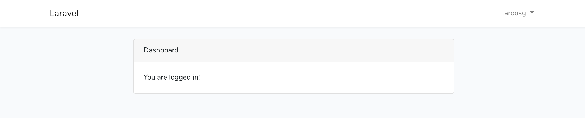

作成日：2019/01/23

更新日：2019/02/03

実行環境：cloud9

PHPバージョン：7.2.14

Laravelバージョン：5.7.21

<div style="page-break-before:always"></div>

## **フレームワークとは**

- フレームワークとは，はじめからよく使用される処理，関数，クラスなどが用意された枠組みのこと．  
- フレームワークを使用しない場合（例えば，PHPで0から自分で書き進める場合），実際にプログラムを書く人によって書き方が異なる．（1ファイルに多く記述，関数化する，オブジェクト指向，など）
- その場合，複数人のチームで開発を行う際に規則性がないコードが生産されてしまう原因となる．
- フレームワークを使用すれば，はじめから規則性が決まっており，書き方さえ把握していれば誰でも規則に沿ったコードを書けるようになる．

### メリット

- 実装の負荷軽減．
- 保守性，セキュリティの担保．
- 規則性のあるコード．
- 可読性の担保．

### デメリット

- 学習コスト．
- 環境構築の手間．
- 言語への習熟度に影響される．


## **Laravelの特徴**

### 学習コストの低さ

- コードが読みやすく，記述量が少ない．
- 入力チェック，ログイン機能，ページネーションなどのwebサービスでよく使用される機能の実装が簡単．
- 本番環境へのアップロードが他のフレームワークと比較して容易．

<div style="page-break-before:always"></div>

## **MVCフレームワークとは**

- フレームワークにおいて，よく使われるシステム．
- 「Model」「View」「Controller」で構成される．
- この3つがそれぞれ異なる役割を担う「役割分担」のシステム．
- 初めて触れる場合，この役割を明確に理解することは困難．
- そのため，まずはMVCフレームワークで構成されたアプリケーションを実際に作成し，その後で知識を固めたほうが良い．

### Model/モデル

- webシステムの中で，データ処理を扱う部分．
- データベース操作である「登録」「表示」「更新」「削除」を行うのが主な役割となる．

### View/ビュー

- ブラウザでの表示領域を扱う部分．
- モデルやコントローラの処理を受け取り，ブラウザで表示するhtmlを出力することが役割．

### Controller/コントローラー

- モデルとビューの制御を行う部分．
- リクエストされたURLに応じて，処理を実行する．

###  Route/ルート

- アクセスされたURLに応じて処理を分類する部分．
- URLに応じて実行する関数を決める役割を持つ．

### ※LaravelとMVC

- 開発者のTaylor Otwell氏は「LaravelはMVCではない」と述べている．
- 確かにMVCの枠組みに近いが，Laravelは厳密に処理を記述する箇所が定められているわけではなく，柔軟に記述できる点も特徴である．

<div style="page-break-before:always"></div>


## **開発環境準備**

- クラウド開発環境である「cloud9」を使用して開発を進める．

### workspace の準備

- wokspaceとはアプリケーションを管理するフォルダのようなもの．
- 1つのwebアプリケーションに対して，1つのworkspace，という理解でOK．
- name  
アプリケーション名を入力．自身が区別できるものでOK．
- description  
アプリケーションの説明．任意で入力する．
- Clone from Git or Mercurial URL (optional)  
githubのリポジトリと連携することができる．後からでも連携できるが，この時点でgithubのリポジトリを作成して連携しておくほうが簡単なのでオススメ．
- Choose a template  
「PHP」を選択．
- 入力完了したら「Create workspace」をクリックするとworkspaceの作成が始まるのでしばらく待つ．
- 入力画面は下記

- workspace設定完了後の画面


<div style="page-break-before:always"></div>

## **Laravelのインストール**

- PHP及びcomposerの状況を確認しつつ，Laravelのインストールを進める．
- 「compoesr」とはPHPライブラリのインストールやバージョン管理を行う便利ツール．

### **1. PHPのバージョン確認**

- インストールされているPHPのバージョンを確認する．
- ターミナルでバージョン確認のコマンドを実行する．  

注意点（以降，ターミナルでの作業すべて）
- $マークは入力しない．
- 入力はすべて半角で行う．


ターミナルで以下を実行
```bash
$ php -v
```
出力結果（バージョンは5.5.9）
```bash
PHP 5.5.9-1ubuntu4.22 (cli) (built: Aug  4 2017 19:40:28) 
Copyright (c) 1997-2014 The PHP Group
Zend Engine v2.5.0, Copyright (c) 1998-2014 Zend Technologies
    with Zend OPcache v7.0.3, Copyright (c) 1999-2014, by Zend Technologies
    with Xdebug v2.5.5, Copyright (c) 2002-2017, by Derick Rethans
```

### **2. compoerのバージョン確認**

ターミナルで以下を実行
```bash
$ composer
```
出力結果（バージョンは1.5.1）
```
   ______
  / ____/___  ____ ___  ____  ____  ________  _____
 / /   / __ \/ __ `__ \/ __ \/ __ \/ ___/ _ \/ ___/
/ /___/ /_/ / / / / / / /_/ / /_/ (__  )  __/ /
\____/\____/_/ /_/ /_/ .___/\____/____/\___/_/
                    /_/
Composer version 1.5.1 2017-08-09 16:07:22

Usage:
  command [options] [arguments]
...
```

### **3. composerのアップデート**

ターミナルで以下を実行
```bash
$ sudo composer self-update
```
出力結果
```bash
Updating to version 1.8.0 (stable channel).
   Downloading (100%)         
Use composer self-update --rollback to return to version 1.5.1
```
再度バージョン確認
```bash
$ composer
```
実行結果（バージョンは1.8.0）
```bash
   ______
  / ____/___  ____ ___  ____  ____  ________  _____
 / /   / __ \/ __ `__ \/ __ \/ __ \/ ___/ _ \/ ___/
/ /___/ /_/ / / / / / / /_/ / /_/ (__  )  __/ /
\____/\____/_/ /_/ /_/ .___/\____/____/\___/_/
                    /_/
Composer version 1.8.0 2018-12-03 10:31:16

Usage:
  command [options] [arguments]
...
```

<div style="page-break-before:always"></div>

### **4. PHPのバージョンアップ**

- Laravelの最新バージョンでは「PHP7.0以上」が必要となる．
- 現在のバージョンは5.5.9なので，以下の手順でバージョンアップを行う．

ターミナルで以下を実行．
```bash
$ sudo add-apt-repository ppa:ondrej/php
```
以下が出力されるがEnter押下で続行
```bash
Press [ENTER] to continue or ctrl-c to cancel adding it
```
実行結果
```bash
...
gpg: keyring `/tmp/tmpgu2gq6me/secring.gpg' created
gpg: keyring `/tmp/tmpgu2gq6me/pubring.gpg' created
gpg: requesting key E5267A6C from hkp server keyserver.ubuntu.com
gpg: /tmp/tmpgu2gq6me/trustdb.gpg: trustdb created
gpg: key E5267A6C: public key "Launchpad PPA for Ondřej Surý" imported
gpg: Total number processed: 1
gpg:               imported: 1  (RSA: 1)
OK
```

引き続き，以下を実行  
```bash
$ sudo apt-get update
```
実行結果
```bash
...
Get:52 http://asia-east1.gce.clouds.archive.ubuntu.com trusty/universe i386 Packages [7597 kB]
Get:53 http://asia-east1.gce.clouds.archive.ubuntu.com trusty/multiverse i386 Packages [172 kB]
Fetched 37.0 MB in 18s (1971 kB/s)                                             
Reading package lists... Done
```

<div style="page-break-before:always"></div>

以下を実行
```bash
$ sudo apt-get install libapache2-mod-php7.2
```
途中で下記出力された場合はすべて「y」で続行
```bash
Do you want to continue? [Y/n]
```
実行結果
```bash
...
Creating config file /etc/php/7.2/apache2/php.ini with new version
libapache2-mod-php7.2: php5 module already enabled, not enabling PHP 7.2
Processing triggers for libc-bin (2.19-0ubuntu6.11) ...
```

以下を実行
```bash
$ sudo a2dismod php5
```
出力結果
```bash
Module php5 disabled.
To activate the new configuration, you need to run:
  service apache2 restart
```

以下を実行
```bash
$ sudo a2enmod php7.2
```
出力結果
```bash
Considering dependency mpm_prefork for php7.2:
Considering conflict mpm_event for mpm_prefork:
Considering conflict mpm_worker for mpm_prefork:
Module mpm_prefork already enabled
Considering conflict php5 for php7.2:
Enabling module php7.2.
To activate the new configuration, you need to run:
  service apache2 restart
```

以下を実行
```bash
$ sudo apt-get install php7.2-dom php7.2-mbstring php7.2-zip php7.2-mysql
```
途中で下記出力された場合はすべて「y」で続行
```bash
Do you want to continue? [Y/n]
```
実行結果
```bash
reating config file /etc/php/7.2/mods-available/zip.ini with new version
Processing triggers for libc-bin (2.19-0ubuntu6.11) ...
Processing triggers for libapache2-mod-php7.2 (7.2.14-1+ubuntu14.04.1+deb.sury.org+1) ...
```

アップデート後のPHPバージョン確認
```bash
$ php -v
```
実行結果（バージョンは7.2.14）
```bash
PHP 7.2.14-1+ubuntu14.04.1+deb.sury.org+1 (cli) (built: Jan 13 2019 10:33:56) ( NTS )
Copyright (c) 1997-2018 The PHP Group
Zend Engine v3.2.0, Copyright (c) 1998-2018 Zend Technologies
    with Zend OPcache v7.2.14-1+ubuntu14.04.1+deb.sury.org+1, Copyright (c) 1999-2018, by Zend Technologies
```

<div style="page-break-before:always"></div>

### **5. Laravelインストーラの準備**

- Laravelインストーラーは下記の場所に配置される．
```
/home/ubuntu/.composer/vender/laravel/installer
```
- 実際のインストールや必要なコードの配置は「composer」コマンドで実行するため,
設置場所に留意する必要はない．
- 「composer」は他に必要なライブラリなども合わせてダウンロードして配置を行う．「composer」を使用しない場合，すべて自分でダウンロードして設置場所の設定も行う必要がある．

以下を実行．
```bash
$ sudo composer global require "laravel/installer"
```
実行結果
```bash
...
symfony/console suggests installing symfony/lock
guzzlehttp/guzzle suggests installing psr/log (Required for using the Log middleware)
Writing lock file
Generating autoload files
```

### **6. Laravelプロジェクトの作成**

- 実際にLaravelプロジェクトを作成する．
- インストールできる範囲で最新のLaravelがインストールされる．

以下を入力．（cmsという名前でプロジェクトを作成する）
```bash
$ composer create-project laravel/laravel cms
```
実行結果
```bash
...
Discovered Package: laravel/tinker
Discovered Package: nesbot/carbon
Discovered Package: nunomaduro/collision
Package manifest generated successfully.
> @php artisan key:generate --ansi
Application key set successfully.
```

以下でLaravelのバージョンを確認できる．
```bash
$ cd cms
$ php artisan --version
```
実行結果（バージョンは5.7.21）
```bash
Laravel Framework 5.7.21
```

### **【参考】Laravelのバージョン指定**

今回は最新版を使用してプロジェクトを作成しているが，バージョンを指定することもできる．

現在（2019年1月）で最新のLTS（長期サポートバージョン）は5.5となっているため，本番環境へのデプロイを意図する場合はバージョン5.5を指定したほうがサポート期間が長く安心である．

バージョン指定（5.5）する際には，プロジェクト作成時のコマンドを下記のように変更する．

```bash
$ composer create-project laravel/laravel cms 5.5.* --prefer-dist
```


### **7. Laravelのインストール確認**

- Laravelインストールの確認にはwebブラウザで動作させて確認する．
- cloud9にはwebサーバが標準で搭載されているため，以下の手順で確認を行う．

1. 「Run Project」ボタンをクリック．
2. 表示されたURLをクリックし「open」を選択．
3. 表示されたwebページで「Open the App」ボタンをクリック．
4. ディレクトリ構成の画面（下記）が表示される．

5. 以下のアドレスにアクセスし，トップページの表示を確認する．上の画面から「cms/」「public/」の順にクリックでもOK．
```
https://プロジェクト名-ユーザ名.c9users.io/cms/public/
```
6. 下記画面が表示されればインストール完了．


<div style="page-break-before:always"></div>

## **webサーバの設定変更**

- 現状では，ルートディレクトリでトップページが表示されず，「/cms/public/」を追加する必要がある．
- ドキュメントルートアクセス時にトップページが表示されるよう設定を変更する．

### ※ドキュメントルートとは？

- `https://hogehoge.com`などのURLにアクセスしたときに表示されるファイルの入っているディレクトリのこと．

変更前のトップページのURL
```
https://プロジェクト名-ユーザ名.c9users.io/cms/public/
```
変更後のトップページのURL
```
https://プロジェクト名-ユーザ名.c9users.io
```

### **1. webサーバのドキュメントルート変更**

ターミナルで以下を実行．vimというエディタで設定ファイルを開く．
```bash
$ sudo vim /etc/apache2/sites-enabled/001-cloud9.conf
```
実行結果
```
<VirtualHost *:8080>
    DocumentRoot /home/ubuntu/workspace
    ServerName https://${C9_HOSTNAME}:443

    LogLevel info

    ErrorLog ${APACHE_LOG_DIR}/error.log
    CustomLog ${APACHE_LOG_DIR}/access.log combined

    <Directory /home/ubuntu/workspace>
        Options Indexes FollowSymLinks
        AllowOverride All
        Require all granted
    </Directory>
</VirtualHost>

ServerName https://${C9_HOSTNAME}
# vim: syntax=apache ts=4 sw=4 sts=4 sr noet
```

「i」キーを押すと左下に「INSERT」が表示されるので，表示された状態で下記のように編集する．
```diff
<VirtualHost *:8080>
-   DocumentRoot /home/ubuntu/workspace
+   DocumentRoot /home/ubuntu/workspace/cms/public
    ServerName https://${C9_HOSTNAME}:443

    LogLevel info

    ErrorLog ${APACHE_LOG_DIR}/error.log
    CustomLog ${APACHE_LOG_DIR}/access.log combined

    <Directory /home/ubuntu/workspace>
        Options Indexes FollowSymLinks
        AllowOverride All
        Require all granted
    </Directory>
</VirtualHost>

ServerName https://${C9_HOSTNAME}
# vim: syntax=apache ts=4 sw=4 sts=4 sr noet
```

編集が終了したら「esc」を押下する．INSERTが消えるので，消えた状態で「:wq」を入力して「Enter」を押下して完了．


### **2. webサーバ設定完了後の画面確認**

- ターミナルのカレントディレクトリが「cms」であることを確認する．ターミナルの「$」の前が「`/cms`」となっていればOK．

- 「`/cms`」でない場合はターミナルで以下を実行してディレクトリを移動する．
```bash
$ cd cms
```
- ターミナルで以下のコマンドを実行．
```bash
$ sudo composer update
```
- 「Run Project」ボタンを押下．
- 下記のアドレスを入力し，トップ画面が表示されればOK．
```
https://プロジェクト名-ユーザ名.c9users.io
```
トップ画面


<div style="page-break-before:always"></div>

## **【参考】Laravelルートディレクトリのファイル構成**

主なディレクトリ構成を解説する．次項で挙げる，よく使用するディレクトリを押さえれば当面はOK．

### **app**

- アプリケーションのコアコードを配置する．
- ModelやControllerもここに配置．

### **bootstrap**

- フレームワークの初期起動やオートローディングなどの設定ファイルが含まれる．
- cache関連のファイルもここに保存される．

### **config**

- アプリケーションの設定ファイルが保存される．

### **database**

- データベースのマイグレーションファイルが保存される．

### **public**

- クライアントサイドのasset（css, javascriptなど）を配置する．
- ここがドキュメントルートとなる．

### **resources**

- Viewのファイルが保存される．

### **routes**

- ルーティングを行うファイルを配置する．

### **tests**

- 自動テストを配置する．

### **vendor**

- composerでインストールしたパッケージが配置される．

<div style="page-break-before:always"></div>

## **よく使用するディレクトリ&ファイル**

### **1. /.env**

- 環境設定に使用

### **2. /routes/web.php**

- ルーティングに使用

### **3. /resources/views/*****

- Viewで使用するファイルを設定，保存

### **4. /app/Http/controller/*****

- Model, Controllerを設定，保存

<div style="page-break-before:always"></div>

## **todo管理アプリの作成①-データベースの準備**

### **0. アプリケーション作成の流れ**

1. データベース&テーブルの設計，作成（マイグレーション）
2. モデルの作成（データ操作できる状態）
3. ルーティング（URLとViewや処理を紐付ける）
4. Viewの作成（表示する画面）
5. 処理を追加（登録，表示，更新，削除）

### **1. データベースの設定**

1. 「`.env`」ファイルにデータベースの設定を記述する．cmsディレクトリ直下に配置されている．

2. 「`.env`」ファイルは隠しファイルなので，表示されていない場合は，ファイルツリー画面右上の歯車マークをクリックして「Show Hidden Files」にチェックを入れると表示される．

3. 「`.env`」ファイルをダブルクリックして開く．

4. ファイルの内容を以下のように編集する．ユーザ名はURLの`ide.c9.io/`以下となる．

`.env`ファイルの内容
```diff
DB_CONNECTION=mysql
-DB_HOST=127.0.0.1
+DB_HOST=localhost
DB_PORT=3306
-DB_DATABASE=homestead
+DB_DATABASE=c9
-DB_USERNAME=homestead
+DB_USERNAME=ユーザ名
-DB_PASSWORD=secret
+DB_PASSWORD=
```

### **2. データベースの確認**

記述したらDBの状態を確認する．ターミナルのカレントディレクトリが「cms」であることを確認する．ターミナルの「$」の前が「`/cms`」となっていればOK．

「`/cms`」でない場合はターミナルで以下を実行してディレクトリを移動する．
```bash
$ cd cms
```

続けて以下を入力し，mysqlを起動する．
```bash
$ mysql-ctl cli
```

実行結果．以降，mysql内で操作を行う．
```bash
...
Type 'help;' or '\h' for help. Type '\c' to clear the current input statement.

mysql> 
```

データベース一覧を表示し，「c9」が存在することを確認する．
```bash
mysql> show databases;
+--------------------+
| Database           |
+--------------------+
| information_schema |
| c9                 |
| mysql              |
| performance_schema |
| phpmyadmin         |
+--------------------+
5 rows in set (0.00 sec)
```

「c9」データベースを選択．
```bash
mysql> use c9;
Database changed
```

テーブルを表示するが，まだ設定していないので存在しない．
```bash
mysql> show tables;
Empty set (0.01 sec)
```

mysqlを終了する．通常のターミナルに戻る．
```bash
mysql> exit;
Bye
```

<div style="page-break-before:always"></div>

## **todo管理アプリの作成②-テーブルの作成**

### **1. データベースマイグレーション**

マイグレーションとは，必要なテーブルの構造をPHPファイル（マイグレーションファイル）で定義し，実行することでテーブルの作成を行うシステム．

テーブル一つに対して，1つのマイグレーションファイルが作成・実行されるイメージ．

【解説】コマンド書式
```bash
$ php artisan make:migration ファイル名 --create=テーブル名
``` 

上記コマンドで以下のようなマイグレーションファイルが作成される．
`[yyyy]_[mm]_[dd]_[hms]_[ファイル名].php`

マイグレーションファイルの内容は以下のようになる．
```php
<?php

use Illuminate\Support\Facades\Schema;
use Illuminate\Database\Schema\Blueprint;
use Illuminate\Database\Migrations\Migration;

class CreateTasksTable extends Migration
{
    public function up()
    {
        Schema::create('テーブル名', function (Blueprint $table) {
            $table->increments('id');
            //ここに必要なカラム名を追記する．
            $table->timestamps();
        });
    }

    public function down()
    {
        Schema::dropIfExists('テーブル名');
    }
}
```

カラム名の追記は「`$table->カラム型('カラム名');`」のように行う．
```php
$table->increments('id');       //自動採番（主キー）
$table->string('email');        //varcharカラム
$table->string('name', 100);    //長さ指定カラム
$table->integer('price');       //integerカラム
$table->text('description');    //textカラム
$table->dateTime('created_at'); //datetimeカラム
$table->timestamps();           //created_atとupdated_atカラムを追加
$table->boolean('confirmed');   //true, falseカラム
$table->json('meta');           //jsonカラム
```

カラムのオプションは以下の通り．
```php
$table->string('email')->nullable();    //nullを許可
$table->string('email')->unique();      //カラムの値を一意にする
```

### **2. マイグレーションファイルの作成**

今回は，
- ファイル名「`create_tasks_table`」
- テーブル名「`tasks`」※テーブル名は複数形（重要）

の名前でマイグレーションファイルとテーブルを作成する．

ターミナルで以下を実行．
```bash
$ php artisan make:migration create_tasks_table --create=tasks
```

実行結果
```bash
Created Migration: 2019_**_**_******_create_tasks_table
```

以下の場所にマイグレーションファイルが作成されるので内容を確認する．
```
/cms/database/migrations
```

ファイルの内容は以下の通り．
```php
<?php

use Illuminate\Support\Facades\Schema;
use Illuminate\Database\Schema\Blueprint;
use Illuminate\Database\Migrations\Migration;

class CreateTasksTable extends Migration
{
    public function up()
    {
        Schema::create('tasks', function (Blueprint $table) {
            $table->increments('id');
            $table->timestamps();
        });
    }

    public function down()
    {
        Schema::dropIfExists('tasks');
    }
}
```

今回はtodo管理アプリケーションを作成するので，以下のカラムを追加する．
- task: タスク名
- deadline: タスクの締切
- comment: タスクの詳細

`[yyyy]_[mm]_[dd]_[hms]_create_tasks_table.php`に必要なカラム名を追記する．
```diff
<?php

use Illuminate\Support\Facades\Schema;
use Illuminate\Database\Schema\Blueprint;
use Illuminate\Database\Migrations\Migration;

class CreateTasksTable extends Migration
{
    public function up()
    {
        Schema::create('tasks', function (Blueprint $table) {
            $table->increments('id');
+           $table->string('task');
+           $table->date('deadline');
+           $table->text('comment')->nullable();
            $table->timestamps();
        });
    }

    public function down()
    {
        Schema::dropIfExists('tasks');
    }
}
```

【注意】このままだと実行時にエラーになるので，文字列型の最大長を変更する．

`/cms/app/Providers/AppServiceProvider.php`の内容を以下のように編集する．
```diff
<?php

namespace App\Providers;

use Illuminate\Support\ServiceProvider;
+ use Illuminate\Support\Facades\Schema;

class AppServiceProvider extends ServiceProvider
{
    public function boot()
    {
-       //
+       Schema::defaultStringLength(191);
    }

    public function register()
    {
        //
    }
}
```

### **3. マイグレーションの実行**

マイグレーションファイルを作成したら，マイグレーションを実行する．

ターミナルで以下を実行する．
```bash
$ php artisan migrate
```

実行結果
```bash
Migration table created successfully.
Migrating: 2014_10_12_000000_create_users_table
Migrated:  2014_10_12_000000_create_users_table
Migrating: 2014_10_12_100000_create_password_resets_table
Migrated:  2014_10_12_100000_create_password_resets_table
Migrating: 2019_01_23_000319_create_tasks_table
Migrated:  2019_01_23_000319_create_tasks_table
```

うまくいかないときはマイグレーションファイルを見直して以下を実行．
```bash
$ php artisan migrate:fresh
```

mysqlでテーブルの状況を確認する．ターミナルで以下を実行する．
```bash
$ mysql-ctl cli
```

実行結果
```bash
...
Type 'help;' or '\h' for help. Type '\c' to clear the current input statement.

mysql>
```

データベース変更．
```bash
mysql> use c9;
Reading table information for completion of table and column names
You can turn off this feature to get a quicker startup with -A

Database changed
```

テーブルを一覧表示．tasksテーブルが作成されていればOK．
```bash
mysql> show tables;
+-----------------+
| Tables_in_c9    |
+-----------------+
| migrations      |
| password_resets |
| tasks           |
| users           |
+-----------------+
4 rows in set (0.00 sec)
```

テーブルの構造確認．
```bash
mysql> desc tasks;
+------------+------------------+------+-----+---------+----------------+
| Field      | Type             | Null | Key | Default | Extra          |
+------------+------------------+------+-----+---------+----------------+
| id         | int(10) unsigned | NO   | PRI | NULL    | auto_increment |
| task       | varchar(191)     | NO   |     | NULL    |                |
| deadline   | date             | NO   |     | NULL    |                |
| comment    | text             | YES  |     | NULL    |                |
| created_at | timestamp        | YES  |     | NULL    |                |
| updated_at | timestamp        | YES  |     | NULL    |                |
+------------+------------------+------+-----+---------+----------------+
6 rows in set (0.01 sec)
```

mysql終了．
```bash
mysql> exit;
Bye
```

これでテーブルの設定は完了．

### 【参考】よく使うマイグレーションコマンドまとめ

マイグレーション実行
```bash
$ php artisan migrate
```

直前に実行したマイグレーションをロールバックする．
```bash
$ php artisan migrate:rollback
```

全てロールバックしてからマイグレーションを再度実行する．
```bash
$ php artisan migrate:refresh
```

全てのテーブルを削除して再度マイグレーションを実行する．
```bash
$ php artisan migrate:fresh
```

マイグレーション状況を出力する．
```bash
$ php artisan migrate:status
```

<div style="page-break-before:always"></div>

## **todo管理アプリの作成③-モデルの作成**

### **1. Eloquent Model**

- Eloquent ModelはLaravel標準のORM（object-relational mapper）である．
- ORMとは，DBのレコードをオブジェクトとして直感的に扱えるようにしたもので，SQLを意識せずにプログラムで処理を記述することができる．
- Eloquent Modelは定義された「model」を用いることで簡単にDBへのデータ保存・取得を行える．
- 1つのモデルが1つのテーブルに対応する．例えば，`tasks`テーブルに対して`Task`のようにモデルを定義すると自動的に対応する．モデル内に明示的に対応を記述することもできる．

### **2. モデル作成コマンド**

下記コマンドでモデルを作成する．
```bash
$ php artisan make:model モデル名
```

今回は「`tasks`」テーブルに対応する「`Task`」モデルを定義する．下記をターミナルで実行する．
```bash
$ php artisan make:model Task
```

実行結果
```bash
Model created successfully.
```

### **3. モデル確認**

`/app/Task.php`が作成される．
内容は以下の通り．
```php
<?php

namespace App;

use Illuminate\Database\Eloquent\Model;

class Task extends Model
{
    //
}
```

<div style="page-break-before:always"></div>

## **todo管理アプリの作成④-ルーティング**

### **1. ルートとは**

`https://******.c9users.io/`のURLドメインの最後の「`/`」がルートとなる．

### **2. ルーティング**

例：

`https://******.c9users.io/`  
`https://******.c9users.io/home`  
`https://******.c9users.io/login`

上の「`/`」と「`****`」がルーティングで指定できる場所．ルーティングは「`/`」以降の文字列を使用し，アプリケーションの処理と紐付ける．


### **3. 必要なルーティング**

今回はアプリケーションに必要な3つのルーティングを作成する．ルーティングは「ユーザがアクセスするURL」と「アプリケーションが実行する処理」を紐付かせる定義となる．
- タスクを追加する処理
- タスクを一覧表示する処理
- 完了したタスクを削除する処理

### **4. ルーティングファイルの作成**

まずは処理が空のルーティングを作成する．実行される処理については後ほど作成する．

ルーティングファイルは`/routes/web.php`で，内容は以下．
```php
<?php

Route::get('/', function () {
    return view('welcome');
});
```

上記の記述は「`/`」にアクセスされたら「`welcome.blade.php`」ページを表示する，という意味となる．

今回必要な3つの処理について，以下のように`/routes/web.php`を編集する．この状態では，アクセスされたURLに対して，何も処理が行われない状態となる．
```diff
<?php
+use App\Task;
+use Illuminate\Http\Request;

-Route::get('/', function () {
-    return view('welcome');
-});

// 表示処理の作成
+Route::get('/', function () {
+    //
+});

// 登録処理の作成
+Route::post('/tasks', function (Request $request) {
+    //
+});

// 削除処理の作成
+Route::post('/task/{task}', function (Task $task) {
+    //
+});
```

### **5. ルーティングとビューの関連付け**

次に「`/`」ルートの定義を完成させる．このルーティングでは，「新しいタスクを登録するフォーム」と「登録済みタスクの一覧」を組み込んだビューを指定する．

ルート定義では「`return view('ファイル名')`」と記述することで指定したビューを表示する．

以下のように`/routes/web.php`を編集する．
```diff
...
// 表示処理の作成
Route::get('/', function () {
-   //
+   return view('tasks');
});
...
```

`view()`に引数として渡した`tasks`がファイル名となる．ここでは「`tasks.blade.php`」を表す．

この段階では，ビューを作成していないのでブラウザで確認できないが，次項でビューを作成した後にブラウザで動作確認を行う．


<div style="page-break-before:always"></div>

## **todo管理アプリの作成⑤-ビューの作成**

- 今回のアプリケーションでは，「タスクを追加するためのフォーム」と「登録されたタスクの一覧」を表示するビューを作成する．
- Laravelではbootstrapを使用可能なため，デザインレイアウトはbootstrapのcssスタイルを使用する．

### **1. テンプレートの定義**

- Laravelではテンプレートエンジン「bladeテンプレート」を使用する．
- bladeテンプレートは「ヘッダー」「フッター」「メニュー」などをパーツ化して共有利用できる．共有利用することで，編集するとどのページでも同時に更新することができる．
- webページでは上記のパーツはどのページでも共通して用いられることが多いため，テンプレートエンジンを使用することで効率的に開発を進めることができる．
- また，テンプレート内で`if`を用いた条件分岐や`for`を用いた繰り返し処理を行うこともできる．
- テンプレートを用いてビュー表示を行う際には，ファイル名に「`*****.blade.php`」の拡張子をつける．

### **2. ビューファイルの設置場所**

- Laravelのビューは全て「`resources/views`」配下に設置する．
- 共通パーツのビューは「`resources/views`」の中に「`layouts`」ディレクトリを作成し，その中に「`app.blade.php`」を作成する．
- 階層を含めたファイルパスは以下のようになる．
```bash
/resources/views/layouts/app.blade.php
```

### **3. 共通パーツ部分の作成**

`/resources/views`ディレクトリに`layouts`ディレクトリを作成し，`layouts`ディレクトリ内に`app.blade.php`ファイルを作成する．（作成した時点では空の状態）

作成した`app.blade.php`の内容に以下を追記する．
```html
<!DOCTYPE html>
<html lang="en">
    <head>
        <title>Todo List</title>
        <!-- CSSとJavaScriptを追加する領域 -->
    </head>
    <body>
        <div class="container">
            <nav class="navbar navbar-default">
                <!-- ナビバーの内容 -->
            </nav>
        </div>
        @yield('content')
    </body>
</html>
```

`app.blade.php`が共通パーツとなり，上記`@yield('content')`の部分に各ページの内容が挿入される.

続けて，メインコンテンツを表示するビューを作成する．

### **4. 個別パーツ部分の作成**

タスク追加フォームと登録済みタスク一覧を作成する．

`/resources/views`ディレクトリに`tasks.blade.php`ファイルを作成する．（作成した時点では空の状態）

作成した`tasks.blade.php`の内容に以下を追記する．
```html
@extends('layouts.app')
@section('content')
    <div class="panel-body">
        <!-- バリデーションエラーの表示に使用するエラーファイル-->
        @include('common.errors')
        <!-- タスク登録フォーム -->
        <form action="{{ url('tasks') }}" method="POST" class="form-horizontal">
            {{ csrf_field() }}
            <!-- タスク名 -->
            <div class="form-group">
                <div class="col-sm-6">
                    <label for="task" class="col-sm-3 control-label">Task</label>
                    <input type="text" name="task" id="task" class="form-control">
                </div>
            </div>
            <!-- タスク登録ボタン -->
            <div class="form-group">
                <div class="col-sm-offset-3 col-sm-6">
                    <button type="submit" class="btn btn-default">Save</button>
                </div>
            </div>
        </form>
        <!-- この下に登録済みタスクリストを表示 -->
    </div>
@endsection
```

`@extends('layouts.app')`で共通パーツである`app.blade.php`を呼び出す．引数は`layouts/app.blade.php`と同義となる．

`@section('content')`から`@endsection`までの内容を`content`という名前で定義している．この`content`を`app.blade.php`の`@yield('content')`部分で呼び出している．

また，記述内でエラーファイルを呼び出しているが，エラーファイルが未作成であるため，このままでは正しく表示されない状態である．

### **5. エラー表示テンプレートの作成**

`/resources/views`ディレクトリに`common`ディレクトリを作成し，`common`ディレクトリ内に`errors.blade.php`ファイルを作成する．（作成した時点では空の状態）

作成した`errors.blade.php`の内容に以下を追記する．
```html
@if (count($errors) > 0)
    <!-- Form Error List -->
    <div class="alert alert-danger">
        <div><strong>入力した文字を修正してください。</strong></div>
        <div>
            <ul>
                @foreach ($errors->all() as $error)
                    <li>{{ $error }}</li>
                @endforeach
            </ul>
        </div>
    </div>
@endif
```

`$error`変数はエラー発生時に使用され，どのファイルからも参照することができる．

### **6. ビューの確認**

必要なビューが全て揃ったので，ブラウザで表示を確認する．

以下にアクセスする．
```bash
https://プロジェクト名-ユーザ名.c9users.io/
```

デザインを適用していないので，下記のようなシンプルなフォームが表示される．


### **【参考】bladeテンプレート内の変数表示**

テンプレート内での変数は
```php
{{ $変数名 }}
```
で記述できる．

bladeテンプレート内で上記のように記述すると，XSS攻撃を防ぐためにPHPのエスケープ関数を自動的に実行する．

エスケープしたくない場合は，
```php
{{ !!$変数名!! }}
```
のように記述できるが，セキュリティを考慮すると`{{ $変数名 }}`の使用が望ましい．

また，変数が存在しない場合に表示を切り分けることもできる．例えば，
```php
{{ $name, 'default' }}
```
のように記述した場合，`$name`が存在すれば値が表示され，存在しない場合は`default`という文字列が表示される．

### **【参考】javascript, cssファイルの配置場所**

これらのファイルは`public/js`や`public/css`に配置する．

例：`main.js`ファイルを作成した場合，配置すると下記のようになる．
```bash
public/js/main.js
```

参照には`asset()`関数を使用する．`asset()`関数は`public`以下を参照するため，以下のように記述する．

例1：javascriptファイルを参照する場合．
```html
<script src="{{asset('js/main.js')}}"></script>
```

例2：cssファイルを参照する場合
```html
<script src="{{asset('css/style.css')}}" rel="stylesheet"></script>
```

<div style="page-break-before:always"></div>

## **todo管理アプリの作成⑥-タスク追加処理の作成**

### **バリデーション（入力チェック）と登録処理の作成**

- フォームに入力された値が正常な値かどうかバリデーション（チェック）する．
- ルーティングの「登録処理作成」部分に記述する．
- 本体ルーティング部分で記述する内容ではないが，まず処理を全て記述し，その後に各役割分担を行う．

`/routes/web.php`を以下のように編集する．
```diff
...
//登録処理の作成
Route::post('/tasks', function (Request $request) {
-   //
    //バリデーション
+   $validator = Validator::make($request->all(), [
+       'task' => 'required|max:255',
+   ]);
    //バリデーション:エラー
+   if ($validator->fails()) {
+       return redirect('/')
+           ->withInput()
+           ->withErrors($validator);
+   }
    // Eloquentモデル
+   $task = new Task;
+   $task->task = $request->task;
+   $task->deadline = '2019-01-23';
+   $task->comment = 'todo!';
+   $task->save();
    //「/」ルートにリダイレクト
+   return redirect('/');
});
...
```

### **【解説】バリデーションの設定**

- task（必須，255文字以内）  
「`|`」を挟むことで複数の条件を指定可能．例えば「`required | min:3 | max:255`」のように記述できる．
- バリデーション失敗時（`if($validator->false()){...}`）  
セッションに値を保存し，ユーザを「`/`」ルートにリダイレクトさせる．
```php
redirect('/')   //ルートへリダイレクト
```
```php
withInput()     //セッションに値を保持
```

### **【解説】データ登録処理**

新しいタスクを登録するためにはEloquentモデル「`Task`」に対して値を代入した後，「`save()`」メソッドで保存する．

保存後，「`return redirect('/')`」でルート画面へ遷移する．

以下，登録して画面遷移する処理．
```php
...
$task = new Task;
$task->task = $request->task;
$task->deadline = '2019-01-23';
$task->comment = 'todo!';
$task->save();
//「/」ルートにリダイレクト
return redirect('/');
...
```
上記コードでは，「`task`」は入力された値を受け取り，それ以外は固定の値となっている．

後ほど，入力欄を追加し，処理を変更する．


<div style="page-break-before:always"></div>

## **todo管理アプリの作成⑦-登録済みタスク一覧表示処理の作成**

### **1. タスクの一覧データを取得し，Viewへ変数として渡す**

「`/`」アクセス時に，`Task`モデルを参照して条件に合致したデータを受け取り，`view()`関数の第2引数に渡す．

`routes/web.app`を以下のように編集．レコードをdeadlineが古い順に並べかえて取得している．

```diff
...
Route::get('/', function () {
-   return view('tasks');
+   $tasks = Task::orderBy('deadline', 'asc')->get();
+   return view('tasks', [
+       'tasks' => $tasks
+   ]);
});
...
```
Viewへ変数を渡せたので，この変数から必要なデータを取り出して表示する処理を作成する．

### **2. Viewが受け取った変数から必要な値を取り出して表示する**

`$tasks`は配列なので，`@foreach`を使用して`$tasks`の値を`$task`へ代入し，表示する．

`/resources/views/tasks.blade.php`を以下のように編集する．
```diff
...
</form>
<!-- この下に登録済みタスクリストを表示 -->
+<!-- 表示領域 -->
+@if (count($tasks) > 0)
+   <div class="panel panel-default">
+       <div class="panel-heading">タスクリスト</div>
+       <div class="panel-body">
+           <table class="table table-striped task-table">
+               <!-- テーブルヘッダ -->
+               <thead>
+                   <th>タスク</th>
+                   <th>&nbsp;</th>
+               </thead>
+               <!-- テーブル本体 -->
+               <tbody>
+                   @foreach ($tasks as $task)
+                       <tr>
+                           <td class="table-text">
+                               <div>{{ $task->task }}</div>
+                           </td>
+                           <td>
+                               <!-- 削除ボタン -->
+                           </td>
+                       </tr>
+                   @endforeach
+               </tbody>
+           </table>
+       </div>
+   </div>
+@endif
+<!-- ここまでタスクリスト -->
</div>
@endsection
```

ブラウザで表示すると，下記のように登録済みタスクが表示される．input欄に入力してsavaボタンを押下するとリストに追加される様子が確認できる．


### **【参考】Bladeテンプレートの制御構文**

分岐処理
```php
@if (count($tasks) === 1)
    タスク1件あり！
@endif
```

多分岐処理
```php
@if (count($tasks) === 1)
    <p>タスク1件あり！</p>
@elseif (count($tasks) > 2)
    <p>タスク2件以上あり！</p>
@else
    <p>全て完了済み！</p>
@endif
```

繰り返し処理
```php
@for ($i=0; $i<10; $i++)
    <p>現在のカウント: {{ $i }} </p>
@endfor
```

繰り返し処理（配列など）
```php
@foreach ($users as $user)
    <p>ユーザ名 {{ $user->name }} </p>
@endforeach
```


<div style="page-break-before:always"></div>

## **todo管理アプリの作成⑧-完了したタスクの削除処理を作成**

### **1. 削除ボタンの追加**

- これまでに作成したビューの中に，削除ボタンを追加する．
- 削除ボタンクリック時に，POSTリクエストを送信し，該当するデータをDBから削除する処理を実行する．

`/resources/views/tasks.blade.php`を以下のように編集する．
```diff
...
<!-- テーブル本体 -->
<tbody>
    @foreach ($tasks as $task)
        <tr>
            <td class="table-text">
                <div>{{ $task->task }}</div>
            </td>
            <td>
                <!-- 削除ボタン -->
+               <form action="{{ url('task/'.$task->id) }}" method="POST">
+               {{ csrf_field() }}
+                   <button type="submit" class="btn btn-danger">削除</button>
+               </form>
            </td>
        </tr>
    @endforeach
</tbody>
...
```

ブラウザで表示すると，各タスクに対して削除ボタンが追加されていることが確認できる．


### **【解説】CSRF**

```php
{{ csrf_field() }}
```

- 「CSRF」とはハッキング手法の一つ．
- プログラムが人間に成り代わり，悪意ある情報を入力・送信する手法．
- LaravelにはCSRFからユーザを保護する関数が用意されており，基本的にログイン後のフォームなどに記述することが推奨されている．
- 今回のケースでは，悪意あるプログラムにユーザの登録したタスクを勝手に削除させないために記述している．

### **2. タスクの削除処理を追加**

ビューで表示した削除ボタンをクリックした際に実行される削除処理を追加する．

`/routes/web.php`を以下のように編集する．削除の処理を実行した後は，一覧画面にリダイレクトする．
```diff
...
// 削除処理の作成
Route::post('/task/{task}', function (Task $task) {
-   //
+   $task->delete();
+   return redirect('/');
});
```

ブラウザで削除ボタンをクリックすると，表示されたタスクが削除される様子を確認できる．


<div style="page-break-before:always"></div>

## **todo管理アプリの作成⑨-bootstrapを用いてデザインを整える**

### **1. bootstrap（CSSフレームワーク）を読み込む**

下記のURLにアクセスする．  
[https://getbootstrap.com/docs/4.1/getting-started/introduction/](https://getbootstrap.com/docs/4.1/getting-started/introduction/)

「Bootstrap CDN」以下のコード（以下の画像部分）をコピーする．cssとjsの両方コピー．


### **2. bootstrapをViewに組み込む**

`/resources/views/layouts/app.blade.php`にコピーしたコードを貼り付ける．

```diff
<!DOCTYPE html>
<html lang="en">
    <head>
        <title>Todo List</title>
        <!-- CSSとJavaScriptを追加する領域 -->
+       <link rel="stylesheet" href="https://stackpath.bootstrapcdn.com/bootstrap/4.1.3/css/bootstrap.min.css" integrity="sha384-MCw98/SFnGE8fJT3GXwEOngsV7Zt27NXFoaoApmYm81iuXoPkFOJwJ8ERdknLPMO" crossorigin="anonymous">
+       <script src="https://code.jquery.com/jquery-3.3.1.slim.min.js" integrity="sha384-q8i/X+965DzO0rT7abK41JStQIAqVgRVzpbzo5smXKp4YfRvH+8abtTE1Pi6jizo" crossorigin="anonymous"></script>
+       <script src="https://cdnjs.cloudflare.com/ajax/libs/popper.js/1.14.3/umd/popper.min.js" integrity="sha384-ZMP7rVo3mIykV+2+9J3UJ46jBk0WLaUAdn689aCwoqbBJiSnjAK/l8WvCWPIPm49" crossorigin="anonymous"></script>
+       <script src="https://stackpath.bootstrapcdn.com/bootstrap/4.1.3/js/bootstrap.min.js" integrity="sha384-ChfqqxuZUCnJSK3+MXmPNIyE6ZbWh2IMqE241rYiqJxyMiZ6OW/JmZQ5stwEULTy" crossorigin="anonymous"></script>
    </head>
...
```

ブラウザで表示すると，以下のようにデザインが整っている状態が確認できる．


<div style="page-break-before:always"></div>

## **todo管理アプリの作成⑩-登録処理の追加**

### **1. タスク名以外の入力フォームを追加する**

- 現状ではタスク名のみを入力し，他の項目は固定された値を登録している．
- 「deadline」と「comment」の入力欄を追加し，全ての項目を入力できるようにする．

`/resources/views/tasks.blade.php`を以下のように編集する．タスク名と同様の形式だが，name属性を正しく設定するよう注意．

```diff
...
<!-- タスク登録フォーム -->
<form action="{{ url('tasks') }}" method="POST" class="form-horizontal">
    {{ csrf_field() }}
    <!-- タスク名 -->
    <div class="form-group">
        <div class="col-sm-6">
            <label for="task" class="col-sm-3 control-label">Task</label>
            <input type="text" name="task" id="task" class="form-control">
        </div>
+       <!-- deadline -->
+       <div class="col-sm-6">
+           <label for="deadline" class="col-sm-3 control-label">Deadline</label>
+           <input type="date" name="deadline" id="deadline" class="form-control">
+       </div>
+       <!-- comment -->
+       <div class="col-sm-6">
+           <label for="comment" class="col-sm-3 control-label">Comment</label>
+           <input type="text" name="comment" id="comment" class="form-control">
+       </div>
    </div>
    <!-- タスク登録ボタン -->
    ...
```

ブラウザで表示すると以下の通り入力欄が追加されていることが確認できる．


### **2. データ表示欄の追加**

- タスク名以外の「deadline」「comment」についても一覧に表示されるよう変更する．
- `$task`に1レコードの全てのデータが含まれるため，`$task->deadline`のように各データを取り出すことができる．
- 後ほど使用する更新ボタンも合わせて追加する．
- 更新ボタンには更新ページへのデータ送信も記述する．更新ページは「`tasksedit/id`」とする．

`/resources/views/tasks.blade.php`を以下のように編集する．タスク名の表示と同様の形式で，deadlineとcommentを表示する要素を作成している．


```diff
...
@foreach ($tasks as $task)
    <tr>
        <td class="table-text">
            <div>{{ $task->task }}</div>
        </td>
+       <td class="table-text">
+           <div>{{ $task->deadline }}</div>
+       </td>
+       <td class="table-text">
+           <div>{{ $task->comment }}</div>
+       </td>
+       <td>
+           <!-- 更新ボタン -->
+           <form action="{{ url('tasksedit/'.$task->id) }}" method="POST">
+               {{ csrf_field() }}
+               <button type="submit" class="btn btn-primary">更新</button>
+           </form>
+       </td>
        <td>
            <!-- 削除ボタン -->
            <form action="{{ url('task/'.$task->id) }}" method="POST">
            {{ csrf_field() }}
                <button type="submit" class="btn btn-danger">削除</button>
            </form>
        </td>
    </tr>
@endforeach
...
```

ブラウザで表示すると，項目が追加されていることが確認できる．


### **3. バリデーションと登録処理の追加**

- 入力欄を増やしたので，登録時の処理に反映させる．
- deadlineが入力されていない場合にエラーを出す．
- これまで固定値で送信していた各データについて，入力された値を送信するよう処理を変更する．
- `$request`に送信データが全て含まれるため，`$request->deadline`のようにそれぞれの値を取り出すことができる．

`/routes/web.php`を以下のように編集する．

```diff
// 登録処理の作成
Route::post('/tasks', function (Request $request) {
    //バリデーション
    $validator = Validator::make($request->all(), [
        'task' => 'required|max:255',
+       'deadline' => 'required'
    ]);
    //バリデーション:エラー
    if ($validator->fails()) {
        return redirect('/')
            ->withInput()
            ->withErrors($validator);
    }
    // Eloquentモデル
    $task = new Task;
    $task->task = $request->task;
-   $task->deadline = '2019-01-23';
+   $task->deadline = $request->deadline;
-   $task->comment = 'todo!';
+   $task->comment = $request->comment;
    $task->save();
    //「/」ルートにリダイレクト
    return redirect('/');
});
```

ブラウザで表示して入力→送信すると，入力した内容が反映されていることが確認できる．


<div style="page-break-before:always"></div>

## **todo管理アプリの作成⑪-更新処理の追加**

- データ表示欄を追加した際に，更新ボタンも合わせて作成した．
- URLを`tasksedit/id`に設定したので，更新画面と更新処理を作成する．

### **1. ルーティングの定義**

`/routes/web.php`を以下のように編集（追記）する．
```diff
...
//ここまで削除処理

+//更新画面
+Route::post('/tasksedit/{task}', function(Task $task) {
+   //{task}id 値を取得 => Task $task id 値の1レコード取得
+   return view('tasksedit', ['task' => $task]);
+});
```

上記の`tasksedit`はアドレスで，`{task}`はidを取得する．  
`Task $task`はTaskモデルを指定して引数に`$task`を指定することで，idが等しい1レコードを取得する．

`tasksedit/id名`のURLにアクセスされると，id名が一致する1レコードを取得して更新ページに渡す．  
更新ページでは，`$task->id`や`$task->deadline`のように各データを取り出すことができる．

### **2. 更新画面の作成**

`/resources/views`のディレクトリに`tasksedit.blade.php`を作成する．

`tasksedit.blade.php`は空なので，以下を追加する．更新処理のURLは`tasks/update`とする
```html
@extends('layouts.app')
@section('content')
<div class="row">
    <div class="col-md-12">
        @include('common.errors')
        <form action="{{ url('tasks/update') }}" method="POST">
            <!-- task -->
            <div class="form-group">
                <label for="task">Task</label>
                <input type="text" id="task" name="task" class="form-control" value="{{$task->task}}">
            </div>
            <!-- deadline -->
            <div class="form-group">
                <label for="deadline">Deadline</label>
                <input type="date" id="deadline" name="deadline" class="form-control" value="{{$task->deadline}}">
            </div>
            <!-- comment -->
            <div class="form-group">
                <label for="comment">Comment</label>
                <input type="text" id="comment" name="comment" class="form-control" value="{{$task->comment}}">
            </div>
            <!-- Saveボタン/Backボタン -->
            <div class="well well-sm">
                <button type="submit" class="btn btn-primary">Save</button>
                <a class="btn btn-link pull-right" href="{{ url('/') }}">Back</a>
            </div>
            <!-- id値を送信 -->
            <input type="hidden" name="id" value="{{$task->id}}" />
            {{ csrf_field() }}
        </form>
    </div>
</div>
@endsection
```

ブラウザで更新ボタンをクリックすると，更新画面に遷移する．それぞれのinput欄に，登録されたデータが表示されていればOK．


### **3. 更新処理の作成**

更新画面からデータが送られた際に，DBに保存してある該当データを更新する処理を作成する．

`/routes/web.php`を以下のように編集（追記）する．

```diff
//更新画面
Route::post('/tasksedit/{task}', function(Task $task) {
    return view('tasksedit', ['task' => $task]);
});

+//更新処理
+Route::post('/tasks/update', function(Request $request){
+   //バリデーション
+   $validator = Validator::make($request->all(), [
+       'id' => 'required',
+       'task' => 'required|max:255',
+       'deadline' => 'required'
+   ]);
+   //バリデーション:エラー
+   if ($validator->fails()) {
+       return redirect('/')
+           ->withInput()
+           ->withErrors($validator);
+   }
+   //データ更新処理
+   $task = Task::find($request->id);
+   $task->task   = $request->task;
+   $task->deadline = $request->deadline;
+   $task->comment = $request->comment;
+   $task->save();
+   return redirect('/');
+});

```

ブラウザで更新ボタン→更新画面で変更→saveすると一覧画面で情報が更新されていることが確認できる．


<div style="page-break-before:always"></div>

## **todo管理アプリの作成⑫-MNCの役割分担**

- これまでの内容では，`/routes/web.php`に各処理を記述していた．
- 各部分で役割分担することで，視認性やメンテナンス性がよくなるため，コードの場所を移動する．

### **1. Controllerの作成**

まずは，実際の処理を行うControllerを作成する．「`TasksController`」という名前のコントローラファイルを作成する．

ターミナルで以下を実行する．作業ディレクトリが「`/cms`」であることを必ず確認すること．
```bash
$ php artisan make:controller TasksController
```

実行結果
```bash
Controller created successfully.
```

`/app/Http/Controllers/TasksController.php`が作成されていることを確認する．内容は以下の通り．
```php
<?php

namespace App\Http\Controllers;

use Illuminate\Http\Request;

class TasksController extends Controller
{
    //
}
```

このままではこれまでに作成したモデル（Task）を読み込めないので，以下のように編集する．以降の作業で，これまで作成した各処理をコントローラファイルへ移動させる．

```diff
<?php

namespace App\Http\Controllers;

use Illuminate\Http\Request;
+use App\Task;
+use Validator;

class TasksController extends Controller
{
    //
}
```

### **2. 各処理に対応する関数の作成**

- 現状の記述（web.php）では，直接各処理を記述している．
- Controllerに移動する際には，それぞれの処理を関数として定義し，ルーティングから呼び出す形にする．
- 処理を移動する前に，それぞれの処理の関数を作成しておく．
- 対象の処理は「登録処理」「表示処理」「更新画面への遷移」「更新処理」「削除処理」の5つ．

`/app/Http/Controllers/TasksController.php`を以下のように編集（追記）する．
```diff
<?php

namespace App\Http\Controllers;

use Illuminate\Http\Request;
use App\Task;
use Validator;

class TasksController extends Controller
{
-   //
+   //登録処理関数
+   public function store(Request $request) {
+       //
+   }

+   //表示処理関数
+   public function index() {
+       //
+   }

+   //更新画面表示関数
+   public function edit(Task $task) {
+       //
+   }

+   //更新処理関数
+   public function update(Request $request) {
+       //
+   }

+   //削除処理関数
+   public function destroy(Task $task) {
+       //
+   }
}
```

### **3. 各処理をControllerに移動**

- `/routes/web.php`の処理を`/app/Http/Controllers/TasksController.php`に移動させる．
- 上で定義した関数の中に対応する処理を移動すればOK.

`/app/Http/Controllers/TasksController.php`に移動させると以下のようになる．

登録処理部分（store関数）
```diff
...
//登録処理関数
public function store(Request $request) {
-   //
+   //バリデーション
+   $validator = Validator::make($request->all(), [
+       'task' => 'required|max:255',
+       'deadline' => 'required'
+   ]);
+   //バリデーション:エラー
+   if ($validator->fails()) {
+       return redirect('/')
+           ->withInput()
+           ->withErrors($validator);
+   }
+   // Eloquentモデル
+   $task = new Task;
+   $task->task = $request->task;
+   $task->deadline = $request->deadline;
+   $task->comment = $request->comment;
+   $task->save();
+   //「/」ルートにリダイレクト
+   return redirect('/');
}
...
```

表示処理部分（index関数）
```diff
//表示処理関数
public function index() {
-   //
+   $tasks = Task::orderBy('deadline', 'asc')->get();
+   return view('tasks', [
+       'tasks' => $tasks
+   ]);
}
```

更新画面遷移部分（edit関数）
```diff
...
//更新画面表示関数
public function edit(Task $task) {
-   //
+   return view('tasksedit', ['task' => $task]);
}
...
```

更新処理部分（update関数）
```diff
...
public function update(Request $request) {
-   //
+   //バリデーション
+   $validator = Validator::make($request->all(), [
+       'id' => 'required',
+       'task' => 'required|max:255',
+       'deadline' => 'required'
+   ]);
+   //バリデーション:エラー
+   if ($validator->fails()) {
+       return redirect('/')
+           ->withInput()
+           ->withErrors($validator);
+   }
+   //データ更新処理
+   $task = Task::find($request->id);
+   $task->task   = $request->task;
+   $task->deadline = $request->deadline;
+   $task->comment = $request->comment;
+   $task->save();
+   return redirect('/');
}
...
```

削除処理部分（destroy関数）
```diff
...
//削除処理関数
public function destroy(Task $task) {
-   //
+   $task->delete();
+   return redirect('/');
}
...
```

もともと処理を記述していた`/routes/web.php`では，各URLのリクエストに応じて，`/app/Http/Controllers/TasksController.php`に定義した各関数を呼び出すように記述を変更する．呼び出し方は以下の通り．

```php
Route::get('URL', 'コントローラ名@関数名');
```

`/routes/web.php`を以下のように編集する．もともと記述してあった処理の詳細な記述は省略している．

```diff
<?php
use App\Task;
use Illuminate\Http\Request;

// 表示処理
-Route::get('/', function () {
-   ...
-});
+Route::get('/', 'TasksController@index');

// 登録処理
-Route::post('/tasks', function (Request $request) {
-   ...
-});
+Route::post('/tasks', 'TasksController@store');

// 削除処理
-Route::post('/task/{task}', function (Task $task) {
-   ...
-});
+Route::post('/task/{task}', 'TasksController@destroy');

//更新画面
-Route::post('/tasksedit/{task}', function(Task $task) {
-   ...
-});
+Route::post('/tasksedit/{task}', 'TasksController@edit');

//更新処理
-Route::post('/tasks/update', function(Request $request){
-   ...
-});
+Route::post('/tasks/update', 'TasksController@update');
```

完成すると`/routes/web.php`が以下のようにスッキリする．リクエストURLに応じて処理を振り分けているだけの状態になっていることがわかる．

```php
<?php
use App\Task;
use Illuminate\Http\Request;

// 表示処理
Route::get('/', 'TasksController@index');

// 登録処理
Route::post('/tasks', 'TasksController@store');

// 削除処理
Route::post('/task/{task}', 'TasksController@destroy');

//更新画面
Route::post('/tasksedit/{task}', 'TasksController@edit');

//更新処理
Route::post('/tasks/update', 'TasksController@update');
```

ここまでで，基本となる「登録」「表示」「更新」「削除」の処理は完了となる．実際に各処理を実行して動作を確認しよう！


<div style="page-break-before:always"></div>

## **追加機能実装①-ログイン処理**

- ここまでの内容で基本的なCRUD操作の処理を実装した．
- ここでは，より実践的なwebサービスの形にするため，ユーザのログイン認証機能を実装する．

### **1. ログイン認証機能を設置**

ターミナルで以下を実行．作業ディレクトリが「`/cms`」であることを確認すること．以降のターミナル操作も同様．

```bash
$ php artisan make:auth
```

実行結果．yesで進める．（訊かれる数が多い場合でも全てyesでOK）
```bash
 The [layouts/app.blade.php] view already exists. Do you want to replace it? (yes/no) [no]:
 > yes

Authentication scaffolding generated successfully.
```

### **2. ログイン認証後のデータテーブルの作成**

ターミナルで以下を実行．（特に変化ない場合もあるがそのまま進めてOK．）

```bash
$ php artisan migrate
```

`/routes/web.php`に以下の2行が追加されていることを確認する．（最下部に追加される）

```php
Auth::routes();

Route::get('/home', 'HomeController@index')->name('home');
```

`/app/Http/Controllers/HomeController.php`が作成されていることを確認する．内容は以下．（コメント部分は省略）

```php
<?php

namespace App\Http\Controllers;

use Illuminate\Http\Request;

class HomeController extends Controller
{
    public function __construct()
    {
        $this->middleware('auth');
    }

    public function index()
    {
        return view('home');
    }
}
```

上記の「`__construct()`」はクラス呼び出し時に自動で最初に実行される．「`$this->middleware('auth');`」は認証している場合に表示する，という意味で，この1行をコメントアウトすると認証状態に関わらず表示される．

### **3. ログイン認証機能の状況を確認する**

ブラウザで下記のURLにアクセスし，ログイン画面が表示されることを確認する．

```bash
http://プロジェクト名-ユーザ名.c9users.io/home
```

表示される画面は以下の通り．


なお，アクセス時にリダイレクトされてURLが下記になっている点に注意．

```bash
http://プロジェクト名-ユーザ名.c9users.io/login
```

「register」から各データを登録してログインすると下記の画面が表示される．



### **4. 他のページもログイン状態のみ表示されるようにする**

- 現在，ログインしていない状態でも各ページが表示される状態となっているが，ログインしている状態のみページを表示させるよう変更する．

- 作成した「TasksController」に「HomeController」の「__construct()」メソッドを追加する．

`/app/Http/Controllers/TasksController.php`を以下のように編集（追記）する．

```diff
<?php

namespace App\Http\Controllers;

use Illuminate\Http\Request;
use App\Task;
use Validator;

class TasksController extends Controller
{
+   //クラスが呼ばれたら最初に実行する処理
+   public function __construct(){
+       $this->middleware('auth');
+   }
    //登録処理関数
...
```

`/routes/web.php`を以下のように編集する．（最下部）

```diff
...
Auth::routes();
-Route::get('/home', 'HomeController@index')->name('home');
+Route::get('/home', 'TasksController@index')->name('home');
```

これで全てのページがログインしている状態でのみ表示されるようになる．

`app.blade.php`の内容が更新されているため，見た目が変わる点に注意．一部条件で正常に表示されないため，以下のように修正する．

```diff
<head>
    <meta charset="utf-8">
    <meta name="viewport" content="width=device-width, initial-scale=1">

    <!-- CSRF Token -->
    <meta name="csrf-token" content="{{ csrf_token() }}">

    <title>{{ config('app.name', 'Laravel') }}</title>

    <!-- Scripts -->
-   <script src="{{ asset('js/app.js') }}" defer></script>
+   <script src="{{ secure_asset('js/app.js') }}" defer></script>

    <!-- Fonts -->
    <link rel="dns-prefetch" href="//fonts.gstatic.com">
    <link href="https://fonts.googleapis.com/css?family=Nunito" rel="stylesheet" type="text/css">

    <!-- Styles -->
-   <link href="{{ asset('css/app.css') }}" rel="stylesheet">
+   <link href="{{ secure_asset('css/app.css') }}" rel="stylesheet">
</head>
```

### **【参考】ログイン関連の記述内容変更**

ログイン画面などのファイルは`/resources/views/auth`ディレクトリに保存されている．

これらのファイルを編集することで，表示内容の変更（メッセージの日本語化）などができる．

### **【参考】ログイン中ユーザの情報取得**

- webサービスでは，ログインしているユーザの情報を使用することが多い．
- Laravelではユーザ情報の取得についても関数が用意されている．

記述式は以下
```php
Auth::user()->プロパティ名;
```

コントローラ内で使用する例
```php
use Auth;
//idを取得する場合
$auth = Auth::user()->id;

//全て取得する場合（[id, task, ...]）
$auths = Auth::user();
```


<div style="page-break-before:always"></div>

## **追加機能実装②-1ユーザ1サービス**

- ログイン機能は準備できたが，登録したデータは全員が全てのデータを扱える状態．
- ユーザごとにタスク登録→表示ができるよう修正する．

### **1. テーブル修正**

データを登録するテーブルにユーザ情報を登録するカラム名を追加する．

まずはテーブル構成を設定するマイグレーションファイルを設定する．

`yyyy_mm_dd_******_create_tasks_table.php`を以下のように編集する．

```diff
Schema::create('tasks', function (Blueprint $table) {
    $table->increments('id');
+   $table->integer('user_id');
    $table->string('task');
    $table->date('deadline');
    $table->text('comment')->nullable();
    $table->timestamps();
});
```

編集が完了したらターミナルで以下を実行する．現在テーブルで保存されているデータが消去される点に注意．

```bash
$ php artisan migrate:reset
```

実行結果．エラーが出るときは`$ mysql-ctl cli`でmysqlを起動してから再度実行する．（mysqlはすぐ`exit;`で終了でOK）

```bash
Rolling back: 2019_01_25_135543_create_tasks_table
Rolled back:  2019_01_25_135543_create_tasks_table
Rolling back: 2014_10_12_100000_create_password_resets_table
Rolled back:  2014_10_12_100000_create_password_resets_table
Rolling back: 2014_10_12_000000_create_users_table
Rolled back:  2014_10_12_000000_create_users_table
```

その後，以下のコマンドでテーブルを再構築する．

```bash
$ php artisan migrate
```

実行結果
```bash
Migrating: 2014_10_12_000000_create_users_table
Migrated:  2014_10_12_000000_create_users_table
Migrating: 2014_10_12_100000_create_password_resets_table
Migrated:  2014_10_12_100000_create_password_resets_table
Migrating: 2019_01_25_135543_create_tasks_table
Migrated:  2019_01_25_135543_create_tasks_table
```

### **2. テーブル確認**

テーブルの構成を修正したので，mysqlで構造を確認する．

ターミナルで以下を実行する．

```bash
$ mysql-ctl cli
```

mysqlに入ったら，DBをc9に変更する．
```bash
mysql> use c9;
Reading table information for completion of table and column names
You can turn off this feature to get a quicker startup with -A

Database changed
```

テーブルが構成されていることを確認する．

```bash
mysql> show tables;
+-----------------+
| Tables_in_c9    |
+-----------------+
| migrations      |
| password_resets |
| tasks           |
| users           |
+-----------------+
4 rows in set (0.00 sec)
```

`tasks`テーブルの構造を確認する．

```bash
mysql> desc tasks;
+------------+------------------+------+-----+---------+----------------+
| Field      | Type             | Null | Key | Default | Extra          |
+------------+------------------+------+-----+---------+----------------+
| id         | int(10) unsigned | NO   | PRI | NULL    | auto_increment |
| user_id    | int(11)          | NO   |     | NULL    |                |
| task       | varchar(191)     | NO   |     | NULL    |                |
| deadline   | date             | NO   |     | NULL    |                |
| comment    | text             | YES  |     | NULL    |                |
| created_at | timestamp        | YES  |     | NULL    |                |
| updated_at | timestamp        | YES  |     | NULL    |                |
+------------+------------------+------+-----+---------+----------------+
7 rows in set (0.00 sec)
```

カラムに`user_id`が存在することを確認する．

### **3. 表示処理を変更する**

初めにログインユーザの情報を取得するために，`/app/Http/Controllers/TasksController.php`に以下を追記する．

```diff
<?php

namespace App\Http\Controllers;

use Illuminate\Http\Request;
use App\Task;
use Validator;
+use Auth;
...
```

ユーザ情報を格納するカラムを設定したので，一覧表示の際に，ログインしているユーザが登録したデータのみを抽出して表示するように処理を変更する．

`/app/Http/Controllers/TasksController.php`を以下のように編集する．

```diff
...
//表示処理関数
public function index() {
-   $tasks = Task::orderBy('deadline', 'asc')->get();
+   $tasks = Task::where('user_id',Auth::user()->id)
+               ->orderBy('deadline', 'asc')
+               ->get();
    return view('tasks', [
        'tasks' => $tasks
    ]);
}
...
```

また，データを登録する際にログインしているユーザのユーザidを追加する必要がある．`/app/Http/Controllers/TasksController.php`の登録処理部分を以下のように編集する．

```diff
...
//登録処理関数
public function store(Request $request) {
    ...
    // Eloquentモデル
    $task = new Task;
+   $task->user_id = Auth::user()->id;
    $task->task = $request->task;
    $task->deadline = $request->deadline;
    $task->comment = $request->comment;
    $task->save();
    //「/」ルートにリダイレクト
    return redirect('/');
}
...
```

更新画面遷移の処理を以下のように変更する．

```diff
...
//更新画面表示関数
-public function edit(Task $task) {
+public function edit($task_id) {
+   $task = Task::where('user_id',Auth::user()->id)->find($task_id);
    return view('tasksedit', [
        'task' => $tasks
    ]);
}
...
```

更新処理を以下のように編集する．
```diff
...
//更新処理関数
public function update(Request $request) {
    //バリデーション
    $validator = Validator::make($request->all(), [
        'id' => 'required',
        'task' => 'required|max:255',
        'deadline' => 'required'
    ]);
    //バリデーション:エラー
    if ($validator->fails()) {
        return redirect('/')
            ->withInput()
            ->withErrors($validator);
    }
    //データ更新処理
-   $task = Task::find($request->id);
+   $task = Task::where('user_id',Auth::user()->id)
+               ->find($request->id);
    $task->task   = $request->task;
    $task->deadline = $request->deadline;
    $task->comment = $request->comment;
    $task->save();
    return redirect('/');
}
...
```

ここまでの実装で，ユーザ登録し，登録したユーザごとに登録したデータを登録，表示，更新，削除する動作が完成した．

各動作について実際に動かして検証しよう！


<div style="page-break-before:always"></div>

## **追加機能実装③-API機能の実装（jQuery & ajax編）**

- ここまでで，基本的なwebサービスの形を実装した．
- Laravelには，webページの遷移を介してのやり取りの他に，API機能を実装できる機能も含まれている．
- APIの機能を用いることでページ遷移を行わずにデータのやり取りを行えるため，他アプリケーションからのアクセスや，SPAアプリケーションの構築などに利用できる．
- 今回はjavascriptで広く用いられている「ajax」の仕組みを用いて通信を行う．PHP及びLaravelだけでなくjavascriptの知識も必要になるため，やや発展的な内容となる．

### **0. APIとは**

- APIとは，「Application Programming Interface」の略で，あるプログラムの機能や管理するデータを呼び出して使用するための手順や規約のことを指す．
- 多くのサービスにおいてAPIが提供されており，企業や団体が保有するデータを取得したり，自身の作成したプログラムに組み込んでデータのCRUD処理を行ったりできる．
- ページ全てを読みこまず，データ部分のみを通信するため，通信量の削減，高速化などのメリットがある．
- 今回の例では，URLへのリクエストに対して返すデータの形式や処理を記述し，javascriptから「登録」「表示」「削除」の3つを扱うまでを実装する．（更新の処理は新たにページを作成する必要があるため今回は割愛する）
- 今回の大きな流れは以下の通り．

1. API処理を実行して表示するためのページを作成．
2. 実際に行うAPI処理を作成．（PHP）
3. javascriptを用いてAPIを実行→結果を表示する処理の作成．（javascript, jquery，ajax）

### **1. API処理実行用ページの作成**

- まず，APIの処理を行うための準備を整える．
- 具体的には，下記の手順で実施．
1. APIを使用するViewを表示するルーティングを定義する．
2. 上記Viewを作成する．

まず，ルーティングの定義のため，`routes/web.php`に下記を追加する．「`/api_ajax`」にリクエストが来た際に「`TasksController@api_ajax`」を実行するように記述している．

```diff
//更新処理
...

+//apiページ表示処理
+Route::get('/api_ajax', 'TasksController@api_ajax');

Auth::routes();
...
```

続いて，`app/http/Controller/TasksController`に以下を追加する．

```diff
//削除処理関数
...

+//api画面表示用関数
+public function api_ajax() {
+   return view('api_ajax');
+}
...
```

次は，表示するViewを作成する．`resources/views/api_ajax.blade.php`を新規作成する．

中身は空なので，以下を記述する．これまでの`tasks.blade.php`とほぼ同じ構造だが，javascriptを用いて操作するため「id名」「class名」「button要素のtype」などを変更している．
```html
@extends('layouts.app')
@section('content')
    <div class="panel-body">
        <form class="form-horizontal" id="api_form">
            {{ csrf_field() }}
            <div class="form-group">
                <!-- タスク名 -->
                <div class="col-sm-6">
                    <label for="task" class="col-sm-3 control-label">Task</label>
                    <input type="text" name="task" id="task" class="form-control">
                </div>
                <!-- deadline -->
                <div class="col-sm-6">
                    <label for="deadline" class="col-sm-3 control-label">Deadline</label>
                    <input type="date" name="deadline" id="deadline" class="form-control">
                </div>
                <!-- comment -->
                <div class="col-sm-6">
                    <label for="comment" class="col-sm-3 control-label">Comment</label>
                    <input type="text" name="comment" id="comment" class="form-control">
                </div>
            </div>
            <!-- タスク登録ボタン -->
            <div class="form-group">
                <div class="col-sm-offset-3 col-sm-6">
                    <button type="button" class="btn btn-default" id="submit">Save</button>
                </div>
            </div>
        </form>
        <div class="panel panel-default">
            <div class="panel-heading">タスクリスト</div>
            <div class="panel-body">
                <table class="table table-striped task-table">
                    <!-- テーブルヘッダ -->
                    <thead>
                        <th>タスク</th>
                        <th>&nbsp;</th>
                    </thead>
                    <!-- テーブル本体 -->
                    <tbody id="echo">
                        <!--データ出力部分-->
                    </tbody>
                </table>
            </div>
        </div>
    </div>
@endsection
```

最後に，API処理用ページへリンクできるよう，`resources/views/tasks.blade.php`に以下を追記する．

```diff
</form>
<!--入力フォーム-->

+<!--api画面用ボタン-->
+<a href="{{ url('api_ajax/') }}">
+   <button type="submit" class="btn btn-primary">API処理画面</button>
+</a>

<!--以下表示領域-->
@if (count($tasks) > 0)
...
```

ここまでできたら，ブラウザで状態を確認する．まず，ログインした後の一覧画面は以下．


上記画面で「API処理画面」ボタンをクリックし，以下のページが表示されることを確認する．


ここまででルーティングとViewの準備は完了．

### **2. API処理の実装**

- ここから，実際のAPI処理について実装を行う．
- 流れは以下の通り．

1. API処理のルーティング作成．
2. API処理用のController作成．

まずは，API処理を実行するためのルーティングを作成する．（前項の処理はAPI処理を行うViewを表示するためのルーティング）

`routes/api.php`を以下のように編集する．`api.php`は`web.php`と同等の役割を果たすが，apiは前者，viewの制御は後者が行うこととして準備されている．  
API処理として，「表示」「登録」「削除」の3つのルーティングを記述する．
```diff
<?php

use Illuminate\Http\Request;

Route::middleware('auth:api')->get('/user', function (Request $request) {
    return $request->user();
});

+// ログイン中のみ処理を実行する
+Route::group(['middleware' => ['auth']], function () {
+   // api関連の処理をまとめる（urlに自動的に/apiが加わる）
+  Route::group(['middleware' => ['api']], function(){
+      // 表示
+      Route::get('/', 'Api\TasksController@index');
+      // 登録
+      Route::post('/tasks', 'Api\TasksController@store');
+      // 削除
+      Route::post('/task/{task}', 'Api\TasksController@destroy');
+  });
+});
```

上記の処理では，下記のようにリクエスト先を指定している．
- 表示処理：`/api`
- 登録処理：`/api/tasks`
- 削除処理：`/api/task/{id値}`

続いて，API処理用のControllerを作成する．`app/Http/Controllers`に`Api`ディレクトリを作成し，その中に`app/Http/Controllers/TasksController`ファイルをコピーする．

コピーした`app/Http/Controllers/Api/TasksController`の内容を以下のように編集する．バリデーション関連を削除しているが，送信時にjavascriptで制御するので問題ない．

「登録」「削除」の処理はそれぞれの処理の後に「表示」と同じ処理を実行している．これは，登録や削除の状態を取得してページに反映するためである．

```diff
<?php

namespace App\Http\Controllers;
+namespace App\Http\Controllers\Api;

use Illuminate\Http\Request;
use App\Task;
use Validator;
use Auth;
+use App\Http\Controllers\Controller;

class TasksController extends Controller
{
    public function __construct(){
        $this->middleware('auth');
    }
    //登録処理関数
    public function store(Request $request) {
-       //バリデーション関連を削除
-       ...
        // Eloquentモデル
        $task = new Task;
        $task->user_id = Auth::user()->id;
        $task->task = $request->task;
        $task->deadline = $request->deadline;
        $task->comment = $request->comment;
        $task->save();
-       //「/」ルートにリダイレクト
-       return redirect('/');
+       // 最新のDB情報を取得して返す
+       $tasks = Task::where('user_id',Auth::user()->id)
+                   ->orderBy('deadline', 'asc')
+                   ->get();
+       return $tasks;
    }

    //表示処理関数
    public function index() {
        $tasks = Task::where('user_id',Auth::user()->id)
                    ->orderBy('deadline', 'asc')
                    ->get();
-       return view('tasks', [
-           'tasks' => $tasks
-       ]);
+       return $tasks;
    }

-   //更新画面表示処理を削除
-   ...
-   //更新処理を削除
-   ...

    //削除処理関数
-   public function destroy(Task $task) {
-       $task->delete();
-       return redirect('/');
-   }
+   public function destroy($task_id) {
+       $task = Task::where('user_id',Auth::user()->id)->find($task_id);
+       $task->delete();
+       // 最新のDB情報を取得して返す
+       $tasks = Task::where('user_id',Auth::user()->id)
+               ->orderBy('deadline', 'asc')
+               ->get();
+       return $tasks;
+   }

-   //api画面表示用関数を削除
-   ...
}
```

最後に，ログイン中にしかAPIを実行させないため，`/cms/app/Http/Kernel.php`に以下を追記する．

初期状態では，API使用時にログインなどのセッション情報を管理しないため，ユーザidの使用などができない状況となっている．下記記述で，通常の処理と同様にする．

```diff
...
protected $middlewareGroups = [
    'web' => [
        \App\Http\Middleware\EncryptCookies::class,
        \Illuminate\Cookie\Middleware\AddQueuedCookiesToResponse::class,
        \Illuminate\Session\Middleware\StartSession::class,
        // \Illuminate\Session\Middleware\AuthenticateSession::class,
        \Illuminate\View\Middleware\ShareErrorsFromSession::class,
        \App\Http\Middleware\VerifyCsrfToken::class,
        \Illuminate\Routing\Middleware\SubstituteBindings::class,
    ],

    'api' => [
+       \App\Http\Middleware\EncryptCookies::class,
+       \Illuminate\Cookie\Middleware\AddQueuedCookiesToResponse::class,
+       \Illuminate\Session\Middleware\StartSession::class,
+       \Illuminate\View\Middleware\ShareErrorsFromSession::class,
        'throttle:60,1',
        'bindings',
    ],
];
...
```

これでControllerの実装は完了．ただ，この状態では作成したAPIを呼び出していないので動作の確認は行えない．

### **3. javascriptを用いたAPIの呼び出しと画面表示① -準備**

- ここまででAPI処理を作成したので，API処理画面で実行し，データの「登録」「表示」「削除」を行うjavascriptの処理を実装する．
- 流れは以下．

1. jsファイルの読み込みと作成（本項）
2. js処理の記述（次項以降）
3. （動作確認）

まず，javascriptの処理を記述するファイルの作成と，作成したファイルの読み込みを行う．

`public/js`に`api_ajax.js`を作成する．（この時点では中身は空のままでOK）

続いて，上記ファイルを読み込みを行うよう，`resources/views/layouts/app.blade.php`に以下を追記する．ajax通信に使用するjqueryライブラリの読み込みも合わせて記述する．

```diff
...
    <!-- Scripts -->
    <script src="{{ secure_asset('js/app.js') }}" defer></script>
+   <script src="https://ajax.googleapis.com/ajax/libs/jquery/3.2.1/jquery.min.js"></script>
+   <script src="{{ secure_asset('js/api_ajax.js') }}" defer></script>
...
```

ここまで記述したらjavascriptが正常に動作することを確認する．`public/js/api_ajax.js`は空なので，以下を記述する．今回はjavascriptの詳細な解説は省くためjqueryを用いて記述する．（慣れていればvue.jsなどでも実装可能）

```diff
+$(function(){
+   alert('ok');
+});
```

保存したら`http://プロジェクト名-ユーザ名.c9users.io/api_ajax`にアクセスし，アラートが表示されればOK．

続いて，APIを呼び出して各処理を行う処理を作成する．

jsファイルの処理の流れは以下の通り．
- ページ読み込み時にDBのデータを取得して表示．
- フォーム入力→送信ボタンクリックでデータをDBに登録し，登録後の最新データを取得して表示を更新．
- 削除ボタンをクリックしたらDBから該当するデータを削除し，登録後の最新データを取得して表示を更新．

まず，「登録」「表示」「更新」の処理を行う関数をそれぞれ定義する．`public/js/api_ajax.js`に以下を記述する．javascriptでは`function 関数名(){...}`の形で関数を定義し，`{...}`部分に処理を記述する．

```diff
$(function(){
-   alert('ok');

+   // 登録する関数
+   function storeData(){
+       //
+   }

+   // 表示する関数
+   function indexData(){
+       //
+   }

+   // 削除する関数
+   function deleteData(id){
+       //
+   }

});
```

jsファイルに各処理の関数を定義したので，これで準備は完了．

### **4. javascriptを用いたAPIの呼び出しと画面表示② -表示処理**

3つの関数を定義したが，この後はそれぞれの処理と処理実行に関する記述を行う．  
まずは表示の処理である`indexData()`関数から記述する．`public/js/api_ajax.js`を編集する．

ここでは`$.getJSON()`を使用してデータを取得し，`console.log()`で出力している．(`data`に取得したデータが入る)  
`url`で`/api`を指定してリクエストを送ることで，`routes/api.php`に記述した`Route::get('/', 'Api\TasksController@index');`が実行されるため，DBから必要なデータを取得する仕組み．

また，関数は定義しただけでは実行されないため，読み込み時に関数を実行する処理も記述している．

```diff
...
// 表示する関数
function indexData(){
-   //
+   const url = '/api';
+   $.getJSON(url)
+       .done(function (data, textStatus, jqXHR) {
+           console.log(data);
+       })
+       .fail(function (jqXHR, textStatus, errorThrown) {
+           console.log(jqXHR.status + textStatus + errorThrown);
+       })
+       .always(function () {
+           console.log('get:complete');
+       });
}

// 削除する関数
function deleteData(id){
    //
}

+// 読み込み時に実行
+indexData();
...
```

ブラウザ表示後に検証ツールを開き，consoleを確認して以下のように出力されていればOK．

このデータはオブジェクトを配列にした形となっており，必要なデータを取り出すには`data[0].task`のように記述する．


ここから，実際に取得したデータをhtmlに追加し，webブラウザ上に表示するための処理を追加する．

今回は，「表示」「登録」「削除」のいずれの場合もデータ処理後の最新のデータを取得して表示するため，html出力の処理を下記の関数で定義する．`make_dom(data)`の`data`にサーバから受け取ったデータを入れることでhtml要素を文字列として返す．

この関数を「登録」「表示」「削除」の各処理後に実行して画面を最新の状態に保つ．

```diff
$(function(){
+   // データからhtmlを出力する関数
+   function make_dom(data){
+       var str = '';
+       for (var i=0;i<data.length;i++){
+           str += `<tr>
+                       <td class="table-text">
+                           ${data[i].task}
+                       </td>
+                       <td class="table-text">
+                           ${data[i].deadline}
+                       </td>
+                       <td class="table-text">
+                           ${data[i].comment}
+                       </td>
+                       <td>
+                           <button type="button" class="btn btn-danger destroy" id="${data[i].id}">削除</button>
+                       </td>
+                   </tr>`;
+       }
+       return str;
+   }
    // 登録する関数
    ...
```

続けて`public/js/api_ajax.js`を編集する．データ取得に成功した場合は取得したデータをhtmlタグに入れ，最後に`#echo`の要素に出力している．

また，削除ボタンのid属性に各レコードのid値を入れている．（削除処理の際に必要）

```diff
...
// 表示する関数
function indexData(){
    const url = '/api';
    $.getJSON(url)
        .done(function (data, textStatus, jqXHR) {
            console.log(data);
+           $('#echo').html(make_dom(data));
    })
        .fail(function (jqXHR, textStatus, errorThrown) {
...
```

ここまで記述したらブラウザで表示を確認する．DBに保存されているデータが下のようにリスト表示されていればOK．


### **【解説】$.ajax()と$.getJSON()**

どちらも，urlにリクエストを送り，データの送受信を行う方法である．

`$.ajax()`がパラメータを設定しての送受信が行えるのに対し，`$.getJSON()`はシンプルにjson形式のデータを受け取ることに特化したメソッドである．

今回は「登録」「削除」の処理は入力値やレコード指定のためのid値を送信する必要があるため`$.ajax()`を使用し，「表示」の処理は情報を取得するのみであるため`$.getJSON()`を使用している．

`$.ajax()`基本の書式は以下．
```javascript
$.ajax({
        headers:  ...,      // ヘッダー情報
        dataType:  ...,     // 受け取るときの形式
        url: ...,           // 送信先url
        type: ...,          // 送信の形式
        data: ...,          // 送信するデータ
        processData: false, // json形式の場合はfalse
        contentType: false  // json形式の場合はfalse
    })
    .done(function (data, textStatus, jqXHR) {
        // データ取得成功時に実行する処理
    })
    .fail(function (jqXHR, textStatus, errorThrown) {
        // 失敗時に実行する処理
    })
    .always(function () {
        // 成功失敗に関わらず実行される処理
    });
```

`$.getJSON()`基本の書式は以下．
```javascript
$.getJSON(url)
    .done(function (data, textStatus, jqXHR) {
        // データ取得成功時に実行する処理
    })
    .fail(function (jqXHR, textStatus, errorThrown) {
        // 失敗時に実行する処理
    })
    .always(function () {
        // 成功失敗に関わらず実行される処理
    });
```

### **5. javascriptを用いたAPIの呼び出しと画面表示③ -登録処理**

ここからは登録の処理である`storeData()`関数を記述する．ここでの流れは以下の通り．

1. `$.ajax()`の送信先に`/api/tasks`のAPIを設定．
2. `.val()`でinput要素の入力値を取得し，`data`オブジェクトに格納する．
3. `$.ajax()`でデータを送信．データはjson形式にする．
4. データ送信成功時，最新のDBを取得し，リストを更新する．

また，実行イベントは送信ボタンクリック時とし，この時点でinput要素への入力有無を判定している．必須項目である「task」「deadline」のいずれかが未入力である場合はアラートを出す．

```diff
...
// 登録する関数
function storeData(){
-   //
+   // 送信先の指定
+   var url = '/api/tasks';
+   // 入力情報の取得
+   var data = {
+       task:$('#task').val(),
+       deadline:$('#deadline').val(),
+       comment:$('#comment').val()
+   };
+   // データ送信
+   $.ajax({
+       headers: {
+           'Content-Type': 'application/json',
+           'X-CSRF-TOKEN': $('meta[name="csrf-token"]').attr('content'),
+       },
+       dataType: 'json',
+       url:url,
+       type:'POST',
+       data:JSON.stringify(data),
+       processData: false,
+       contentType: false
+   })
+   .done(function (data) {
+       console.log(data);
+       console.log('done');
+       $('#echo').html(make_dom(data));
+   })
+   .fail(function (XMLHttpRequest, textStatus, errorThrown) {
+       console.log(textStatus);
+       console.log('fail');
+   })
+   .always(function () {
+       console.log('post:complete');
+   });
}

// 表示する関数
...

// 削除する関数
...

// 読み込み時に処理
...

+// 送信ボタンクリック時に登録
+$('#submit').on('click',function(){
+   if(
+       $('#task').val() == '' ||
+       $('#deadline').val() == ''
+   ){
+       alert('taskとdeadlineは入力必須です！')
+   }else{
+       storeData();
+       $('#task').val(''),
+       $('#deadline').val(''),
+       $('#comment').val('')
+   }
+});
...
```

ここまで記述したらブラウザで表示を確認する．フォームに入力し，送信ボタンクリック時にリスト表示に追加されればOK．


### **6. javascriptを用いたAPIの呼び出しと画面表示④ -削除処理**

ここまででAPIを使用した「登録」「表示」の処理が完成した．

最後に，削除ボタンクリック時に該当するデータを削除する処理を実装する．流れは以下の通り．

1. 削除ボタンクリック時にボタンのid（各レコードの数値が入っている）を取得する．
2. 取得したid値をurlに含めてajaxで送信．
3. （API側でid値に該当するレコードを削除）
4. 削除完了後，最新のDBの情報を取得してリストを更新．


```diff
// 削除する関数
function deleteData(id){
-   //
+   // 送信先の指定
+   var url = `/api/task/${id}`;
+   $.ajax({
+       headers: {
+           'X-CSRF-TOKEN': $('meta[name="csrf-token"]').attr('content'),
+       },
+       url:url,
+       type:'POST',
+       processData: false,
+       contentType: false
+   })
+   .done(function (data) {
+       console.log(data);
+       console.log('done');
+       $('#echo').html(make_dom(data));
+   })
+   .fail(function (XMLHttpRequest, textStatus, errorThrown) {
+       console.log(textStatus);
+       console.log('fail');
+   })
+   .always(function () {
+       console.log('post:complete');
+   });
}

// 読み込み時に表示
...

// 送信ボタンクリック時に登録
...

+// 削除ボタンクリック時に削除
+$('#echo').on('click','.destroy',function(){
+   // 削除するタスクのidを取得
+   var id = $(this).attr('id');
+   deleteData(id);
+});
```

記述したらブラウザで表示を確認する．削除ボタンをクリックして，該当するデータが表示されなくなればOK．


ここまでで，APIの機能を用いた「登録」「表示」「削除」の機能が完成した．

完成したページで各操作を行い，どの操作においてもページの遷移や再読込がない動きとなっていることを確認しよう！


