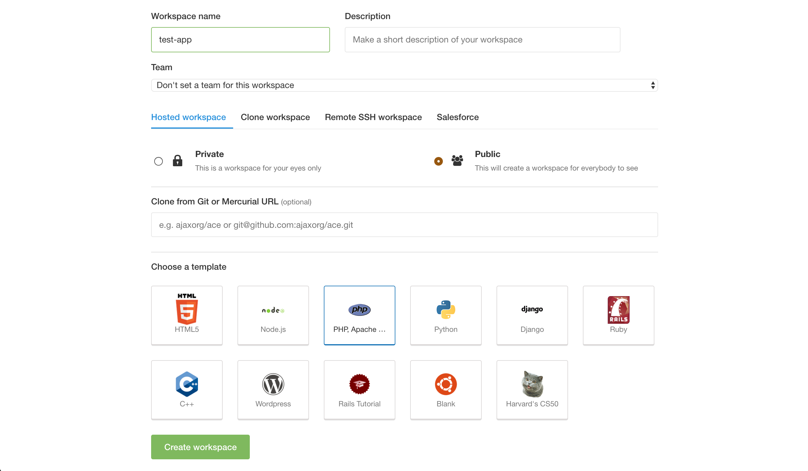
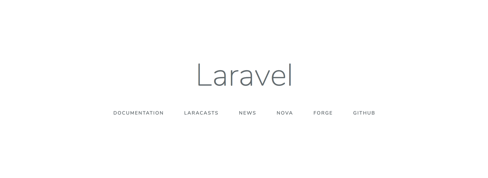

作成日：2019/02/08

更新日：2019/03/10

実行環境：cloud9

PHPバージョン：7.3.3

Laravelバージョン：5.8.3

## **目次**
- APIを用いたSPA
- 開発環境準備
- Laravelのインストール
- webサーバの設定変更
- vue.jsとvue-routerの準備
- todo管理アプリの作成

<div style="page-break-before:always"></div>

## **APIを用いたSPA**

- SPAとはSingle Page Applicationの略で，一つのページを表示して要素（コンポーネントとも）の切り替えのみで表示を制御するアプリケーションのこと．
- ページ遷移が少ない分，表示が高速或いはインタラクティブであり，近年のモダンなアプリケーションで多く使用されている．
- 今回は，サーバでの処理をlaravelのAPIで実装し，クライアント側ではvue-routerを用いたSPAを作成する．
- 内容はシンプルなタスクリストとし，CRUDの処理を一通り実装する．

<div style="page-break-before:always"></div>


## **開発環境準備**

- クラウド開発環境である「cloud9」を使用して開発を進める．

### **workspaceの準備**

- wokspaceとはアプリケーションを管理するフォルダのようなもの．
- 1つのwebアプリケーションに対して，1つのworkspace，という理解でOK．
- **name**  
アプリケーション名を入力．自身が区別できるものでOK．
- **description**  
アプリケーションの説明．任意で入力する．
- **Clone from Git or Mercurial URL (optional)**  
githubのリポジトリと連携することができる．後からでも連携できるが，この時点でgithubのリポジトリを作成して連携しておくほうが簡単なのでオススメ．
- **Choose a template**  
「PHP」を選択．
- 入力完了したら「Create workspace」をクリックするとworkspaceの作成が始まるのでしばらく待つ．
- 入力画面は下記

- workspace設定完了後の画面


<div style="page-break-before:always"></div>

## **Laravelのインストール**

- PHP及びcomposerの状況を確認しつつ，Laravelのインストールを進める．
- 「compoesr」とはPHPライブラリのインストールやバージョン管理を行う便利ツール．

### **1. PHPのバージョン確認**

- インストールされているPHPのバージョンを確認する．
- ターミナルでバージョン確認のコマンドを実行する．  

注意点（以降，ターミナルでの作業すべて）
- $マークは入力しない．
- 入力はすべて半角で行う．


ターミナルで以下を実行
```bash
$ php -v
```
出力結果（バージョンは5.5.9）
```bash
PHP 5.5.9-1ubuntu4.22 (cli) (built: Aug  4 2017 19:40:28) 
Copyright (c) 1997-2014 The PHP Group
Zend Engine v2.5.0, Copyright (c) 1998-2014 Zend Technologies
    with Zend OPcache v7.0.3, Copyright (c) 1999-2014, by Zend Technologies
    with Xdebug v2.5.5, Copyright (c) 2002-2017, by Derick Rethans
```

### **2. compoerのバージョン確認**

ターミナルで以下を実行
```bash
$ composer
```
出力結果（バージョンは1.5.1）
```
   ______
  / ____/___  ____ ___  ____  ____  ________  _____
 / /   / __ \/ __ `__ \/ __ \/ __ \/ ___/ _ \/ ___/
/ /___/ /_/ / / / / / / /_/ / /_/ (__  )  __/ /
\____/\____/_/ /_/ /_/ .___/\____/____/\___/_/
                    /_/
Composer version 1.5.1 2017-08-09 16:07:22

Usage:
  command [options] [arguments]
...
```

### **3. composerのアップデート**

ターミナルで以下を実行
```bash
$ sudo composer self-update
```
出力結果
```bash
Updating to version 1.8.4 (stable channel).
   Downloading (100%)         
Use composer self-update --rollback to return to version 1.5.1
```
再度バージョン確認
```bash
$ composer
```
実行結果（バージョンは1.8.4）
```bash
   ______
  / ____/___  ____ ___  ____  ____  ________  _____
 / /   / __ \/ __ `__ \/ __ \/ __ \/ ___/ _ \/ ___/
/ /___/ /_/ / / / / / / /_/ / /_/ (__  )  __/ /
\____/\____/_/ /_/ /_/ .___/\____/____/\___/_/
                    /_/
Composer version 1.8.4 2019-02-11 10:52:10

Usage:
  command [options] [arguments]
...
```

<div style="page-break-before:always"></div>

### **4. PHPのバージョンアップ**

- Laravelの最新バージョンでは「PHP7.1.3以上」が必要となる．
- 現在のバージョンは5.5.9なので，以下の手順でバージョンアップを行う．

ターミナルで以下を実行．
```bash
$ sudo add-apt-repository ppa:ondrej/php
```
以下が出力されるがEnter押下で続行
```bash
Press [ENTER] to continue or ctrl-c to cancel adding it
```
実行結果
```bash
...
gpg: keyring `/tmp/tmpgu2gq6me/secring.gpg' created
gpg: keyring `/tmp/tmpgu2gq6me/pubring.gpg' created
gpg: requesting key E5267A6C from hkp server keyserver.ubuntu.com
gpg: /tmp/tmpgu2gq6me/trustdb.gpg: trustdb created
gpg: key E5267A6C: public key "Launchpad PPA for Ondřej Surý" imported
gpg: Total number processed: 1
gpg:               imported: 1  (RSA: 1)
OK
```

引き続き，以下を実行  
```bash
$ sudo apt-get update
```
実行結果
```bash
...
Get:52 http://asia-east1.gce.clouds.archive.ubuntu.com trusty/universe i386 Packages [7597 kB]
Get:53 http://asia-east1.gce.clouds.archive.ubuntu.com trusty/multiverse i386 Packages [172 kB]
Fetched 37.0 MB in 18s (1971 kB/s)                                             
Reading package lists... Done
```

<div style="page-break-before:always"></div>

以下を実行
```bash
$ sudo apt-get install libapache2-mod-php7.3
```
途中で下記出力された場合はすべて「y」で続行
```bash
Do you want to continue? [Y/n]
```
実行結果
```bash
...
Creating config file /etc/php/7.3/apache2/php.ini with new version
libapache2-mod-php7.3: php5 module already enabled, not enabling PHP 7.3
Processing triggers for libc-bin (2.19-0ubuntu6.11) ...
```

以下を実行
```bash
$ sudo a2dismod php5
```
出力結果
```bash
Module php5 disabled.
To activate the new configuration, you need to run:
  service apache2 restart
```

以下を実行
```bash
$ sudo a2enmod php7.3
```
出力結果
```bash
Considering dependency mpm_prefork for php7.3:
Considering conflict mpm_event for mpm_prefork:
Considering conflict mpm_worker for mpm_prefork:
Module mpm_prefork already enabled
Considering conflict php5 for php7.3:
Enabling module php7.3.
To activate the new configuration, you need to run:
  service apache2 restart
```

以下を実行
```bash
$ sudo apt-get install php7.3-dom php7.3-mbstring php7.3-zip php7.3-mysql
```
途中で下記出力された場合はすべて「y」で続行
```bash
Do you want to continue? [Y/n]
```
実行結果
```bash
Creating config file /etc/php/7.3/mods-available/zip.ini with new version
Processing triggers for libc-bin (2.19-0ubuntu6.11) ...
Processing triggers for libapache2-mod-php7.3 (7.3.2-1+ubuntu14.04.1+deb.sury.org+1) ...
```

アップデート後のPHPバージョン確認
```bash
$ php -v
```
実行結果（バージョンは7.3.3）
```bash
PHP 7.3.3-1+ubuntu14.04.1+deb.sury.org+1 (cli) (built: Mar  7 2019 20:48:45) ( NTS )
Copyright (c) 1997-2018 The PHP Group
Zend Engine v3.3.2, Copyright (c) 1998-2018 Zend Technologies
    with Zend OPcache v7.3.2-1+ubuntu14.04.1+deb.sury.org+1, Copyright (c) 1999-2018, by Zend Technologies
```

<div style="page-break-before:always"></div>

### **5. Laravelインストーラの準備**

- Laravelインストーラーは下記の場所に配置される．
```
/home/ubuntu/.composer/vender/laravel/installer
```
- 実際のインストールや必要なコードの配置は「composer」コマンドで実行するため,
設置場所に留意する必要はない．
- 「composer」は他に必要なライブラリなども合わせてダウンロードして配置を行う．「composer」を使用しない場合，すべて自分でダウンロードして設置場所の設定も行う必要がある．

以下を実行．
```bash
$ sudo composer global require "laravel/installer"
```
実行結果
```bash
...
symfony/console suggests installing symfony/lock
guzzlehttp/guzzle suggests installing psr/log (Required for using the Log middleware)
Writing lock file
Generating autoload files
```

### **6. Laravelプロジェクトの作成**

- 実際にLaravelプロジェクトを作成する．
- インストールできる範囲で最新のLaravelがインストールされる．

以下を入力．（cmsという名前でプロジェクトを作成する）
```bash
$ composer create-project laravel/laravel spa
```
実行結果
```bash
...
Discovered Package: laravel/tinker
Discovered Package: nesbot/carbon
Discovered Package: nunomaduro/collision
Package manifest generated successfully.
> @php artisan key:generate --ansi
Application key set successfully.
```

以下でLaravelのバージョンを確認できる．
```bash
$ cd spa
$ php artisan --version
```
実行結果（バージョンは5.8.3）
```bash
Laravel Framework 5.8.3
```

### **【参考】Laravelのバージョン指定**

今回は最新版を使用してプロジェクトを作成しているが，バージョンを指定することもできる．

現在（2019年2月）で最新のLTS（長期サポートバージョン）は5.5となっているため，本番環境へのデプロイを意図する場合はバージョン5.5を指定したほうがサポート期間が長く安心である．

バージョン指定（5.5）する際には，プロジェクト作成時のコマンドを下記のように変更する．

```bash
$ composer create-project laravel/laravel spa 5.5.* --prefer-dist
```


### **7. Laravelのインストール確認**

- Laravelインストールの確認にはwebブラウザで動作させて確認する．
- cloud9にはwebサーバが標準で搭載されているため，以下の手順で確認を行う．

1. 「Run Project」ボタンをクリック．
2. 表示されたURLをクリックし「open」を選択．
3. 表示されたwebページで「Open the App」ボタンをクリック．
4. ディレクトリ構成の画面（下記）が表示される．

5. 以下のアドレスにアクセスし，トップページの表示を確認する．上の画面から「spa/」「public/」の順にクリックでもOK．
```
https://プロジェクト名-ユーザ名.c9users.io/spa/public/
```
6. 下記画面が表示されればインストール完了．


<div style="page-break-before:always"></div>

## **webサーバの設定変更**

- 現状では，ルートディレクトリでトップページが表示されず，「/spa/public/」を追加する必要がある．
- ドキュメントルートアクセス時にトップページが表示されるよう設定を変更する．

### ※ドキュメントルートとは？

- `https://hogehoge.com`などのURLにアクセスしたときに表示されるファイルの入っているディレクトリのこと．

変更前のトップページのURL
```
https://プロジェクト名-ユーザ名.c9users.io/spa/public/
```
変更後のトップページのURL
```
https://プロジェクト名-ユーザ名.c9users.io
```

### **1. webサーバのドキュメントルート変更**

ターミナルで以下を実行．vimというエディタで設定ファイルを開く．
```bash
$ sudo vim /etc/apache2/sites-enabled/001-cloud9.conf
```
実行結果
```
<VirtualHost *:8080>
    DocumentRoot /home/ubuntu/workspace
    ServerName https://${C9_HOSTNAME}:443

    LogLevel info

    ErrorLog ${APACHE_LOG_DIR}/error.log
    CustomLog ${APACHE_LOG_DIR}/access.log combined

    <Directory /home/ubuntu/workspace>
        Options Indexes FollowSymLinks
        AllowOverride All
        Require all granted
    </Directory>
</VirtualHost>

ServerName https://${C9_HOSTNAME}
# vim: syntax=apache ts=4 sw=4 sts=4 sr noet
```

「i」キーを押すと左下に「INSERT」が表示されるので，表示された状態で下記のように編集する．
```diff
<VirtualHost *:8080>
-   DocumentRoot /home/ubuntu/workspace
+   DocumentRoot /home/ubuntu/workspace/spa/public
    ServerName https://${C9_HOSTNAME}:443

    LogLevel info

    ErrorLog ${APACHE_LOG_DIR}/error.log
    CustomLog ${APACHE_LOG_DIR}/access.log combined

    <Directory /home/ubuntu/workspace>
        Options Indexes FollowSymLinks
        AllowOverride All
        Require all granted
    </Directory>
</VirtualHost>

ServerName https://${C9_HOSTNAME}
# vim: syntax=apache ts=4 sw=4 sts=4 sr noet
```

編集が終了したら「esc」を押下する．INSERTが消えるので，消えた状態で「:wq」を入力して「Enter」を押下して完了．


### **2. webサーバ設定完了後の画面確認**

- ターミナルのカレントディレクトリが「spa」であることを確認する．ターミナルの「$」の前が「`/spa`」となっていればOK．

- 「`/spa`」でない場合はターミナルで以下を実行してディレクトリを移動する．
```bash
$ cd spa
```
- ターミナルで以下のコマンドを実行．
```bash
$ sudo composer update
```
- 「Run Project」ボタンを押下．
- 下記のアドレスを入力し，トップ画面が表示されればOK．
```
https://プロジェクト名-ユーザ名.c9users.io
```
トップ画面


<div style="page-break-before:always"></div>

## **【参考】Laravelルートディレクトリのファイル構成**

主なディレクトリ構成を解説する．次項で挙げる，よく使用するディレクトリを押さえれば当面はOK．

### **app**

- アプリケーションのコアコードを配置する．
- ModelやControllerもここに配置．

### **bootstrap**

- フレームワークの初期起動やオートローディングなどの設定ファイルが含まれる．
- cache関連のファイルもここに保存される．

### **config**

- アプリケーションの設定ファイルが保存される．

### **database**

- データベースのマイグレーションファイルが保存される．

### **public**

- クライアントサイドのasset（css, javascriptなど）を配置する．
- ここがドキュメントルートとなる．

### **resources**

- Viewのファイルが保存される．

### **routes**

- ルーティングを行うファイルを配置する．

### **tests**

- 自動テストを配置する．

### **vendor**

- composerでインストールしたパッケージが配置される．

<div style="page-break-before:always"></div>

## **【参考】よく使用するディレクトリ&ファイル**

### **1. /.env**

- 環境設定に使用

### **2. /routes/web.php**

- ルーティングに使用

### **3. /resources/views/*****

- Viewで使用するファイルを設定，保存

### **4. /app/Http/controller/*****

- Model, Controllerを設定，保存

<div style="page-break-before:always"></div>

## **DBの準備**

1. 「`.env`」ファイルにデータベースの設定を記述する．spaディレクトリ直下に配置されている．

2. 「`.env`」ファイルは隠しファイルなので，表示されていない場合は，ファイルツリー画面右上の歯車マークをクリックして「Show Hidden Files」にチェックを入れると表示される．

3. 「`.env`」ファイルをダブルクリックして開く．

4. ファイルの内容を以下のように編集する．ユーザ名はURLの`ide.c9.io/`以下となる．

`.env`ファイルの内容
```diff
DB_CONNECTION=mysql
-DB_HOST=127.0.0.1
+DB_HOST=localhost
DB_PORT=3306
-DB_DATABASE=homestead
+DB_DATABASE=c9
-DB_USERNAME=homestead
+DB_USERNAME=ユーザ名
-DB_PASSWORD=secret
+DB_PASSWORD=
```


<div style="page-break-before:always"></div>

## **vue.jsとvue-routerの準備**

### **1. vue.jsの準備**

- 今回のSPAではフロントエンドの処理はjavascriptのフレームワークであるvue.jsを用いる．
- vue.jsはlaravelにバンドルされており，npmコマンドを用いるだけで利用可能になる．

ターミナルで以下のコマンドを実行する．（カレントディレクトリが`spa`であること）  
ある程度時間がかかるので気長に待つ．

```bash
$ npm install
```

実行結果
```bash
│ ├── pify@3.0.0 
│ └── semver@5.6.0 
└── vue@2.6.3 

npm WARN optional SKIPPING OPTIONAL DEPENDENCY: fsevents@^1.2.7 (node_modules/chokidar/node_modules/fsevents):
npm WARN notsup SKIPPING OPTIONAL DEPENDENCY: Unsupported platform for fsevents@1.2.7: wanted {"os":"darwin","arch":"any"} (current: {"os":"linux","arch":"x64"})
```

引き続き，以下のコマンドでコンパイルを実行する．

vue.jsでは記述したコードと実際に動作するプログラムが異なる．コードからプログラムを生成するためのコマンドである．

```bash
$ npm run dev
```

実行結果
```bash
 DONE  Compiled successfully in 11058ms                        3:53:42 AM

       Asset      Size   Chunks             Chunk Names
/css/app.css   171 KiB  /js/app  [emitted]  /js/app
  /js/app.js  1.36 MiB  /js/app  [emitted]  /js/app
  ```

### **2. vue-routerとaxiosの準備**

- vue-routerはtempleteなどを活用することでSPAを構築できるvue.jsのライブラリである．
- axiosはサーバとのhttp通信を行うライブラリで，できることはajaxに近いと考えるとわかりやすい．
- 今回のアプリケーションではvue-routerを用いて画面の切り替えを行い，axiosを用いてサーバとの通信を行う．

以下のコマンドを実行する．

```bash
$ npm install vue-router vue-axios --save
```

実行結果
```bash
├── vue-axios@2.1.4 
└── vue-router@3.0.2 

npm WARN optional SKIPPING OPTIONAL DEPENDENCY: fsevents@^1.2.7 (node_modules/chokidar/node_modules/fsevents):
npm WARN notsup SKIPPING OPTIONAL DEPENDENCY: Unsupported platform for fsevents@1.2.7: wanted {"os":"darwin","arch":"any"} (current: {"os":"linux","arch":"x64"})
```

これで一通りの準備は完了となる．

実装に入る前に下記のコマンドを実行しておくと良い．vue.jsのコードを記述した際，本来は都度コンパイルする必要があるが，下記コマンドを実行しておくと自動で実行される．

実行したら追加で新しくターミナルを開いておくと並行して作業ができるのでオススメ．

```bash
$ npm run watch
```

実行結果（そのままにしておく）

```bash
 DONE  Compiled successfully in 9624ms                         4:12:52 AM

       Asset      Size   Chunks             Chunk Names
/css/app.css   171 KiB  /js/app  [emitted]  /js/app
  /js/app.js  1.36 MiB  /js/app  [emitted]  /js/app
```


<div style="page-break-before:always"></div>

## **todo管理アプリの作成-目次**

1. DB&テーブル&モデルの作成
2. ルーティング
3. ビューの作成
4. コンポーネントの作成
5. API処理の実装
6. クライアントとサーバのデータ通信の実装


<div style="page-break-before:always"></div>

## **todo管理アプリの作成①-DB&テーブル&モデルの作成**

### **1. DBの準備**

記述したらDBの状態を確認する．ターミナルのカレントディレクトリが「spa」であることを確認する．ターミナルの「$」の前が「`/spa`」となっていればOK．

「`/spa`」でない場合はターミナルで以下を実行してディレクトリを移動する．
```bash
$ cd spa
```

続けて以下を入力し，mysqlを起動する．
```bash
$ mysql-ctl cli
```

実行結果．以降，mysql内で操作を行う．
```bash
...
Type 'help;' or '\h' for help. Type '\c' to clear the current input statement.

mysql> 
```

データベース一覧を表示し，「c9」が存在することを確認する．
```bash
mysql> show databases;
+--------------------+
| Database           |
+--------------------+
| information_schema |
| c9                 |
| mysql              |
| performance_schema |
| phpmyadmin         |
+--------------------+
5 rows in set (0.00 sec)
```

「c9」データベースを選択．
```bash
mysql> use c9;
Database changed
```

テーブルを表示するが，まだ設定していないので存在しない．
```bash
mysql> show tables;
Empty set (0.01 sec)
```

mysqlを終了する．通常のターミナルに戻る．
```bash
mysql> exit;
Bye
```

### **2. テーブルとモデルの作成**

- テーブルの設計と作成にはマイグレーションという手法を用いる．
- マイグレーションとは，必要なテーブルの構造をPHPファイル（マイグレーションファイル）で定義し，実行することでテーブルの作成を行うシステム．
- また，モデルはテーブルへの操作を行う部分であり，モデルを作成する際にテーブルの設定を記述する「マイグレーションファイル」を作成する．
- テーブル一つに対して，1つのマイグレーションファイルが対応するイメージ．
- マイグレーションファイルにカラム名などの設定を記述し，マイグレーションを実行することでテーブルが作成される仕組み．

下記コマンドで「Task」モデルと対応するマイグレーションファイルが作成する．

```bash
$ php artisan make:model Task -m
``` 

実行結果

```bash
Model created successfully.
Created Migration: 2019_02_08_042520_create_tasks_table
```

上記コマンドで`/database/migrations`に以下のようなマイグレーションファイルが作成される．

`yyyy_mm_dd_hhmmss_create_tasks_table.php`

マイグレーションファイルの内容は以下のようになっている．

```php
<?php

use Illuminate\Support\Facades\Schema;
use Illuminate\Database\Schema\Blueprint;
use Illuminate\Database\Migrations\Migration;

class CreateTasksTable extends Migration
{
    public function up()
    {
        Schema::create('tasks', function (Blueprint $table) {
            $table->increments('id');
            $table->timestamps();
        });
    }

    public function down()
    {
        Schema::dropIfExists('tasks');
    }
}
```

【解説】カラム名の追記は「`$table->カラム型('カラム名');`」のように行う．
```php
$table->increments('id');       //自動採番（主キー）
$table->string('email');        //varcharカラム
$table->string('name', 100);    //長さ指定カラム
$table->integer('price');       //integerカラム
$table->text('description');    //textカラム
$table->dateTime('created_at'); //datetimeカラム
$table->timestamps();           //created_atとupdated_atカラムを追加
$table->boolean('confirmed');   //true, falseカラム
$table->json('meta');           //jsonカラム
```

【解説】カラムのオプションは以下の通り．
```php
$table->string('email')->nullable();    //nullを許可
$table->string('email')->unique();      //カラムの値を一意にする
```

今回はtodo管理アプリケーションを作成するので，以下のカラムを追加する．
- title: タスク名
- deadline: タスクの締切
- comment: タスクの詳細

`yyyy_mm_dd_hhmmss_create_tasks_table.php`に必要なカラム名を追記する．
```diff
<?php

use Illuminate\Support\Facades\Schema;
use Illuminate\Database\Schema\Blueprint;
use Illuminate\Database\Migrations\Migration;

class CreateTasksTable extends Migration
{
    public function up()
    {
        Schema::create('tasks', function (Blueprint $table) {
            $table->increments('id');
+           $table->string('title');
+           $table->date('deadline');
+           $table->text('comment')->nullable();
            $table->timestamps();
        });
    }

    public function down()
    {
        Schema::dropIfExists('tasks');
    }
}
```

【注意】このままだと実行時にエラーになるので，文字列型の最大長を変更する．

`/app/Providers/AppServiceProvider.php`の内容を以下のように編集する．
```diff
<?php

namespace App\Providers;

use Illuminate\Support\ServiceProvider;
+ use Illuminate\Support\Facades\Schema;

class AppServiceProvider extends ServiceProvider
{
    public function boot()
    {
-       //
+       Schema::defaultStringLength(191);
    }

    public function register()
    {
        //
    }
}
```

また，`app`ディレクトリ直下にモデルファイルである`Task.php`が作成される．

`Task.php`を以下のように編集する．テーブルに登録できるカラムのホワイトリストを記述する．

```diff
<?php

namespace App;

use Illuminate\Database\Eloquent\Model;

class Task extends Model
{
-   //
+   protected $fillable = ['title', 'deadline', 'comment'];
}
```

マイグレーションファイルとモデルの準備が完了したら，マイグレーションを実行する．

ターミナルで以下を実行する．
```bash
$ php artisan migrate
```

実行結果
```bash
Migration table created successfully.
Migrating: 2014_10_12_000000_create_users_table
Migrated:  2014_10_12_000000_create_users_table
Migrating: 2014_10_12_100000_create_password_resets_table
Migrated:  2014_10_12_100000_create_password_resets_table
Migrating: 2019_02_08_042520_create_tasks_table
Migrated:  2019_02_08_042520_create_tasks_table
```

うまくいかないときはマイグレーションファイルを見直して以下を実行．
```bash
$ php artisan migrate:fresh
```

mysqlでテーブルの状況を確認する．ターミナルで以下を実行する．
```bash
$ mysql-ctl cli
```

実行結果
```bash
...
Type 'help;' or '\h' for help. Type '\c' to clear the current input statement.

mysql>
```

データベース変更．
```bash
mysql> use c9;
Reading table information for completion of table and column names
You can turn off this feature to get a quicker startup with -A

Database changed
```

テーブルを一覧表示．tasksテーブルが作成されていればOK．
```bash
mysql> show tables;
+-----------------+
| Tables_in_c9    |
+-----------------+
| migrations      |
| password_resets |
| tasks           |
| users           |
+-----------------+
4 rows in set (0.00 sec)
```

テーブルの構造確認．
```bash
mysql> desc tasks;
+------------+------------------+------+-----+---------+----------------+
| Field      | Type             | Null | Key | Default | Extra          |
+------------+------------------+------+-----+---------+----------------+
| id         | int(10) unsigned | NO   | PRI | NULL    | auto_increment |
| task       | varchar(191)     | NO   |     | NULL    |                |
| deadline   | date             | NO   |     | NULL    |                |
| comment    | text             | YES  |     | NULL    |                |
| created_at | timestamp        | YES  |     | NULL    |                |
| updated_at | timestamp        | YES  |     | NULL    |                |
+------------+------------------+------+-----+---------+----------------+
6 rows in set (0.01 sec)
```

mysql終了．
```bash
mysql> exit;
Bye
```

これでテーブルの設定は完了．

### 【参考】よく使うマイグレーションコマンドまとめ

マイグレーション実行
```bash
$ php artisan migrate
```

直前に実行したマイグレーションをロールバックする．
```bash
$ php artisan migrate:rollback
```

全てロールバックしてからマイグレーションを再度実行する．
```bash
$ php artisan migrate:refresh
```

全てのテーブルを削除して再度マイグレーションを実行する．
```bash
$ php artisan migrate:fresh
```

マイグレーション状況を出力する．
```bash
$ php artisan migrate:status
```

<div style="page-break-before:always"></div>

## **todo管理アプリの作成②-ルーティング**

### **1. ルートとは**

`https://******.c9users.io/`のURLドメインの最後の「`/`」がルートとなる．

### **2. ルーティング**

例：

`https://******.c9users.io/`  
`https://******.c9users.io/home`  
`https://******.c9users.io/login`

上の「`/`」と「`****`」がルーティングで指定できる場所．ルーティングは「`/`」以降の文字列を使用し，アプリケーションの処理と紐付ける．

### **3. ルーティングファイルの作成**

今回はSPAにするため，どのURLにアクセスが来ても単一のビューを表示する．

ルーティングファイルは`/routes/web.php`で，内容は以下．
```php
<?php

Route::get('/', function () {
    return view('welcome');
});
```

今回は以下のように`/routes/web.php`を編集する．全てのURLに対するアクセスで`task.blade.php`を表示する．`view()`の引数である`task`が`task.blade.php`を表す．

```diff
<?php

- Route::get('/', function () {
-     return view('welcome');
- });

+Route::get('/{any}', function () {
+     return view('tasks');
+})->where('any', '.*');
```


<div style="page-break-before:always"></div>

## **todo管理アプリの作成③-ビューの作成**

- 今回のアプリケーションでは，表示するビューは一つだけなので，`task.blade.php`を作成する．
- また，実際に画面に表示するデザインはvue.js側で実装するため，ここで作成するビューはhtmlの雛形が主となる．

### **1. テンプレートの定義**

- Laravelのビューではテンプレートエンジン「bladeテンプレート」を使用する．
- テンプレートを用いてビュー表示を行う際には，ファイル名に「`*****.blade.php`」の拡張子をつける．

### **2. ビューファイルの設置場所**

- Laravelのビューは全て「`resources/views`」配下に設置する．
- 今回の場合，階層を含めたファイルパスは以下のようになる．
```bash
/resources/views/task.blade.php
```

### **3. ビューファイルの作成**

`/resources/views`ディレクトリに`tasks.blade.php`ファイルを作成する．（作成した時点では空の状態）

作成した`tasks.blade.php`の内容に以下を追記する．

```html
<!doctype html>
<html lang="{{ str_replace('_', '-', app()->getLocale()) }}">
    <head>
        <meta charset="utf-8">
        <meta name="viewport" content="width=device-width, initial-scale=1">
        <title>Laravue</title>
        <link href="https://fonts.googleapis.com/css?family=Nunito:200,600" rel="stylesheet" type="text/css">
        <link href="{{ mix('css/app.css') }}" type="text/css" rel="stylesheet" />
        <meta name="csrf-token" value="{{ csrf_token() }}" />
    </head>
    <body>
        <div id="app">
          <example-component></example-component>
        </div>
        <script src="{{ mix('js/app.js') }}" type="text/javascript"></script>
    </body>
</html>
```

### **4. ビューの確認**

必要なビューが全て揃ったので，ブラウザで表示を確認する．

以下にアクセスする．
```bash
https://プロジェクト名-ユーザ名.c9users.io/
```

まだコンポーネントを作成していないので，下記のようなサンプルビューが表示される．


<div style="page-break-before:always"></div>

## **todo管理アプリの作成④-コンポーネントの作成**

- 今回はvue.js上でページのパーツである「コンポーネント」を作成し，条件に応じて切り替えを行ってページ遷移を表現する．
- 流れは以下の通り．

1. ライブラリの準備
2. 個別パーツの作成
3. 個別パーツのルーティング
4. 共通パーツの作成

### **1. ライブラリの準備**

インストール関連はすでに準備の項で終了しているので，ライブラリの呼び出しを記述する．

`/resources/js/app.js`を開き，以下のように編集する．vue-routerとaxiosを呼び出し，使用できる状態にしている．

```diff
require('./bootstrap');
window.Vue = require('vue');
+import VueRouter from 'vue-router';
+Vue.use(VueRouter);

+import VueAxios from 'vue-axios';
+import axios from 'axios';
+Vue.use(VueAxios, axios);

Vue.component('example-component', require('./components/ExampleComponent.vue').default);

-const app = new Vue({
-   el: '#app'
-});

+const router = new VueRouter({ mode: 'history'});
+const app = new Vue(Vue.util.extend({ router })).$mount('#app');
```

### **2. 個別パーツの作成**

- 個別パーツ（コンポーネント）は`/resources/js/components`ディレクトリに作成する．
- リクエストされたURLに応じて，対応するコンポーネントを呼び出す仕組みとなる．

`/resources/js/components`に以下の4ファイルを作成する．

1. `HomeComponent.vue`
2. `CreateComponent.vue`
3. `EditComponent.vue`
4. `IndexComponent.vue`

作成したらそれぞれについて下記を追加．

`HomeComponent.vue`

```html
<template>
  <div class="row justify-content-center">
      <div class="col-md-8">
          <div class="card card-default">
              <div class="card-header">Home Component</div>

              <div class="card-body">
                  I'm the Home Component component.
              </div>
          </div>
      </div>
  </div>
</template>

<script>
    export default {
        mounted() {
            console.log('Component mounted.')
        }
    }
</script>
```

`CreateComponent.vue`

```html
<template>
  <div class="row justify-content-center">
      <div class="col-md-8">
          <div class="card card-default">
              <div class="card-header">Create Component</div>

              <div class="card-body">
                  I'm the Create Component component.
              </div>
          </div>
      </div>
  </div>
</template>

<script>
    export default {
        mounted() {
            console.log('Component mounted.')
        }
    }
</script>
```

`EditComponent.vue`

```html
<template>
  <div class="row justify-content-center">
      <div class="col-md-8">
          <div class="card card-default">
              <div class="card-header">Edit Component</div>

              <div class="card-body">
                  I'm an Edit component.
              </div>
          </div>
      </div>
  </div>
</template>

<script>
    export default {
        mounted() {
            console.log('Example Component mounted.')
        }
    }
</script>
```

`IndexComponent.vue`

```html
<template>
  <div class="row justify-content-center">
      <div class="col-md-8">
          <div class="card card-default">
              <div class="card-header">Index Component</div>

              <div class="card-body">
                  I'm an Index component.
              </div>
          </div>
      </div>
  </div>
</template>

<script>
    export default {
        mounted() {
            console.log('Index Component mounted.')
        }
    }
</script>
```

### **3. 個別パーツのルーティング**

- 続いて，各URLにコンポーネントを対応させるルーティングを作成する．
- ルーティングは`/resources/js/app.js`に記述する．

`/resources/js/app.js`を以下のように編集する．

```diff
require('./bootstrap');
window.Vue = require('vue');
import VueRouter from 'vue-router';
Vue.use(VueRouter);
import VueAxios from 'vue-axios';
import axios from 'axios';
+import App from './App.vue';
Vue.use(VueAxios, axios);

+import HomeComponent from './components/HomeComponent.vue';
+import CreateComponent from './components/CreateComponent.vue';
+import IndexComponent from './components/IndexComponent.vue';
+import EditComponent from './components/EditComponent.vue';

-Vue.component('example-component', require('./components/ExampleComponent.vue').default);
+const routes = [
+ {
+     name: 'home',
+     path: '/',
+     component: HomeComponent
+ },
+ {
+     name: 'create',
+     path: '/create',
+     component: CreateComponent
+ },
+ {
+     name: 'tasks',
+     path: '/tasks',
+     component: IndexComponent
+ },
+ {
+     name: 'edit',
+     path: '/edit/:id',
+     component: EditComponent
+ }
+];

-const router = new VueRouter({ mode: 'history'});
+const router = new VueRouter({ mode: 'history', routes: routes});
-const app = new Vue(Vue.util.extend({ router })).$mount('#app');
+const app = new Vue(Vue.util.extend({ router }, App)).$mount('#app');
```

### **4. 共通パーツの作成**

- 共通パーツはどのURLへのリクエストにも共通して表示されるコンポーネントである．
- 共通パーツとして，`/resources/js/App.vue`を作成する．

作成した`/resources/js/App.vue`を以下のように編集する．

```html
<template>
    <div class="container">
        <router-view></router-view>
    </div>
</template>

<script>
    export default{
    }
</script>
```

ここまで記述したらブラウザ下記4つのURLにアクセスする．

それぞれ異なるコンポーネントが呼び出されることを確認する．

1. `https://プロジェクト名-ユーザ名.c9users.io/`
2. `https://プロジェクト名-ユーザ名.c9users.io/tasks`
3. `https://プロジェクト名-ユーザ名.c9users.io/create`
4. `https://プロジェクト名-ユーザ名.c9users.io/edit/1`

どの場合でも構成は共通した画面で，コンポーネントが切り替わる動作となる．  
（下図は`https://プロジェクト名-ユーザ名.c9users.io/tasks`アクセス時の例）


このままでアクセスがしにくいので，共通パーツにナビゲーションバーを設置する．合わせて登録画面にフォームを設置する．

`/resources/js/App.vue`を以下のように編集する．

```diff
<template>
    <div class="container">
+       <nav class="navbar navbar-expand-sm bg-dark navbar-dark">
+           <ul class="navbar-nav">
+               <li class="nav-item">
+                   <router-link to="/" class="nav-link">Home</router-link>
+               </li>
+               <li class="nav-item">
+                   <router-link to="/create" class="nav-link">Create Task</router-link>
+               </li>
+               <li class="nav-item">
+                   <router-link to="/tasks" class="nav-link">Tasks</router-link>
+               </li>
+           </ul>
+       </nav>
        <router-view></router-view>
    </div>
</template>

<script>
    export default{
    }
</script>
```

ブラウザで表示を確認する．下記のようにナビゲーションが表示されるので，リンクすると表示が切り替わることを確認しよう．


続いて，登録用フォームを設置する．

`/resources/js/components/CreateComponent.vue`を開き，下記のように編集する．フォームの要素とともに，`<script>`部分でv-modelで展開する`task`変数を定義している．

また，登録処理（入力データの送信）を行う`addTask()`関数も合わせて定義している．

```diff
<template>
-   <div class="row justify-content-center">
-       <div class="col-md-8">
-           <div class="card card-default">
-               <div class="card-header">Create Component</div>
-               <div class="card-body">
-                   I'm the Create Component component.
-               </div>
-           </div>
-       </div>
-   </div>
+   <div>
+       <h1>Create A Task</h1>
+       <form @submit.prevent="addTask">
+           <div class="row">
+               <div class="col-md-6">
+                   <div class="form-group">
+                       <label>Task Title:</label>
+                       <input type="text" class="form-control" v-model="task.title">
+                   </div>
+                   <div class="form-group">
+                       <label>Task Deadline:</label>
+                       <input type="date" class="form-control" v-model="task.deadline">
+                   </div>
+               </div>
+           </div>
+           <div class="row">
+               <div class="col-md-6">
+                   <div class="form-group">
+                       <label>Task Comment:</label>
+                       <textarea class="form-control" v-model="task.comment" rows="5"></textarea>
+                   </div>
+               </div>
+           </div>
+           <div class="form-group">
+               <button class="btn btn-primary">Submit</button>
+           </div>
+       </form>
+   </div>
</template>

<script>
    export default {
+       data(){
+           return {
+               task:{}
+           }
+       },
+       methods: {
+           addTask(){
+               console.log(this.task);
+           }
+       }
-       mounted() {
-           console.log('Component mounted.')
-       }
    }
</script>
```

記述したら`https://プロジェクト名-ユーザ名.c9users.io/create`にアクセスし，下記のように表示されればOK．


<div style="page-break-before:always"></div>

## **todo管理アプリの作成⑤-API処理の実装**

- ここまでで各URLアクセス時に表示されるコンポーネントを作成した．
- ここからは，サーバ側でCRUDの処理を行うAPIを実装する．

### **1. コントローラとコレクションの作成**

まず，API処理の関数を定義するコントローラファイルを作成する．

ターミナルで以下を実行する．

```bash
$ php artisan make:controller TaskController
```

実行結果
```bash
Controller created successfully.
```

コントローラファイルは`/app/Http/Controllers/TaskController.php`が作成される．

また，モデルとクライアント側でデータをやり取りする際にjson形式への変換が必要となるため，変換を支援するコレクションを作成する．

ターミナルで下記を実行する．

```bash
$ php artisan make:resource TaskCollection
```

実行結果

```bash
Resource collection created successfully.
```

コレクションファイルは`/app/Http/Resources/TaskCollection.php`が作成される．（特に追記等は必要なし）

### **2. コントローラでCRUD関数の作成**

`/spa/app/Http/Controllers/TaskController.php`を開き，以下のように編集する．まず初めに「登録」のためのstore()関数を定義している．

```diff
<?php

namespace App\Http\Controllers;

use Illuminate\Http\Request;
+use App\Http\Resources\TaskCollection;
+use App\Task;

class TaskController extends Controller
{
-   //
+   public function store(Request $request)
+   {
+     $task = new Task([
+       'title' => $request->get('title'),
+       'deadline' => $request->get('deadline'),
+       'comment' => $request->get('comment')
+     ]);
+     $task->save();
+     return response()->json('success');
+   }
}
```

引き続き，「表示」「更新」「削除」の処理を追加する．

```diff
class PostController extends Controller
{
    public function store(Request $request)
    {...}

+   public function index()
+   {
+     return new TaskCollection(Task::all());
+   }

+   public function edit($id)
+   {
+     $task = Task::find($id);
+     return response()->json($task);
+   }

+   public function update($id, Request $request)
+   {
+     $task = Task::find($id);
+     $task->update($request->all());
+     return response()->json('successfully updated');
+   }

+   public function delete($id)
+   {
+     $task = Task::find($id);
+     $task->delete();
+     return response()->json('successfully deleted');
+   }
}
```

### **3. API処理のルーティング**

上記で作成したAPI処理を実行するためのルーティングを作成する．

各URLを設定し，リクエストに応じて各APIの処理が実行されるよう記述する．

`/routes/api.php`を以下のように編集する．

```diff
<?php

use Illuminate\Http\Request;

Route::middleware('auth:api')->get('/user', function (Request $request) {
    return $request->user();
});

+Route::post('/task/create', 'TaskController@store');
+Route::get('/task/edit/{id}', 'TaskController@edit');
+Route::post('/task/update/{id}', 'TaskController@update');
+Route::delete('/task/delete/{id}', 'TaskController@delete');
+Route::get('/tasks', 'TaskController@index');
```

これでサーバ側のAPIは完成．


<div style="page-break-before:always"></div>

## **todo管理アプリの作成⑥-クライアントとサーバのデータ通信の実装**

### **1. データ送信処理**

- データ送信はaxiosライブラリを使用する．
- これまでに作成したフォームから，入力した内容をAPIのURL宛にリクエストし，DBへの登録を行う．

`/resources/js/components/CreateComponent.vue`を以下のように編集する．axiosにurlと変数`task`を設定し，formのsubmit時に関数を実行している．

```diff
<script>
    export default {
        data(){
            return {
                task:{}
            }
        },
        methods: {
            addTask(){
                console.log(this.task);
+               const uri = '/api/task/create';
+               this.axios.post(uri, this.task).then((response) => {
+                   this.$router.push({name: 'tasks'});
+               });
            }
        }
    }
</script>
```

送信処理だけでは結果の確認ができないので，表示の処理も作成する．

### **2. データ受信&表示処理**

- DBに保存されているデータを一覧で表示する．
- こちらも登録と同様にaxiosを用いた通信を使用する．

`/spa/resources/js/components/IndexComponent.vue`を以下のように編集する．

```diff
<template>
-   <div class="row justify-content-center">
-       <div class="col-md-8">
-           <div class="card card-default">
-               <div class="card-header">Index Component</div>
-               <div class="card-body">
-                   I'm an Index component.
-               </div>
-           </div>
-       </div>
-   </div>
+   <div>
+       <h1>Posts</h1>
+       <div class="row">
+           <div class="col-md-10"></div>
+           <div class="col-md-2">
+             <router-link :to="{ name: 'create' }" class="btn btn-primary">Create Task</router-link>
+           </div>
+       </div>
+       <table class="table table-hover">
+           <thead>
+           <tr>
+               <th>ID</th>
+               <th>Task</th>
+               <th>Deadline</th>
+               <th>Comment</th>
+               <th>Edit</th>
+               <th>Delete</th>
+           </tr>
+           </thead>
+           <tbody>
+               <tr v-for="task in tasks" :key="task.id">
+                   <td>{{ task.id }}</td>
+                   <td>{{ task.title }}</td>
+                   <td>{{ task.deadline }}</td>
+                   <td>{{ task.comment }}</td>
+                   <td><router-link :to="{name: 'edit', params: { id: task.id }}" class="btn btn-primary">Edit</router-link></td>
+                   <td><button class="btn btn-danger">Delete</button></td>
+               </tr>
+           </tbody>
+       </table>
+   </div>
</template>

<script>
    export default {
-       mounted() {
-           console.log('Index Component mounted.')
-       }
+       data() {
+           return {
+               tasks: []
+           }
+       },
+       created() {
+           const uri = '/api/tasks';
+           this.axios.get(uri).then(response => {
+               this.tasks = response.data.data;
+           });
+       }
    }
</script>
```

登録と表示の処理を記述したので，ブラウザで確認する．

登録ページのフォームからタスクを登録し，表示画面で下記のように表示されればOK．


### **3. データ更新処理**

- 更新ボタンクリック時に更新ページに移動する．
- 更新ページでは更新したいデータを読込時に表示し，編集して送信するとDBのデータを更新する．

`/resources/js/components/EditComponent.vue`を以下のように編集する．

```diff
<template>
-   <div class="row justify-content-center">
-       <div class="col-md-8">
-           <div class="card card-default">
-               <div class="card-header">Edit Component</div>
-               <div class="card-body">
-                   I'm an Edit component.
-               </div>
-           </div>
-       </div>
-   </div>
+   <div>
+       <h1>Edit Task</h1>
+       <form @submit.prevent="updatePost">
+           <div class="row">
+               <div class="col-md-6">
+                   <div class="form-group">
+                       <label>Task Title:</label>
+                       <input type="text" class="form-control" v-model="task.title">
+                   </div>
+                   <div class="form-group">
+                       <label>Task Deadline:</label>
+                       <input type="date" class="form-control" v-model="task.deadline">
+                   </div>
+               </div>
+           </div>
+           <div class="row">
+               <div class="col-md-6">
+                   <div class="form-group">
+                       <label>Task Comment:</label>
+                       <textarea class="form-control" v-model="task.comment" rows="5"></textarea>
+                   </div>
+               </div>
+           </div>
+           <div class="form-group">
+               <button class="btn btn-primary">Update</button>
+           </div>
+       </form>
+   </div>
</template>

<script>
    export default {
-       mounted() {
-           console.log('Example Component mounted.')
-       }
+       data() {
+           return {
+               task: {}
+           }
+       },
+       created() {
+           const uri = `/api/task/edit/${this.$route.params.id}`;
+           this.axios.get(uri).then((response) => {
+              this.task = response.data;
+           });
+       },
+       methods: {
+           updatePost() {
+               const uri = `/api/task/update/${this.$route.params.id}`;
+               this.axios.post(uri, this.task).then((response) => {
+                   this.$router.push({name: 'tasks'});
+               });
+           }
+       }
    }
</script>
```

ファイルを編集したらブラウザで確認する．

一覧ページからeditボタンをクリックして，編集ページへ表示が切り替わることを確認する．`<input>`や`<textarea>`に内容が表示されていればOK．


続いて，更新の処理を実行する．上記の編集ページで値を任意に変更し，Updateボタンをクリックする．一覧画面に移動して内容が更新されていればOK．


### **4. データ削除処理**

- 削除ボタンクリック時に削除処理を実行する．
- 特に別ページがないため，IndexComponentファイルに関数を追加する．`created(){}`の後に`,`が必要な点に注意．

`/spa/resources/js/components/IndexComponent.vue`を以下のように編集する．

```diff
...
<td>{{ task.comment }}</td>
<td><router-link :to="{name: 'edit', params: { id: task.id }}" class="btn btn-primary">Edit</router-link></td>
-<td><button class="btn btn-danger">Delete</button></td>
+<td><button class="btn btn-danger" @click.prevent="deleteTask(task.id)">Delete</button></td>
...
<script>
    export default {
        data() {...},
        created() {...},
+       methods: {
+           deleteTask(id)
+           {
+               const uri = `/api/task/delete/${id}`;
+               this.axios.delete(uri).then(response => {
+                   this.tasks.splice(this.tasks.indexOf(id), 1);
+               });
+           }
+       }
    }
</script>
```

ブラウザで適当にデータを登録し，削除ボタンクリック時にデータが削除されればOK．

ここまでで，laravelのAPIとvue-routerを用いたCRUD処理のSPAが完成となる．

いずれの処理を実行する際にも，画面の更新や遷移は発生せず，コンポーネントの切り替えのみで実行されている点に着目しよう．


