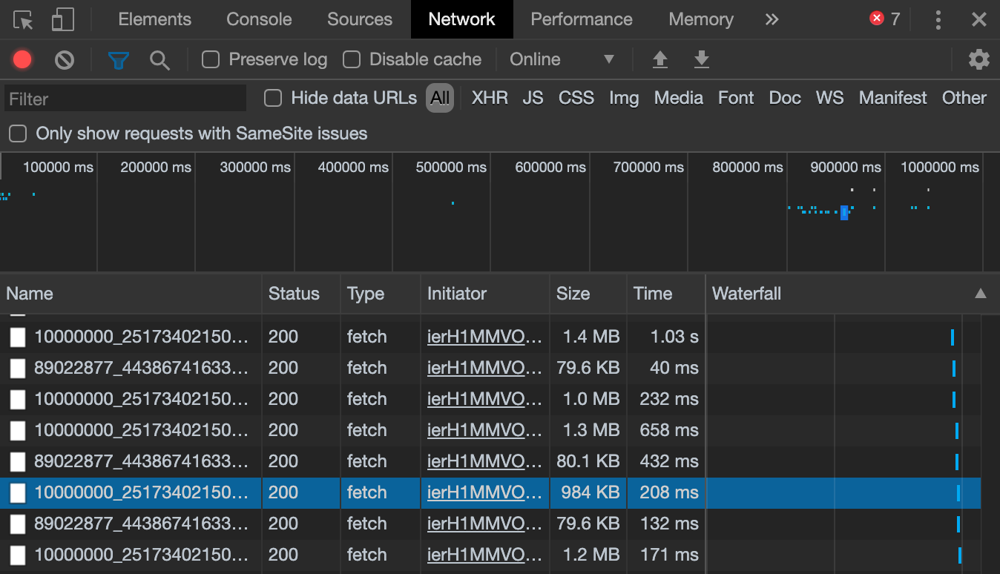

作成日：2020/03/01

## どうした？？

- webサイトの動画をダウンロードしたい．
- 検証画面から要素を確認したが，`<video>`の`src`がblob形式になっており，動画ファイルにアクセスできなかった（下図）．
- ※小さめの動画では`<video>`タグから直接ダウンロードできる．

videoタグの例
```html
<video height="282" width="500" preload="auto" style="" class="_ox1 _21y0 _1_d1" data-video-width="500" data-video-height="282" data-original-aspect-ratio="1.7777777777778" id="u_0_21" src="blob:https://hogehoge.com/xxxxxxxxx"></video>
```

## 解決策

- 検証ツールから`Network`タブを開く．
- 動画を再生し，暫く待つ．
- 数秒ごとに下図のようにデータが読み込まれる．
- 適当なものを右クリックし，`copy` -> `copy link address`を選択（下図のハイライト部分）．
- コピーしたURLをブラウザのアドレスバーに貼り付ける．
- URLの最後に`&bytestart=1234567&byteend=9876543`のような文字列があるので削除する（数値は適当）．
- リンクにアクセスすると動画ファイルが読み込まれるので，ダウンロードすればOK！




## 考察

- サイズが大きいファイルは細かく分割されて一定時間ごとに読み込みしているらしい．
- 元のファイルから分割した開始位置と終了位置を指定してURLを発行しているらしい．
- 読み込み元のファイルを参照して，開始位置と終了位置の指定をなくせばファイル本体にアクセスできる．

今回はここまで( `･ω･)b
