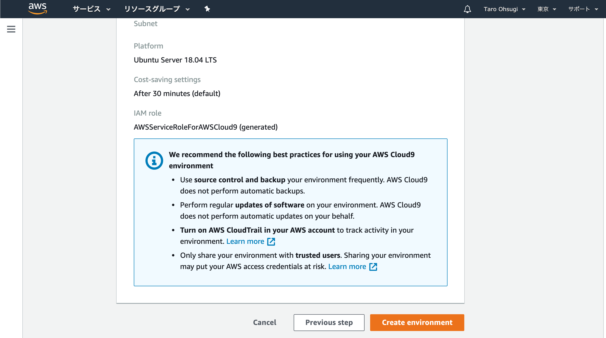

- 作成日：2021/01/04

- 更新日：2021/01/04

## はじめに

Laravel8 では多くの新機能が追加され，これまでのバージョンと比較しても異なる部分が多い．todo アプリケーションの実装を通して，基本的な CRUD 処理を実現する．

## 環境構築

- クラウド開発環境である「aws cloud9」を使用して開発を進める．
- ローカルの仮想サーバ（virtual box & vagrant）を用いて環境を準備する方法もあるが，やや手順が多くなるため今回はオンラインの環境を活用する．

### environment の準備

- environment とはアプリケーションを動作させる環境．AWS 上に仮想マシンが立ち上がる．
- 1 つの web アプリケーションに対して，1 つの environment，という理解で OK．

まず，AWS のマネジメントコンソールから「cloud9」を探してアクセスする．


下記の画面になるので「create environment」をクリック．


名前を適当に入力．（Description は任意）


【重要】「Platform」は「`ubuntu server 18.04 LTS`」を選択．「Instance type」は「`t2.micro`」を選択．その他はデフォルトで「create environment」をクリック．


確認画面が出るので「next step」をクリック．



しばらく待つと下記の画面が表示される．これで準備完了．


### 仮想マシンの容量追加（EC2 操作）

environment を作成したことで，AWS 上に仮想マシンが割り当てられた状態となる．しかし，初期状態では容量不足になってしまう．そのため，設定を変更して容量を増やす．

1. AWS の画面の左上「Services」->「EC2」にアクセスする．

2. 画面左側のメニューから「Instances」をクリックする．

3. インスタンス（仮想マシン）の一覧が表示されるので，該当するもの（Running になっているもの）にチェックを入れる．

4. 画面下に表示されるタブの「Storage」をクリックし，表示された「Volume ID」のリンクをクリックする．

5. 画面上部の「Actions」をクリックし，「Modify Volume」を選択．「Size」を「10」から「20」に変更し，「Modify」をクリック．なにか訊かれたら「Yes」．

6. 画面左側のメニューから「Instances」をクリック．該当するインスタンスにチェックを入れて「Instance State」->「Reboot Instance」．なにか訊かれたら「Reboot」で進む．

ここまでで仮想マシンの設定は終了．

設定確認のため，Cloud9 画面のターミナルで下記をコマンド実行する．

```bash
$ df -h
```

出力結果

```bash
Filesystem      Size  Used Avail Use% Mounted on
udev            476M     0  476M   0% /dev
tmpfs            98M  788K   98M   1% /run
/dev/xvda1       20G  8.7G   11G  45% /
tmpfs           490M     0  490M   0% /dev/shm
tmpfs           5.0M     0  5.0M   0% /run/lock
tmpfs           490M     0  490M   0% /sys/fs/cgroup
/dev/loop0       13M   13M     0 100% /snap/amazon-ssm-agent/495
/dev/loop1       88M   88M     0 100% /snap/core/5328
/dev/loop2       33M   33M     0 100% /snap/amazon-ssm-agent/2996
/dev/loop3       56M   56M     0 100% /snap/core18/1944
/dev/loop4       98M   98M     0 100% /snap/core/10577
tmpfs            98M     0   98M   0% /run/user/1000
```

`/dev/xvda1`の Size が 20G になっていれば OK．

### swap メモリ作成

無料で作成できるインスタンスは実行メモリが 512MB しかなく，途中でメモリ不足になる．

そのため，ストレージから 1GB の容量を借りてきてメモリに割り当てる（これを swap 領域と呼ぶ）．

Cloud9 のターミナルで下記コマンドを実行する．swap 領域作成のためのファイルを作成している．

```bash
$ sudo dd if=/dev/zero of=/swapfile bs=1M count=1024
```

実行結果

```bash
1024+0 records in
1024+0 records out
1073741824 bytes (1.1 GB, 1.0 GiB) copied, 13.9046 s, 77.2 MB/s
```

続いて，下記コマンド実行する．作成した swap ファイルの権限を変更し，swap 領域を準備する．

```bash
$ sudo chmod 600 /swapfile
$ sudo mkswap /swapfile
```

実行結果

```bash
Setting up swapspace version 1, size = 1024 MiB (1073737728 bytes)
no label, UUID=a0e6a190-14b0-4766-95d5-89bd37782a24
```

下記コマンドを実行する．実際に swap 領域を作成し，メモリの状況を確認する．

```bash
$ sudo swapon /swapfile
$ free --mega
```

実行結果

```bash
              total        used        free      shared  buff/cache   available
Mem:           1002         475          75           2         451         376
Swap:          1548          13        1535
```

`Swap:`の`total`が 1500 程度になっていれば OK．

### Node.js の更

Laravel（7 以降）では，JS や CSS をビルドする必要があり，その際に Node.js が使用される（実際に Node.js を書くことはない）．

しかし，AWS Cloud9 では Node.js のバージョンが古く，ビルド時に失敗する．そのため，Node.js を最新バージョンに更新する．

Node.js のバージョンを確認するため，Cloud9 のターミナルで下記コマンドを実行する．

```bash
$ node -v
v10.23.0
```

アップデートするため，下記コマンドを実行する．LTS（安定バージョン）の最新版をインストールする．

`nvm`は Node.js の管理ツールであり，AWS Cloud9 にははじめからインストールされている．

```bash
$ nvm install --lts
```

実行結果

```bash
Installing latest LTS version.
Downloading https://nodejs.org/dist/v14.15.3/node-v14.15.3-linux-x64.tar.xz...
################################################################################# 100.0%
Now using node v14.15.3 (npm v6.14.9)
nvm_ensure_default_set: a version is required
```

アップデート後のバージョンを確認する．

```bash
$ node -v
v14.15.3
```

`14.*.*`のバージョンであれば問題ない．

### PHP の更新

Laravel の最新版では，PHP7.2.25 以上が必要となるが，AWS Cloud9 上でインストールされているバージョンは 7.2.24 であるため，アップデートが必要になる．

今回は最新である PHP8 にアップデートする．

以下はバージョンの確認コマンド．

```bash
$ php -v
PHP 7.2.24-0ubuntu0.18.04.7 (cli) (built: Oct  7 2020 15:24:25) ( NTS )
Copyright (c) 1997-2018 The PHP Group
Zend Engine v3.2.0, Copyright (c) 1998-2018 Zend Technologies
    with Zend OPcache v7.2.24-0ubuntu0.18.04.7, Copyright (c) 1999-2018, by Zend Technologies
    with Xdebug v2.6.0, Copyright (c) 2002-2018, by Derick Rethans
```

アップデートの準備をする．下記コマンドを実行する．今回の OS「Ubuntu」では，`apt`と呼ばれるパッケージ管理ツールを使用する．まずは`apt`に PHP のリポジトリを追加する（追加することで`apt`が PHP を扱えるようになる）．

```bash
$ sudo add-apt-repository ppa:ondrej/php
```

なにか訊かれたら Enter で続行．

```bash
...
# LC_ALL=C.UTF-8 add-apt-repository ppa:ondrej/php
 More info: https://launchpad.net/~ondrej/+archive/ubuntu/php
Press [ENTER] to continue or Ctrl-c to cancel adding it.
```

実行結果

```bash
...
Get:7 http://ppa.launchpad.net/ondrej/php/ubuntu bionic/main amd64 Packages [81.2 kB]
Get:8 http://ppa.launchpad.net/ondrej/php/ubuntu bionic/main Translation-en [31.7 kB]
Fetched 222 kB in 1s (154 kB/s)
Reading package lists... Done
```

下記コマンドを実行し，`apt`が管理しているパッケージの最新バージョンをチェックする（たまにエラーになる場合があるが，少し待ってから再度実行するとうまくいく）．

```bash
$ sudo apt-get update
```

実行結果

```bash
...
Hit:5 http://ppa.launchpad.net/ondrej/php/ubuntu bionic InRelease
Get:6 http://security.ubuntu.com/ubuntu bionic-security InRelease [88.7 kB]
Fetched 88.7 kB in 1s (124 kB/s)
Reading package lists... Done
```

下記コマンドを実行し，PHP の 8 をインストールする．

```bash
$ sudo apt-get install libapache2-mod-php8.0
```

なにか訊かれたら`y`を入力して Enter

```bash
...
1 upgraded, 7 newly installed, 0 to remove and 24 not upgraded.
Need to get 4528 kB of archives.
After this operation, 20.2 MB of additional disk space will be used.
Do you want to continue? [Y/n]
```

実行結果

```bash
...
Creating config file /etc/php/8.0/apache2/php.ini with new version
libapache2-mod-php8.0: php7.2 module already enabled, not enabling PHP 8.0
Processing triggers for man-db (2.8.3-2ubuntu0.1) ...
Processing triggers for libc-bin (2.27-3ubuntu1.4) ...
Processing triggers for php8.0-cli (8.0.0-1+ubuntu18.04.1+deb.sury.org+1) ...
Processing triggers for libapache2-mod-php8.0 (8.0.0-1+ubuntu18.04.1+deb.sury.org+1) ...
```

下記コマンドを実行し，現在の PHP7.2 を無効化する．

```bash
$ sudo a2dismod php7.2
```

実行結果

```bash
Module php7.2 disabled.
To activate the new configuration, you need to run:
  systemctl restart apache2
```

下記コマンドを実行し，インストールした PHP8 を有効にする．

```bash
$ sudo a2enmod php8.0
```

実行結果

```bash
Considering dependency mpm_prefork for php8.0:
Considering conflict mpm_event for mpm_prefork:
Considering conflict mpm_worker for mpm_prefork:
Module mpm_prefork already enabled
Considering conflict php5 for php8.0:
Enabling module php8.0.
To activate the new configuration, you need to run:
  systemctl restart apache2
```

下記コマンドを実行し，周辺のモジュールをインストールする．

```bash
$ sudo apt-get install php8.0-dom php8.0-mbstring php8.0-zip php8.0-mysql
```

なにか訊かれたら`y`を入力して Enter．

```bash
After this operation, 2685 kB of additional disk space will be used.
Do you want to continue? [Y/n]
```

実行結果

```bash
...
Creating config file /etc/php/8.0/mods-available/zip.ini with new version
Processing triggers for libapache2-mod-php8.0 (8.0.0-1+ubuntu18.04.1+deb.sury.org+1) ...
Processing triggers for libc-bin (2.27-3ubuntu1.4) ...
Processing triggers for php8.0-cli (8.0.0-1+ubuntu18.04.1+deb.sury.org+1) ...
```

PHP のバージョンを確認し，8 になっていれば OK．

```bash
$ php -v
PHP 8.0.0 (cli) (built: Nov 27 2020 12:26:05) ( NTS )
Copyright (c) The PHP Group
Zend Engine v4.0.0-dev, Copyright (c) Zend Technologies
    with Zend OPcache v8.0.0, Copyright (c), by Zend Technologies
```

### composer のインストール

`Compoesr`は PHP の依存性管理ツールである．依存性管理ツールとは，あるライブラリに必要な別のライブラリなどを一括で管理していくれるものである．

Laravel ではプロジェクト作成やライブラリのインストールなど，多岐にわたって使用するため，インストールが必要になる．

Cloud9 のターミナルで下記コマンドを実行し，必要なファイルをダウンロードする．

```bash
$ curl -sS https://getcomposer.org/installer | php
```

実行結果

```bash
All settings correct for using Composer
Downloading...

Composer (version 2.0.8) successfully installed to: /home/ubuntu/environment/composer.phar
Use it: php composer.phar
```

下記コマンドを実行する．Composer は決まったディレクトリにファイルを置かないと動作しないため，ダウンロードしたファイルを移動している．

```bash
$ sudo mv composer.phar /usr/bin/composer
```

`composer`と入力することでバージョンなどが確認できる．

```bash
$ composer
```

実行結果

```bash
   ______
  / ____/___  ____ ___  ____  ____  ________  _____
 / /   / __ \/ __ `__ \/ __ \/ __ \/ ___/ _ \/ ___/
/ /___/ /_/ / / / / / / /_/ / /_/ (__  )  __/ /
\____/\____/_/ /_/ /_/ .___/\____/____/\___/_/
                    /_/
Composer version 2.0.8 2020-12-03 17:20:38
...
```

上記のようなバージョン情報が表示されれば OK（細かいバージョンは異なっていて問題なし）．

ここまでで，Laravel でアプリケーションを作成する土台が完成した．

## Laravel プロジェクトの作成

### インストーラの準備

下記コマンドを実行．

```bash
$ sudo composer global require "laravel/installer"
```

yes を入力して Enter

```bash
Continue as root/super user [yes]?
```

実行結果

```bash
...
6 package suggestions were added by new dependencies, use `composer suggest` to see details.
Generating autoload files
10 packages you are using are looking for funding.
Use the `composer fund` command to find out more!
```

下記コマンドを実行．

```bash
$ composer create-project laravel/laravel laravel_todo
```

実行結果

```bash
Package manifest generated successfully.
73 packages you are using are looking for funding.
Use the `composer fund` command to find out more!
> @php artisan key:generate --ansi
Application key set successfully.
```

project ディレクトリに移動

```bash
$ cd laravel_todo
```

バージョン確認

```bash
$ php artisan --version
Laravel Framework 8.20.1
```

### ライブラリ準備

認証用の Laravel Breeze

```bash
$ composer require laravel/breeze --dev
```

実行結果

```bash
...
Discovered Package: nesbot/carbon
Discovered Package: nunomaduro/collision
Package manifest generated successfully.
73 packages you are using are looking for funding.
Use the `composer fund` command to find out more!
```

インストール

```bash
$ php artisan breeze:install
```

実行結果

```bash
Breeze scaffolding installed successfully.
Please execute the "npm install && npm run dev" command to build your assets.
```

その他必要なパッケージをインストールしてビルド

```bash
$ npm install && npm run dev
```

実行結果

```bash
 DONE  Compiled successfully in 35024ms                                       3:03:55 AM

       Asset      Size   Chunks             Chunk Names
/css/app.css  3.75 MiB  /js/app  [emitted]  /js/app
  /js/app.js   669 KiB  /js/app  [emitted]  /js/app
```

### MySQL の準備

下記コマンドを実行，

```bash
$ sudo mysql
```

実行結果
管理者でログインできる

```bash
...
Type 'help;' or '\h' for help. Type '\c' to clear the current input statement.

mysql>
```

下記コマンドを実行．
ユーザ名 root パスワード root で入れるように設定する．

```bash
mysql> ALTER USER 'root'@'localhost' IDENTIFIED WITH mysql_native_password BY 'root';
```

実行結果

```bash
Query OK, 0 rows affected (0.02 sec)
```

ログアウトする．

```bash
mysql> exit;
Bye
```

ユーザ名 roo パスワード root でログインできることを確認する．
下記コマンドを実行．

```bash
$ mysql -u root -p
```

パスワードを求められるので「root」を入力（表示されない）
実行結果

```bash
Type 'help;' or '\h' for help. Type '\c' to clear the current input statement.

mysql>
```

データベースを作成する．
データベース名は laravel_todo
下記コマンドを実行．

```bash
mysql> create database laravel_todo;
```

実行結果

```bash
Query OK, 1 row affected (0.00 sec)
```

下記コマンドを実行して確認．

```bash
mysql> show databases;
+--------------------+
| Database           |
+--------------------+
| information_schema |
| laravel_todo       |
| mysql              |
| performance_schema |
| sys                |
+--------------------+
5 rows in set (0.02 sec)
```

ログアウトする．

```bash
mysql> exit;
Bye
```

### Laravel から DB に接続するための準備

.env ファイルを開き，以下のように編集する．

```env
DB_CONNECTION=mysql
DB_HOST=localhost         // 編集
DB_PORT=3306
DB_DATABASE=laravel_todo  // 編集
DB_USERNAME=root
DB_PASSWORD=root          // 編集
```

.env ファイルを更新したらキャッシュをクリアする．

```bash
$ php artisan config:cache
```

実行結果

```bash
Configuration cache cleared!
Configuration cached successfully!
```

### https と http 混在状態で動作するように設定

AWScloud9 で動かす場合，https と http が混在する問題があり，下記設定を行わないとトップページ以外動作しない．
`laravel_todo/app/Http/Middleware/TrustProxies.php`を以下のように編集する．

```php
<?php

namespace App\Http\Middleware;

use Fideloper\Proxy\TrustProxies as Middleware;
use Illuminate\Http\Request;

class TrustProxies extends Middleware
{
  /**
   * The trusted proxies for this application.
   *
   * @var array|string|null
   */
  // ↓この1行を追加
  protected $proxies = '*';

  /**
   * The headers that should be used to detect proxies.
   *
   * @var int
   */
  protected $headers = Request::HEADER_X_FORWARDED_ALL;
}
```

編集したらインスタンス再起動．

### 動作確認

新しくターミナルを立ち上げ，下記コマンドを実行．

```bash
$ cd laravel_todo
```

サーバを立ち上げる．

```bash
$ php artisan serve --port=8080
```

実行結果

```bash
Starting Laravel development server: http://127.0.0.1:8080
[Thu Dec 31 03:24:59 2020] PHP 8.0.0 Development Server (http://127.0.0.1:8080) started
```

Previwe -> Preview Running Application で右下に小さいウインドウが表示される．
「Browser ボタンの右側の資格が重なったようなボタン」で新規タブで開ける．右下のウインドウは閉じて OK．
サーバは「Ctrl + c」で停止できる．

下のような画面が表示されれば OK．

[初期画面の画像]()

## todo アプリケーションの準備

### テーブル設計（マイグレーション）

モデルとマイグレーションファイルを作成する．
下記コマンドを実行．

```bash
$ php artisan make:model Todo -m
```

実行結果（日付時刻は毎回変わる）

```bash
Model created successfully.
Created Migration: 2020_12_31_033638_create_todos_table
```

`laravel_todo/database/migration/2020_12_31_033638_create_todos_table.php`を開く．
下記にように編集する．

```php
<?php

use Illuminate\Database\Migrations\Migration;
use Illuminate\Database\Schema\Blueprint;
use Illuminate\Support\Facades\Schema;

class CreateTodosTable extends Migration
{
  /**
   * Run the migrations.
   *
   * @return void
   */
  public function up()
  {
    Schema::create('todos', function (Blueprint $table) {
      $table->id();
      // ↓追加
      $table->string('todo');
      $table->date('deadline');
      $table->text('comment')->nullable();
      // ↑ここまで
      $table->timestamps();
    });
  }

  /**
   * Reverse the migrations.
   *
   * @return void
   */
  public function down()
  {
    Schema::dropIfExists('todos');
  }
}
```

最大文字列長を変更する．
`/project01/app/Providers/AppServiceProvider.php`の内容を以下のように編集する．

```php
<?php

namespace App\Providers;

use Illuminate\Support\ServiceProvider;
use Illuminate\Support\Facades\Schema;  // 追記

class AppServiceProvider extends ServiceProvider
{
  /**
   * Register any application services.
   *
   * @return void
   */
  public function register()
  {
    //
  }

  /**
   * Bootstrap any application services.
   *
   * @return void
   */
  public function boot()
  {
    Schema::defaultStringLength(191); // 追記
  }
}
```

マイグレーションを実行するとテーブルが作成される．
以下のコマンドを実行．

```bash
$ php artisan migrate
```

実行結果

```bash
Migration table created successfully.
Migrating: 2014_10_12_000000_create_users_table
Migrated:  2014_10_12_000000_create_users_table (31.23ms)
Migrating: 2014_10_12_100000_create_password_resets_table
Migrated:  2014_10_12_100000_create_password_resets_table (29.71ms)
Migrating: 2019_08_19_000000_create_failed_jobs_table
Migrated:  2019_08_19_000000_create_failed_jobs_table (30.85ms)
Migrating: 2020_12_31_033638_create_todos_table
Migrated:  2020_12_31_033638_create_todos_table (14.63ms)
```

エラーになる場合はマイグレーションファイルの内容が間違っていることが多い．
修正して以下のコマンドを実行する．

```bash
$ php artisan migrate:fresh
```

うまくいったら，mysql にログインしてテーブルを確認する．

```bash
$ mysql -u root -p

mysql> use laravel_todo;
Reading table information for completion of table and column names
You can turn off this feature to get a quicker startup with -A

Database changed

mysql> show tables;
+------------------------+
| Tables_in_laravel_todo |
+------------------------+
| failed_jobs            |
| migrations             |
| password_resets        |
| todos                  |
| users                  |
+------------------------+
5 rows in set (0.00 sec)

mysql> desc todos;
+------------+---------------------+------+-----+---------+----------------+
| Field      | Type                | Null | Key | Default | Extra          |
+------------+---------------------+------+-----+---------+----------------+
| id         | bigint(20) unsigned | NO   | PRI | NULL    | auto_increment |
| todo       | varchar(191)        | NO   |     | NULL    |                |
| deadline   | date                | NO   |     | NULL    |                |
| comment    | text                | YES  |     | NULL    |                |
| created_at | timestamp           | YES  |     | NULL    |                |
| updated_at | timestamp           | YES  |     | NULL    |                |
+------------+---------------------+------+-----+---------+----------------+
6 rows in set (0.00 sec)

mysql> exit;
Bye

```

## ルーティングとコントローラ

### ルーティングとコントローラの作成

コントローラとルーティングの説明

コントローラとルーティングを作成する．
下記コマンドを実行する．

```bash
$ php artisan make:controller TodoController --resource
```

実行結果

```bash
Controller created successfully.
```

`/laravel_todo/routes/web.php`を以下のように編集する．

```php
<?php

use Illuminate\Support\Facades\Route;
use App\Http\Controllers\TodoController;

Route::get('/', function () {
  return view('welcome');
});

// 下記1行を追記
Route::resource('todo', TodoController::class);

Route::get('/dashboard', function () {
  return view('dashboard');
})->middleware(['auth'])->name('dashboard');

require __DIR__ . '/auth.php';

```

ルーティングの一覧は下記で確認できる．

```bash
$ php artisan route:list
```

実行結果（ユーザ操作などは省略）
この表は非常に重要．

```bash
+--------+-----------+---------------------------------+---------------------+------------------------------------------------+--------------+
| Domain | Method    | URI                             | Name                | Action                                         | Middleware   |
+--------+-----------+---------------------------------+---------------------+------------------------------------------------+--------------+
|        | GET|HEAD  | todo                            | todo.index          | App\Http\Controllers\TodoController@index      | web          |
|        | POST      | todo                            | todo.store          | App\Http\Controllers\TodoController@store      | web          |
|        | GET|HEAD  | todo/create                     | todo.create         | App\Http\Controllers\TodoController@create     | web          |
|        | GET|HEAD  | todo/{todo}                     | todo.show           | App\Http\Controllers\TodoController@show       | web          |
|        | PUT|PATCH | todo/{todo}                     | todo.update         | App\Http\Controllers\TodoController@update     | web          |
|        | DELETE    | todo/{todo}                     | todo.destroy        | App\Http\Controllers\TodoController@destroy    | web          |
|        | GET|HEAD  | todo/{todo}/edit                | todo.edit           | App\Http\Controllers\TodoController@edit       | web          |
+--------+-----------+---------------------------------+---------------------+------------------------------------------------+--------------+
```

### コントローラの実装（一部）

`/laravel_todo/app/Http/Controllers/TodoController.php`の内容を以下のように編集する．

```php
<?php

namespace App\Http\Controllers;

use Illuminate\Http\Request;

// 下記2行を追加
use Validator;
use App\Models\Todo;

class TodoController extends Controller
{
  /**
   * Display a listing of the resource.
   *
   * @return \Illuminate\Http\Response
   */
  public function index()
  {
    // 追加
    return view('todo.index');
  }

  /**
   * Show the form for creating a new resource.
   *
   * @return \Illuminate\Http\Response
   */
  public function create()
  {
    // 追記
    return view('todo.create');
  }

  /**
   * Store a newly created resource in storage.
   *
   * @param  \Illuminate\Http\Request  $request
   * @return \Illuminate\Http\Response
   */
  public function store(Request $request)
  {
    //
  }

  /**
   * Display the specified resource.
   *
   * @param  int  $id
   * @return \Illuminate\Http\Response
   */
  public function show($id)
  {
    //
  }

  /**
   * Show the form for editing the specified resource.
   *
   * @param  int  $id
   * @return \Illuminate\Http\Response
   */
  public function edit($id)
  {
    //
  }

  /**
   * Update the specified resource in storage.
   *
   * @param  \Illuminate\Http\Request  $request
   * @param  int  $id
   * @return \Illuminate\Http\Response
   */
  public function update(Request $request, $id)
  {
    //
  }

  /**
   * Remove the specified resource from storage.
   *
   * @param  int  $id
   * @return \Illuminate\Http\Response
   */
  public function destroy($id)
  {
    //
  }
}

```

## ビュー（画面）の作成

### 共通画面の調整

`latavel_todo/resources/view/layouts/app.blade.php`を以下のように編集する．

```php
<!DOCTYPE html>
<html lang="{{ str_replace('_', '-', app()->getLocale()) }}">

<head>
  <meta charset="utf-8">
  <meta name="viewport" content="width=device-width, initial-scale=1">
  <meta name="csrf-token" content="{{ csrf_token() }}">

  <title>{{ config('app.name', 'Laravel') }}</title>

  <!-- Fonts -->
  <link rel="stylesheet" href="https://fonts.googleapis.com/css2?family=Nunito:wght@400;600;700&display=swap">

  <!-- Styles -->
  <!-- ↓変更 -->
  <link rel="stylesheet" href="{{ secure_asset('css/app.css') }}">

  <!-- Scripts -->
  <!-- ↓変更 -->
  <script src="{{ secure_asset('js/app.js') }}" defer></script>
</head>

<body class="font-sans antialiased">
  <div class="min-h-screen bg-gray-100">
    @include('layouts.navigation')

    <!-- Page Heading -->
    <header class="bg-white shadow">
      <div class="max-w-7xl mx-auto py-6 px-4 sm:px-6 lg:px-8">
        {{ $header }}
      </div>
    </header>

    <!-- Page Content -->
    <main>
      {{ $slot }}
    </main>
  </div>
</body>

</html>
```

### 共通パーツ（エラー表示）の作成

`latavel_todo/resources/view`の中に`common`フォルダを作成する．
`common`フォルダの中に`errors.blade.php`ファイルを作成する．

`errors.blade.php`に以下の内容を記述する．

```php
@if (count($errors) > 0)
<div>
  <div class="font-medium text-red-600">
    {{ __('Whoops! Something went wrong.') }}
  </div>

  <ul class="mt-3 list-disc list-inside text-sm text-red-600">
    @foreach ($errors->all() as $error)
    <li>{{ $error }}</li>
    @endforeach
  </ul>
</div>
@endif
```

### 共通パーツ（ナビゲーションバー）の作成

`laravel_todo/resources/views/layouts/navigation.blade.php`の内容を以下のように編集する．

```php
<nav x-data="{ open: false }" class="bg-white border-b border-gray-100">
  <!-- Primary Navigation Menu -->
  <div class="max-w-7xl mx-auto px-4 sm:px-6 lg:px-8">
    <div class="flex justify-between h-16">
      <div class="flex">
        <!-- Logo -->
        <div class="flex-shrink-0 flex items-center">
          <a href="{{ route('dashboard') }}">
            <x-application-logo class="block h-10 w-auto fill-current text-gray-600" />
          </a>
        </div>

        <!-- Navigation Links -->
        <div class="hidden space-x-8 sm:-my-px sm:ml-10 sm:flex">
          <x-nav-link :href="route('dashboard')" :active="request()->routeIs('dashboard')">
            {{ __('Dashboard') }}
          </x-nav-link>
        </div>
        <!-- ↓一覧ページへのリンクを追加 -->
        <div class="hidden space-x-8 sm:-my-px sm:ml-10 sm:flex">
          <x-nav-link :href="route('todo.index')" :active="request()->routeIs('todo.index')">
            {{ __('Index') }}
          </x-nav-link>
        </div>
        <!-- ↓作成ページへのリンクを追加 -->
        <div class="hidden space-x-8 sm:-my-px sm:ml-10 sm:flex">
          <x-nav-link :href="route('todo.create')" :active="request()->routeIs('todo.create')">
            {{ __('Create') }}
          </x-nav-link>
        </div>
      </div>

      <!-- Settings Dropdown -->
      <div class="hidden sm:flex sm:items-center sm:ml-6">
        <x-dropdown align="right" width="48">
          <x-slot name="trigger">
            <button class="flex items-center text-sm font-medium text-gray-500 hover:text-gray-700 hover:border-gray-300 focus:outline-none focus:text-gray-700 focus:border-gray-300 transition duration-150 ease-in-out">
              <div>{{ Auth::user()->name }}</div>

              <div class="ml-1">
                <svg class="fill-current h-4 w-4" xmlns="http://www.w3.org/2000/svg" viewBox="0 0 20 20">
                  <path fill-rule="evenodd" d="M5.293 7.293a1 1 0 011.414 0L10 10.586l3.293-3.293a1 1 0 111.414 1.414l-4 4a1 1 0 01-1.414 0l-4-4a1 1 0 010-1.414z" clip-rule="evenodd" />
                </svg>
              </div>
            </button>
          </x-slot>

          <x-slot name="content">
            <!-- Authentication -->
            <form method="POST" action="{{ route('logout') }}">
              @csrf

              <x-dropdown-link :href="route('logout')" onclick="event.preventDefault();
                                                this.closest('form').submit();">
                {{ __('Logout') }}
              </x-dropdown-link>
            </form>
          </x-slot>
        </x-dropdown>
      </div>

      <!-- Hamburger -->
      <div class="-mr-2 flex items-center sm:hidden">
        <button @click="open = ! open" class="inline-flex items-center justify-center p-2 rounded-md text-gray-400 hover:text-gray-500 hover:bg-gray-100 focus:outline-none focus:bg-gray-100 focus:text-gray-500 transition duration-150 ease-in-out">
          <svg class="h-6 w-6" stroke="currentColor" fill="none" viewBox="0 0 24 24">
            <path :class="{'hidden': open, 'inline-flex': ! open }" class="inline-flex" stroke-linecap="round" stroke-linejoin="round" stroke-width="2" d="M4 6h16M4 12h16M4 18h16" />
            <path :class="{'hidden': ! open, 'inline-flex': open }" class="hidden" stroke-linecap="round" stroke-linejoin="round" stroke-width="2" d="M6 18L18 6M6 6l12 12" />
          </svg>
        </button>
      </div>
    </div>
  </div>

  <!-- Responsive Navigation Menu -->
  <div :class="{'block': open, 'hidden': ! open}" class="hidden sm:hidden">
    <div class="pt-2 pb-3 space-y-1">
      <x-responsive-nav-link :href="route('dashboard')" :active="request()->routeIs('dashboard')">
        {{ __('Dashboard') }}
      </x-responsive-nav-link>
    </div>
    <!-- ↓一覧ページへのリンクを追加 -->
    <div class="pt-2 pb-3 space-y-1">
      <x-responsive-nav-link :href="route('todo.index')" :active="request()->routeIs('todo.index')">
        {{ __('Index') }}
      </x-responsive-nav-link>
    </div>
    <!-- ↓作成ページへのリンクを追加 -->
    <div class="pt-2 pb-3 space-y-1">
      <x-responsive-nav-link :href="route('todo.create')" :active="request()->routeIs('todo.create')">
        {{ __('Create') }}
      </x-responsive-nav-link>
    </div>

    <!-- Responsive Settings Options -->
    <div class="pt-4 pb-1 border-t border-gray-200">
      <div class="flex items-center px-4">
        <div class="flex-shrink-0">
          <svg class="h-10 w-10 fill-current text-gray-400" xmlns="http://www.w3.org/2000/svg" fill="none" viewBox="0 0 24 24" stroke="currentColor">
            <path stroke-linecap="round" stroke-linejoin="round" stroke-width="2" d="M16 7a4 4 0 11-8 0 4 4 0 018 0zM12 14a7 7 0 00-7 7h14a7 7 0 00-7-7z" />
          </svg>
        </div>

        <div class="ml-3">
          <div class="font-medium text-base text-gray-800">{{ Auth::user()->name }}</div>
          <div class="font-medium text-sm text-gray-500">{{ Auth::user()->email }}</div>
        </div>
      </div>

      <div class="mt-3 space-y-1">
        <!-- Authentication -->
        <form method="POST" action="{{ route('logout') }}">
          @csrf

          <x-responsive-nav-link :href="route('logout')" onclick="event.preventDefault();
                                        this.closest('form').submit();">
            {{ __('Logout') }}
          </x-responsive-nav-link>
        </form>
      </div>
    </div>
  </div>
</nav>
```

## データ作成処理と参照処理の作成

### 個別画面（todo 作成画面と todo 一覧画面）の作成

`latavel_todo/resources/view`の中に`todo`フォルダを作成する．
`todo`フォルダの中に以下のファイルを作成する．

- `index.blade.php`
- `create.blade.php`
- `show.blade.php`
- `edit.blade.php`

`index.blade.php`を以下のように編集する．

```php
<x-app-layout>
  <x-slot name="header">
    <h2 class="font-semibold text-xl text-gray-800 leading-tight">
      {{ __('Todo Index') }}
    </h2>
  </x-slot>

  <div class="py-12">
    <div class="max-w-7xl mx-auto sm:w-10/12 md:w-8/10 lg:w-8/12">
      <div class="bg-white overflow-hidden shadow-sm sm:rounded-lg">
        <div class="p-6 bg-white border-b border-gray-200">
          <table class="text-center w-full border-collapse">
            <thead>
              <tr>
                <th class="py-4 px-6 bg-grey-lightest font-bold uppercase text-lg text-grey-dark border-b border-grey-light">todo</th>
                <th class="py-4 px-6 bg-grey-lightest font-bold uppercase text-lg text-grey-dark border-b border-grey-light">deadline</th>
                <th class="py-4 px-6 bg-grey-lightest font-bold uppercase text-lg text-grey-dark border-b border-grey-light">actions</th>
              </tr>
            </thead>
            <tbody>
              @foreach ($todos as $todo)
              <tr class="hover:bg-grey-lighter">
                <td class="py-4 px-6 border-b border-grey-light">
                  <a href="{{ route('todo.show',$todo->id) }}">{{$todo->todo}}</a>
                </td>
                <td class="py-4 px-6 border-b border-grey-light">{{$todo->deadline}}</td>
                <td class="py-4 px-6 border-b border-grey-light flex justify-center">
                  <form action="{{ route('todo.edit',$todo->id) }}" method="GET">
                    @csrf
                    <button type="submit" class="mr-2 ml-2 text-sm bg-black hover:bg-gray-900 hover:shadow-none text-white py-1 px-2 focus:outline-none focus:shadow-outline">
                      <svg class="h-6 w-6 text-gray-500" fill="none" viewBox="0 0 24 24" stroke="white">
                        <path stroke-linecap="round" stroke-linejoin="round" stroke-width="2" d="M11 5H6a2 2 0 00-2 2v11a2 2 0 002 2h11a2 2 0 002-2v-5m-1.414-9.414a2 2 0 112.828 2.828L11.828 15H9v-2.828l8.586-8.586z" />
                      </svg>
                    </button>
                  </form>
                  <form action="{{ route('todo.destroy',$todo->id) }}" method="POST">
                    @method('delete')
                    @csrf
                    <button type="submit" class="mr-2 ml-2 text-sm bg-black hover:bg-gray-900 hover:shadow-none text-white py-1 px-2 focus:outline-none focus:shadow-outline">
                      <svg class="h-6 w-6 text-gray-500" fill="none" viewBox="0 0 24 24" stroke="white">
                        <path stroke-linecap="round" stroke-linejoin="round" stroke-width="2" d="M19 7l-.867 12.142A2 2 0 0116.138 21H7.862a2 2 0 01-1.995-1.858L5 7m5 4v6m4-6v6m1-10V4a1 1 0 00-1-1h-4a1 1 0 00-1 1v3M4 7h16" />
                      </svg>
                    </button>
                  </form>
                </td>
              </tr>
              @endforeach
            </tbody>
          </table>
        </div>
      </div>
    </div>
  </div>
</x-app-layout>
```

`create.php`を以下のように編集する．

```php
<x-app-layout>
  <x-slot name="header">
    <h2 class="font-semibold text-xl text-gray-800 leading-tight">
      {{ __('Create New Todo') }}
    </h2>
  </x-slot>

  <div class="py-12">
    <div class="max-w-7xl mx-auto sm:w-8/12 md:w-1/2 lg:w-5/12">
      <div class="bg-white overflow-hidden shadow-sm sm:rounded-lg">
        <div class="p-6 bg-white border-b border-gray-200">
          @include('common.errors')
          <form class="mb-6" action="{{ route('todo.store') }}" method="POST">
            @csrf
            <div class="flex flex-col mb-4">
              <label class="mb-2 uppercase font-bold text-lg text-grey-darkest" for="todo">Todo</label>
              <input class="border py-2 px-3 text-grey-darkest" type="text" name="todo" id="todo">
            </div>
            <div class="flex flex-col mb-4">
              <label class="mb-2 uppercase font-bold text-lg text-grey-darkest" for="deadline">Deadline</label>
              <input class="border py-2 px-3 text-grey-darkest" type="date" name="deadline" id="deadline">
            </div>
            <div class="flex flex-col mb-4">
              <label class="mb-2 uppercase font-bold text-lg text-grey-darkest" for="comment">Comment</label>
              <input class="border py-2 px-3 text-grey-darkest" type="text" name="comment" id="comment">
            </div>
            <button type="submit" class="w-full py-3 mt-6 font-medium tracking-widest text-white uppercase bg-black shadow-lg focus:outline-none hover:bg-gray-900 hover:shadow-none">
              Create
            </button>
          </form>
        </div>
      </div>
    </div>
  </div>
</x-app-layout>
```

編集したらブラウザから`amazonaws.com/todo/create`にアクセスして動作確認．
下記画面になっていれば OK．

`index.blade.php`を以下のように編集する．

```php
<x-app-layout>
  <x-slot name="header">
    <h2 class="font-semibold text-xl text-gray-800 leading-tight">
      {{ __('Todo Index') }}
    </h2>
  </x-slot>

  <div class="py-12">
    <div class="max-w-7xl mx-auto sm:w-10/12 md:w-8/10 lg:w-8/12">
      <div class="bg-white overflow-hidden shadow-sm sm:rounded-lg">
        <div class="p-6 bg-white border-b border-gray-200">
          <table class="text-center w-full border-collapse">
            <thead>
              <tr>
                <th class="py-4 px-6 bg-grey-lightest font-bold uppercase text-lg text-grey-dark border-b border-grey-light">todo</th>
                <th class="py-4 px-6 bg-grey-lightest font-bold uppercase text-lg text-grey-dark border-b border-grey-light">deadline</th>
                <th class="py-4 px-6 bg-grey-lightest font-bold uppercase text-lg text-grey-dark border-b border-grey-light">actions</th>
              </tr>
            </thead>
            <tbody>
              @foreach ($todos as $todo)
              <tr class="hover:bg-grey-lighter">
                <td class="py-4 px-6 border-b border-grey-light">
                  <p>{{$todo->todo}}</p>
                </td>
                <td class="py-4 px-6 border-b border-grey-light">{{$todo->deadline}}</td>
                <td class="py-4 px-6 border-b border-grey-light flex justify-center">
                  <!-- 更新ボタン -->
                  <!-- 削除ボタン -->
                </td>
              </tr>
              @endforeach
            </tbody>
          </table>
        </div>
      </div>
    </div>
  </div>
</x-app-layout>
```

こっちはまだエラー．

`/laravel_todo/app/Http/Controllers/TodoController.php`の`index()`を内容を以下のように編集する．

```php
public function index()
{
  return view('todo.index', [
    'todos' => []
  ]);
}
```

編集したらブラウザから`amazonaws.com/todo`にアクセスして動作確認．
下記画面になっていれば OK．

### データ作成処理の実装

モデルの編集
`laravel_todo/app/Models/Todo.php`を以下のように編集する．

```php
<?php

namespace App\Models;

use Illuminate\Database\Eloquent\Factories\HasFactory;
use Illuminate\Database\Eloquent\Model;

class Todo extends Model
{
  use HasFactory;

  // アプリケーション側でcreateなどできない値を記述
  // ↓以下の処理を記述
  protected $guarded = [
    'id',
    'created_at',
    'updated_at',
  ];
}
```

コントローラに「モデルに対しての命令」を記述する．DB とやり取りする関数はすでに定義されているのでモデル側に新たな記述は必要ない．

`/laravel_todo/app/Http/Controllers/TodoController.php`の`store()`を内容を以下のように編集する．

```php
public function store(Request $request)
{
  // バリデーション
  $validator = Validator::make($request->all(), [
    'todo' => 'required|max:191',
    'deadline' => 'required',
  ]);
  // バリデーション:エラー
  if ($validator->fails()) {
    return redirect()
      ->route('todo.create')
      ->withInput()
      ->withErrors($validator);
  }
  // create()は最初から用意されている関数
  // 戻り値は挿入されたレコードの情報
  $result = Todo::create($request->all());
  // ルーティング「todo.index」にリクエスト送信（一覧ページに移動）
  return redirect()->route('todo.index');
}
```

### データ参照処理の作成

締切が早い順にソートしてデータを参照する処理を作成する．
`laravel_todo/app/Models/Todo.php`に以下の関数を作成する．

```php
public static function getAllOrderByDeadline()
{
  return self::orderBy('deadline', 'asc')->get();
}
```

`/laravel_todo/app/Http/Controllers/TodoController.php`の`index()`を内容を以下のように編集する．

```php
public function index()
{
  // モデルに定義した関数を実行する．
  $todos = Todo::getAllOrderByDeadline();
  return view('todo.index', [
    'todos' => $todos
  ]);
}
```

動作させて検証．

## 詳細表示の作成

### 一覧画面に詳細画面へのリンクを作成

各 todo の詳細を取得する処理と表示する画面を作成する．

一覧画面の todo 名をクリックすると詳細画面に移動するようにする．

`index.blade.php`を以下のように編集する．

```php
<x-app-layout>
  <x-slot name="header">
    <h2 class="font-semibold text-xl text-gray-800 leading-tight">
      {{ __('Todo Index') }}
    </h2>
  </x-slot>

  <div class="py-12">
    <div class="max-w-7xl mx-auto sm:w-10/12 md:w-8/10 lg:w-8/12">
      <div class="bg-white overflow-hidden shadow-sm sm:rounded-lg">
        <div class="p-6 bg-white border-b border-gray-200">
          <table class="text-center w-full border-collapse">
            <thead>
              <tr>
                <th class="py-4 px-6 bg-grey-lightest font-bold uppercase text-lg text-grey-dark border-b border-grey-light">todo</th>
                <th class="py-4 px-6 bg-grey-lightest font-bold uppercase text-lg text-grey-dark border-b border-grey-light">deadline</th>
                <th class="py-4 px-6 bg-grey-lightest font-bold uppercase text-lg text-grey-dark border-b border-grey-light">actions</th>
              </tr>
            </thead>
            <tbody>
              @foreach ($todos as $todo)
              <tr class="hover:bg-grey-lighter">
                <td class="py-4 px-6 border-b border-grey-light">
                  <!-- ↓ここがリンクになるように編集する -->
                  <a href="{{ route('todo.show',$todo->id) }}">{{$todo->todo}}</a>
                </td>
                <td class="py-4 px-6 border-b border-grey-light">{{$todo->deadline}}</td>
                <td class="py-4 px-6 border-b border-grey-light flex justify-center">
                  <!-- 更新ボタン -->
                  <!-- 削除ボタン -->
                </td>
              </tr>
              @endforeach
            </tbody>
          </table>
        </div>
      </div>
    </div>
  </div>
</x-app-layout>
```

### 指定した 1 件のデータを取得する処理を追加

`/laravel_todo/app/Http/Controllers/TodoController.php`の`show()`を内容を以下のように編集する．

```php
public function show($id)
{
  $todo = Todo::find($id);
  return view('todo.show', ['todo' => $todo]);
}
```

### 詳細表示画面の作成

詳細画面の`show.blade.php`を以下のように編集する．

```php
<x-app-layout>
  <x-slot name="header">
    <h2 class="font-semibold text-xl text-gray-800 leading-tight">
      {{ __('Show Todo Detail') }}
    </h2>
  </x-slot>

  <div class="py-12">
    <div class="max-w-7xl mx-auto sm:w-8/12 md:w-1/2 lg:w-5/12">
      <div class="bg-white overflow-hidden shadow-sm sm:rounded-lg">
        <div class="p-6 bg-white border-b border-gray-200">
          <div class="mb-6">
            <div class="flex flex-col mb-4">
              <p class="mb-2 uppercase font-bold text-lg text-grey-darkest">Todo</p>
              <p class="py-2 px-3 text-grey-darkest" id="todo">
                {{$todo->todo}}
              </p>
            </div>
            <div class="flex flex-col mb-4">
              <p class="mb-2 uppercase font-bold text-lg text-grey-darkest">Deadline</p>
              <p class="py-2 px-3 text-grey-darkest" id="deadline">
                {{$todo->deadline}}
              </p>
            </div>
            <div class="flex flex-col mb-4">
              <p class="mb-2 uppercase font-bold text-lg text-grey-darkest">Comment</p>
              <p class="py-2 px-3 text-grey-darkest" id="comment">
                {{$todo->comment}}
              </p>
            </div>
            <a href="{{ route('todo.index') }}" class="block text-center w-full py-3 mt-6 font-medium tracking-widest text-white uppercase bg-black shadow-lg focus:outline-none hover:bg-gray-900 hover:shadow-none">
              Back
            </a>
          </div>
        </div>
      </div>
    </div>
  </div>
</x-app-layout>
```

動作させて確認する．

## 削除処理の作成

### 一覧画面に削除ボタンを追加

`index.blade.php`を以下のように編集する．

```php
<x-app-layout>
  <x-slot name="header">
    <h2 class="font-semibold text-xl text-gray-800 leading-tight">
      {{ __('Todo Index') }}
    </h2>
  </x-slot>

  <div class="py-12">
    <div class="max-w-7xl mx-auto sm:w-10/12 md:w-8/10 lg:w-8/12">
      <div class="bg-white overflow-hidden shadow-sm sm:rounded-lg">
        <div class="p-6 bg-white border-b border-gray-200">
          <table class="text-center w-full border-collapse">
            <thead>
              <tr>
                <th class="py-4 px-6 bg-grey-lightest font-bold uppercase text-lg text-grey-dark border-b border-grey-light">todo</th>
                <th class="py-4 px-6 bg-grey-lightest font-bold uppercase text-lg text-grey-dark border-b border-grey-light">deadline</th>
                <th class="py-4 px-6 bg-grey-lightest font-bold uppercase text-lg text-grey-dark border-b border-grey-light">actions</th>
              </tr>
            </thead>
            <tbody>
              @foreach ($todos as $todo)
              <tr class="hover:bg-grey-lighter">
                <td class="py-4 px-6 border-b border-grey-light">
                  <a href="{{ route('todo.show',$todo->id) }}">{{$todo->todo}}</a>
                </td>
                <td class="py-4 px-6 border-b border-grey-light">{{$todo->deadline}}</td>
                <td class="py-4 px-6 border-b border-grey-light flex justify-center">
                  <!-- 更新ボタン -->
                  <!-- 削除ボタン -->
                  <form action="{{ route('todo.destroy',$todo->id) }}" method="POST">
                    @method('delete')
                    @csrf
                    <button type="submit" class="mr-2 ml-2 text-sm bg-black hover:bg-gray-900 hover:shadow-none text-white py-1 px-2 focus:outline-none focus:shadow-outline">
                      <svg class="h-6 w-6 text-gray-500" fill="none" viewBox="0 0 24 24" stroke="white">
                        <path stroke-linecap="round" stroke-linejoin="round" stroke-width="2" d="M19 7l-.867 12.142A2 2 0 0116.138 21H7.862a2 2 0 01-1.995-1.858L5 7m5 4v6m4-6v6m1-10V4a1 1 0 00-1-1h-4a1 1 0 00-1 1v3M4 7h16" />
                      </svg>
                    </button>
                  </form>
                </td>
              </tr>
              @endforeach
            </tbody>
          </table>
        </div>
      </div>
    </div>
  </div>
</x-app-layout>
```

### 指定したデータを削除する処理の作成

`/laravel_todo/app/Http/Controllers/TodoController.php`の`destroy()`を内容を以下のように編集する．

```php
public function destroy($id)
{
  $result = Todo::find($id)->delete();
  return redirect()->route('todo.index');
}
```

動作させて確認する．

## 更新処理の作成

### 一覧画面に更新ボタンを追加

`index.blade.php`を以下のように編集する．

```php
<x-app-layout>
  <x-slot name="header">
    <h2 class="font-semibold text-xl text-gray-800 leading-tight">
      {{ __('Todo Index') }}
    </h2>
  </x-slot>

  <div class="py-12">
    <div class="max-w-7xl mx-auto sm:w-10/12 md:w-8/10 lg:w-8/12">
      <div class="bg-white overflow-hidden shadow-sm sm:rounded-lg">
        <div class="p-6 bg-white border-b border-gray-200">
          <table class="text-center w-full border-collapse">
            <thead>
              <tr>
                <th class="py-4 px-6 bg-grey-lightest font-bold uppercase text-lg text-grey-dark border-b border-grey-light">todo</th>
                <th class="py-4 px-6 bg-grey-lightest font-bold uppercase text-lg text-grey-dark border-b border-grey-light">deadline</th>
                <th class="py-4 px-6 bg-grey-lightest font-bold uppercase text-lg text-grey-dark border-b border-grey-light">actions</th>
              </tr>
            </thead>
            <tbody>
              @foreach ($todos as $todo)
              <tr class="hover:bg-grey-lighter">
                <td class="py-4 px-6 border-b border-grey-light">
                  <a href="{{ route('todo.show',$todo->id) }}">{{$todo->todo}}</a>
                </td>
                <td class="py-4 px-6 border-b border-grey-light">{{$todo->deadline}}</td>
                <td class="py-4 px-6 border-b border-grey-light flex justify-center">
                  <!-- 更新ボタン -->
                  <form action="{{ route('todo.edit',$todo->id) }}" method="GET">
                    @csrf
                    <button type="submit" class="mr-2 ml-2 text-sm bg-black hover:bg-gray-900 hover:shadow-none text-white py-1 px-2 focus:outline-none focus:shadow-outline">
                      <svg class="h-6 w-6 text-gray-500" fill="none" viewBox="0 0 24 24" stroke="white">
                        <path stroke-linecap="round" stroke-linejoin="round" stroke-width="2" d="M11 5H6a2 2 0 00-2 2v11a2 2 0 002 2h11a2 2 0 002-2v-5m-1.414-9.414a2 2 0 112.828 2.828L11.828 15H9v-2.828l8.586-8.586z" />
                      </svg>
                    </button>
                  </form>
                  <!-- 削除ボタン -->
                  <form action="{{ route('todo.destroy',$todo->id) }}" method="POST">
                    @method('delete')
                    @csrf
                    <button type="submit" class="mr-2 ml-2 text-sm bg-black hover:bg-gray-900 hover:shadow-none text-white py-1 px-2 focus:outline-none focus:shadow-outline">
                      <svg class="h-6 w-6 text-gray-500" fill="none" viewBox="0 0 24 24" stroke="white">
                        <path stroke-linecap="round" stroke-linejoin="round" stroke-width="2" d="M19 7l-.867 12.142A2 2 0 0116.138 21H7.862a2 2 0 01-1.995-1.858L5 7m5 4v6m4-6v6m1-10V4a1 1 0 00-1-1h-4a1 1 0 00-1 1v3M4 7h16" />
                      </svg>
                    </button>
                  </form>
                </td>
              </tr>
              @endforeach
            </tbody>
          </table>
        </div>
      </div>
    </div>
  </div>
</x-app-layout>
```

### 更新画面に移動する処理の作成

`/laravel_todo/app/Http/Controllers/TodoController.php`の`edit()`を内容を以下のように編集する．

```php
public function edit($id)
{
  $todo = Todo::find($id);
  return view('todo.edit', ['todo' => $todo]);
}
```

### 更新画面の作成

`edit.blade.php`を以下のように編集する．

```php
<x-app-layout>
  <x-slot name="header">
    <h2 class="font-semibold text-xl text-gray-800 leading-tight">
      {{ __('Edit Todo') }}
    </h2>
  </x-slot>

  <div class="py-12">
    <div class="max-w-7xl mx-auto sm:w-8/12 md:w-1/2 lg:w-5/12">
      <div class="bg-white overflow-hidden shadow-sm sm:rounded-lg">
        <div class="p-6 bg-white border-b border-gray-200">
          @include('common.errors')
          <form class="mb-6" action="{{ route('todo.update',$todo->id) }}" method="POST">
            @method('put')
            @csrf
            <div class="flex flex-col mb-4">
              <label class="mb-2 uppercase font-bold text-lg text-grey-darkest" for="todo">Todo</label>
              <input class="border py-2 px-3 text-grey-darkest" type="text" name="todo" id="todo" value="{{$todo->todo}}">
            </div>
            <div class="flex flex-col mb-4">
              <label class="mb-2 uppercase font-bold text-lg text-grey-darkest" for="deadline">Deadline</label>
              <input class="border py-2 px-3 text-grey-darkest" type="date" name="deadline" id="deadline" value="{{$todo->deadline}}">
            </div>
            <div class="flex flex-col mb-4">
              <label class="mb-2 uppercase font-bold text-lg text-grey-darkest" for="comment">Comment</label>
              <input class="border py-2 px-3 text-grey-darkest" type="text" name="comment" id="comment" value="{{$todo->comment}}">
            </div>
            <div class="flex justify-evenly">
              <a href="{{ route('todo.index') }}" class="block text-center w-5/12 py-3 mt-6 font-medium tracking-widest text-black uppercase bg-gray-100 shadow-sm focus:outline-none hover:bg-gray-200 hover:shadow-none">
                Back
              </a>
              <button type="submit" class="w-5/12 py-3 mt-6 font-medium tracking-widest text-white uppercase bg-black shadow-lg focus:outline-none hover:bg-gray-900 hover:shadow-none">
                Update
              </button>
            </div>
          </form>
        </div>
      </div>
    </div>
  </div>
</x-app-layout>
```

一覧画面の更新ボタンをクリックし，現在のデータが表示されていれば OK．

### 指定したデータを更新する処理の作成

`/laravel_todo/app/Http/Controllers/TodoController.php`の`update()`を内容を以下のように編集する．

```php
public function update(Request $request, $id)
{
  //バリデーション
  $validator = Validator::make($request->all(), [
    'todo' => 'required|max:191',
    'deadline' => 'required',
  ]);
  //バリデーション:エラー
  if ($validator->fails()) {
    return redirect()
      ->route('todo.edit', $id)
      ->withInput()
      ->withErrors($validator);
  }
  //データ更新処理
  // updateは更新する情報がなくても更新が走る（updated_atが更新される）
  $result = Todo::find($id)->update($request->all());
  // fill()save()は更新する情報がない場合は更新が走らない（updated_atが更新されない）
  // $redult = Todo::find($id)->fill($request->all())->save();
  return redirect()->route('todo.index');
}
```

動作させてデータが更新されれば OK．

## ユーザ情報の利用

### ログインしていないユーザはアプリケーションにアクセスできないようにする．

`/laravel_todo/app/Http/Controllers/TodoController.php`を以下のように編集する．

```php
<?php

namespace App\Http\Controllers;

use Illuminate\Http\Request;

use Validator;
use App\Models\Task;
// ↓追加
use Auth;

class TasksController extends Controller
{
  // ↓関数を作成
  public function __construct()
  {
    $this->middleware(['auth']);
  }

  // ...省略

}
```

ログアウトして URL 直打ちするとログイン画面に戻される．

### todo テーブルにユーザ ID カラムを追加する

`laravel_todo/database/migration/2020_12_31_033638_create_todos_table.php`を開く．
下記にように編集する．

```php
<?php

use Illuminate\Database\Migrations\Migration;
use Illuminate\Database\Schema\Blueprint;
use Illuminate\Support\Facades\Schema;

class CreateTodosTable extends Migration
{
  /**
   * Run the migrations.
   *
   * @return void
   */
  public function up()
  {
    Schema::create('todos', function (Blueprint $table) {
      $table->id();
      // ↓追加
      $table->integer('user_id');
      $table->string('todo');
      $table->date('deadline');
      $table->text('comment')->nullable();
      // ↑ここまで
      $table->timestamps();
    });
  }

  /**
   * Reverse the migrations.
   *
   * @return void
   */
  public function down()
  {
    Schema::dropIfExists('todos');
  }
}
```

以下のコマンドを実行する．

```bash
$ php artisan migrate:fresh
```

実行結果

```bash
Dropped all tables successfully.
Migration table created successfully.
Migrating: 2014_10_12_000000_create_users_table
Migrated:  2014_10_12_000000_create_users_table (33.21ms)
Migrating: 2014_10_12_100000_create_password_resets_table
Migrated:  2014_10_12_100000_create_password_resets_table (25.65ms)
Migrating: 2019_08_19_000000_create_failed_jobs_table
Migrated:  2019_08_19_000000_create_failed_jobs_table (28.30ms)
Migrating: 2020_12_31_033638_create_todos_table
Migrated:  2020_12_31_033638_create_todos_table (17.26ms)
```

うまくいったら，mysql にログインしてテーブルを確認する．

```bash
$ mysql -u root -p

mysql> use laravel_todo;
Reading table information for completion of table and column names
You can turn off this feature to get a quicker startup with -A

Database changed
mysql> show tables;
+------------------------+
| Tables_in_laravel_todo |
+------------------------+
| failed_jobs            |
| migrations             |
| password_resets        |
| todos                  |
| users                  |
+------------------------+
5 rows in set (0.00 sec)

mysql> desc todos;
+------------+---------------------+------+-----+---------+----------------+
| Field      | Type                | Null | Key | Default | Extra          |
+------------+---------------------+------+-----+---------+----------------+
| id         | bigint(20) unsigned | NO   | PRI | NULL    | auto_increment |
| user_id    | int(11)             | NO   |     | NULL    |                |
| todo       | varchar(191)        | NO   |     | NULL    |                |
| deadline   | date                | NO   |     | NULL    |                |
| comment    | text                | YES  |     | NULL    |                |
| created_at | timestamp           | YES  |     | NULL    |                |
| updated_at | timestamp           | YES  |     | NULL    |                |
+------------+---------------------+------+-----+---------+----------------+
7 rows in set (0.00 sec)

mysql> exit;
Bye

```

user_id カラムが追加されていれば OK．

ユーザテーブルは初期化されているので再度 register すること．

### データ追加時に user_id を追加

`/laravel_todo/app/Http/Controllers/TodoController.php`の`store()`を内容を以下のように編集する．

```php
public function store(Request $request)
{
  // バリデーション
  $validator = Validator::make($request->all(), [
    'todo' => 'required|max:255',
    'deadline' => 'required',
  ]);
  // バリデーション:エラー
  if ($validator->fails()) {
    return redirect()
      ->route('todo.create')
      ->withInput()
      ->withErrors($validator);
  }
  // フォームから送信されてきたデータとユーザIDをマージする
  $data = $request->merge(['user_id' => Auth::user()->id])->all();
  // create()は最初から用意されている関数
  // 戻り値は挿入されたレコードの情報
  $result = Todo::create($data);
  // ルーティング「todo.index」にリクエスト送信（一覧ページに移動）
  return redirect()->route('todo.index');
}
```

### 一覧画面にログインユーザが登録したデータのみを表示する

ログインしているユーザの ID でフィルタリングして締切が早い順にソートしてデータを参照する処理を作成する．
`laravel_todo/app/Models/Todo.php`に以下のように編集する．

```php
<?php

namespace App\Models;

use Illuminate\Database\Eloquent\Factories\HasFactory;
use Illuminate\Database\Eloquent\Model;
// ↓1行追加
use Auth;

class Task extends Model
{
  use HasFactory;

  protected $guarded = [
    'id',
    // 'task',
    'created_at',
    'updated_at',
  ];

  public static function getAllOrderByDeadline()
  {
    $todos = self::orderBy('deadline', 'asc')
      ->get();
    return $todos;
  }

  // ↓新しい関数を追加
  public static function getMyAllOrderByDeadline()
  {
    $todos = self::where('user_id', Auth::user()->id)
      ->orderBy('deadline', 'asc')
      ->get();
    return $todos;
  }
}
```

`/laravel_todo/app/Http/Controllers/TodoController.php`の`index()`を内容を以下のように編集する．

```php
public function index()
{
  // モデルに定義した関数を実行する．
  $todos = Todo::getMyAllOrderByDeadline();
  return view('todo.index', [
    'todos' => $todos
  ]);
}
```

動作させて検証．
