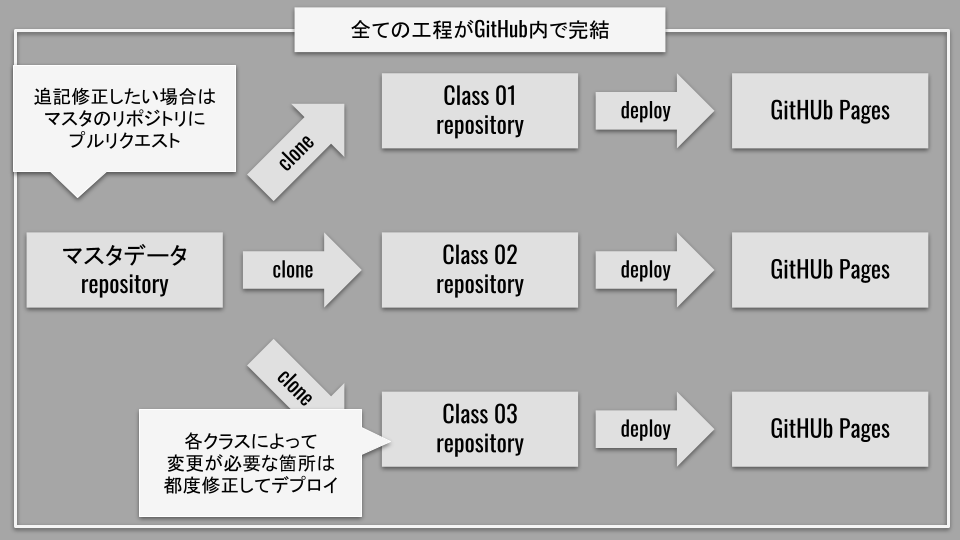
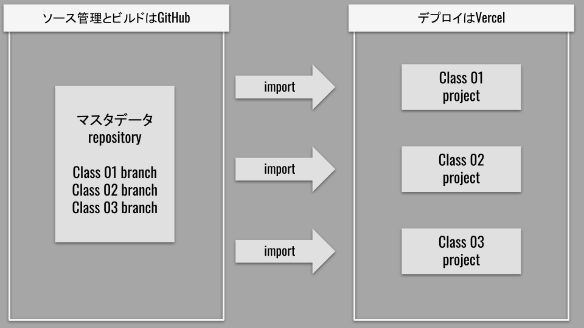

- 作成日：2021/12/01

- 更新日：2021/12/01

## はじめに

- 前半（[リンク](./dx-the-lecture-01)）
- 後半（この記事）

前回で新たに判明した課題は次の 3 つであった．

- 新規クラスが開講する度に新しいリポジトリの生成が必要となる．
- 内容の修正が必要な場合，クラス資料とマスタデータの異なるリポジトリで更新作業が必要となる．
- 複数の人間が講師を務める場合，お互いの修正内容を円滑に反映することができない．

これらを解決するためには，下記 2 点が必要となる．

- GitHub のリポジトリを単一とし，各クラス向けの講義資料はブランチで管理する．
- デプロイの方法を変更する．

## 成果物

最終的に出来上がった仕組みを組み込んだサンプルが以下のリポジトリとなる．readme ファイルに複数クラス用にデプロイした URL が記載されている．

全てのクラスの講義を 1 つのリポジトリで管理できるようになった．これにより，新クラス追加，資料修正，修正の反映，などより容易に実行することができる．

- [リポジトリのリンク](https://github.com/taroosg/dx-the-lecture-02)

状況はこれまでと同様．

- JavaScript 2 回と PHP 2 回の講義を想定
- 全ての講義を終えたクラス 1
- JavaScript のみを終えたクラス 2

## 方針

GitHub 上の単一リポジトリで管理するためには以下の状況をクリアする必要がある．

- 【すぐ実現可能】リポジトリ内でブランチを作成してソースコードを管理する．
- 【変更なし】GitHub Actions を用いてビルド →zip 圧縮を行う．
- 【要改善】デプロイに使用している GitHub Pages では 1 つのブランチしかデプロイすることができない．

## ブランチを用いたソースコード管理

各クラス用のブランチを用意する．例えばクラス 01 と 02 の 2 つが存在する場合，ブランチ全体は以下のような構成となる．

```txt
.
├── main
├── develop
├── gh-pages
├── class01-main
├── class01-develop
├── class01-deploy
├── class02-main
├── class02-develop
└── class02-deploy

```

役割は以下のとおりである．

| ブランチ        | 役割                                                                |
| --------------- | ------------------------------------------------------------------- |
| main            | マスタデータの最新状態を管理する．                                  |
| develop         | マスタデータの編集を行う．main にプルリクエストを送信する．         |
| gh-pages        | ビルド内容確認用．                                                  |
| class0n-main    | 各クラス講義資料の最新状態を管理する．                              |
| class0n-develop | 内容を編集して main にプルリクエストを送信する．                    |
| class0n-deploy  | main ブランチの内容をビルドし，デプロイ用のファイルが push される． |

ブランチが増えていくため，ブランチの命名規則を定めておくことが大切だ．

## GitHub Actions を用いてビルド → zip 圧縮

これまでと同様であるが，ブランチ毎に多少 yml ファイルを変更する必要がある．

具体的には以下のような内容となる．処理自体は変更ないため，ブランチ名を適切に設定しておけば問題ない．

```yml
name: github pages

on:
  push:
    branches:
      # 🔽 発火タイミングを各クラスのmainブランチを指定
      - class01-main
  pull_request:

jobs:
  deploy:
    runs-on: ubuntu-18.04
    steps:
      - uses: actions/checkout@v2

      - name: Setup mdBook
        uses: peaceiris/actions-mdbook@v1
        with:
          mdbook-version: "0.4.8"
          # mdbook-version: 'latest'

      # mdファイルのビルド
      - run: mdbook build

      # サンプルファイルをzip圧縮してビルドしたファイル群に追加
      - run: |
          mkdir ./book/samples
          cd samples
          find . \! -name '*.zip' -type d -exec zip -r {}.zip {} \;
          mv *.zip ../book/samples

      # ビルドされたファイル群をgh-pagesブランチにデプロイ
      - name: Deploy
        uses: peaceiris/actions-gh-pages@v3
        # 🔽 ソースを各クラスのmainブランチを指定
        if: github.ref == 'refs/heads/class01-main'
        with:
          github_token: ${{ secrets.GITHUB_TOKEN }}
          publish_dir:
            ./book
            # 🔽 デプロイ先を各クラスのdeployブランチを指定
          publish_branch: class01-deploy
```

## デプロイ方法の変更

現状でデプロイに使用している GitHub Pages では 1 つのブランチしかデプロイすることができない．そのため，クラスをブランチで管理してもそれぞれデプロイすることができない．

そこで，デプロイ環境を「GitHub Pages」から「Vercel」に変更した．両者の特徴は以下のとおりである．

### GitHub Pages

- リポジトリ毎に任意のブランチの内容をホスティングする．
- 指定のブランチに push されたタイミングで自動デプロイされる．
- public リポジトリのみ対応．

↓ 前回構築した，GitHub Pages を使用したフローの図．



### Vercel

- プロジェクト毎に任意のリポジトリの任意のブランチの内容をホスティングする．
- 指定のブランチに push されたタイミングで自動デプロイされる．
- public，private どちらでも対応．

今回のケースでは，「単一リポジトリに複数のデプロイ用ブランチが存在し」「ブランチ毎に 1 つのデプロイ先が存在する」ため，GitHub Pages では対応しきれない．

Vercel を用いれば，「単一リポジトリの任意のブランチに対してプロジェクトを作成」することができるため，ブランチごとのデプロイが可能となる．

↓ このように，ブランチ（各クラス）ごとのプロジェクトが作られて，別々の URL にデプロイされることとなる．



Vercel のほうが GitHub Pages よりも URL がスッキリした（個人の感想）．

## 結果

これらにより，講義のフローは以下のようになった．

1. マスタデータを作成しておく．
2. 講師は，クラスが開講するタイミングで main ブランチからクラス用のブランチ（class0n-main，class0n-develop）を作成する．
3. 各クラス用ブランチの yml ファイルを編集し，GitHub Actions でビルドできるよう設定して実行する．
4. Vercel でクラス用のプロジェクトを作成し，各クラスのデプロイ用ブランチ（class0n-deploy）を参照するよう設定する．

また，講義資料の修正もプルリクエストで対応できるようになり，全てを一人の講師が行う必要もなくすことができた．

1. 各クラスで修正が発生した場合は，develop ブランチに対してプルリクエストを送信する．
2. 管理者はプルリクエストを確認し，問題なければ main ブランチにマージしてマスタデータを更新する．
3. 修正の度にマスタデータが最新となるため，以降開講するクラスにも間違いなく修正点が反映される．

## まとめ

今回 mdbook，GitHub，Vercel の 3 種類を用いることで，抱えていた問題を一掃することができた．

### 【前回】

- PDF 資料による講義資料の不具合解消．
- デプロイによる講義資料へのアクセス改善．
- 講義資料とサンプルコードの管理や展開の簡略化．

### 【今回】

- 単一リポジトリでの講義資料運用．
- 修正内容の分散管理と単一講師の負荷軽減．

定型的な業務を効率化することにより，より創造的な仕事にリソースを注げるようになるだろう．

コードを書いた箇所は GitHub Actions のシェルコマンドのみだが，各技術を活用することで自動化を実現することができた．

今後も積極的に自動化できる部分は自動化していく所存である．

以上だ(｀･ω･)b
